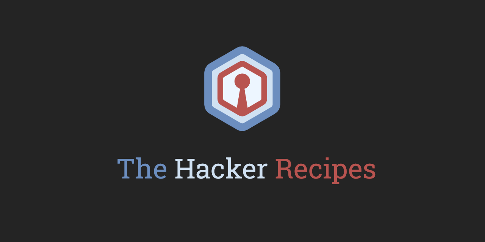

# Introduction


**This project is a work in progress**. I started it in 2018 and will probably "finish" it by 2024. But of course, it will never be finished, those subjects evolve day after day and I don't plan on letting this project become deprecated. 

The "Active Directory" part is a good example of what I want this whole project to be like.

The 🛠️ emoji is used where work has to be done.


This project is aimed at providing technical guides on various hacking topics:

* Active Directory services
* Servers
* Web services
* Intelligence gathering
* Physical intrusion
* Social engineering
* Phishing
* Mobile apps
* ...

Cheatsheets are huge resources, but they sometimes lack simplicity or on the contrary not giving any context or explanation. **This is not a cheatsheets project**. Everything here will be verified, tested, and not only copy pasted from I don't know where.

Keep in mind that these guides are maintained by non-omniscient security enthusiasts in their spare time. You will probably find things missing or mistakes.

📣 Please feel free to contribute, give feedback/suggestions or reach out to me on Twitter \([@\_nwodtuhs](https://twitter.com/_nwodtuhs)\), Discord \(Shutdown\#2539\), IRL or whatever you feel appropriate.


Almost every tool mentioned in theses notes is installed, and sometimes pre-configured, in [Exegol](https://github.com/ShutdownRepo/Exegol), another project of mine of a docker environment ready to hack on day-to-day engagements. It's not much but I use it on all my engagements. Feel free to use it, to contribute, to give feedback etc.


