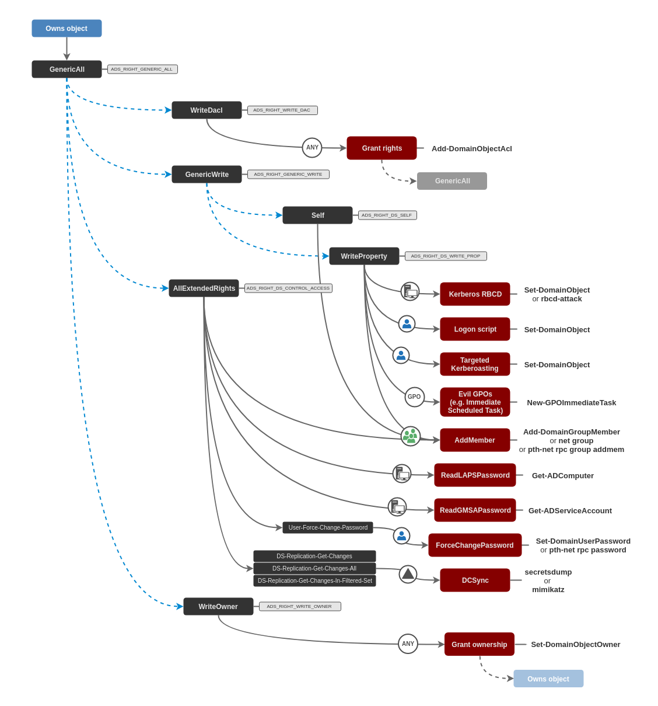

# Access Control Entries \(ACEs\)

## Theory

Access privileges for resources in Active Directory Domain Services are usually granted through the use of an Access Control Entry \(ACE\). Access Control Entries describe the allowed and denied permissions for a principal in Active Directory against a securable object \(user, group, computer, container, organization unit \(OU\), GPO and so on\)

DACLs \(Active Directory Discretionary Access Control Lists\) are lists made of ACEs \(Access Control Entries\).

When misconfigured, ACEs can be abused to operate lateral movement or privilege escalation within an AD domain.

## Practice

### Requirements

The attacker needs to be in control of the object the ACE is set on to abuse it and possibly gain control over what this ACE applies to. The following abuses can only be carried out when running commands as the user the ACE is set on \(see [impersonation techniques](../credentials/impersonation.md)\).


**Windows or UNIX ?**

All abuses below can be carried out on a Windows system that doesn't even have to be joined to the domain. On UNIX-like systems, a few of the following abuses can be carried out with tools like [aclpwn](https://github.com/fox-it/aclpwn.py) and [ntlmrelayx](https://github.com/SecureAuthCorp/impacket/blob/master/examples/ntlmrelayx.py). I personally find it way easier to abuse ACEs from a Windows machine.


### Exploitation paths

In order to navigate the notes, testers can use the mindmap below.

All of the aforementioned attacks \(red blocks\) are detailed in the child notes, except:

* **Kerberos RBCD**: see [ADDS &gt; Movement &gt; Kerberos &gt; Kerberos Delegations &gt; RBCD](../abusing-kerberos/delegations.md#resource-based-constrained-delegations-rbcd)
* **GPO abuses**: see [ADDS &gt; Movement &gt; GPOs](../abusing-gpos.md)
* **DCSync** : see [ADDS &gt; Movement &gt; Credential &gt; Dumping &gt; DCSync](../credentials/dumping/dcsync.md)

## Resources











