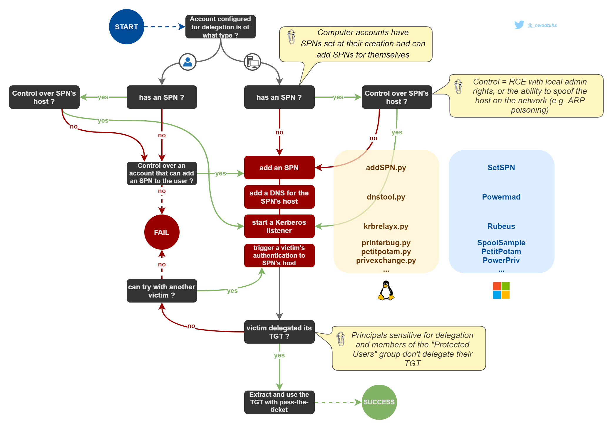
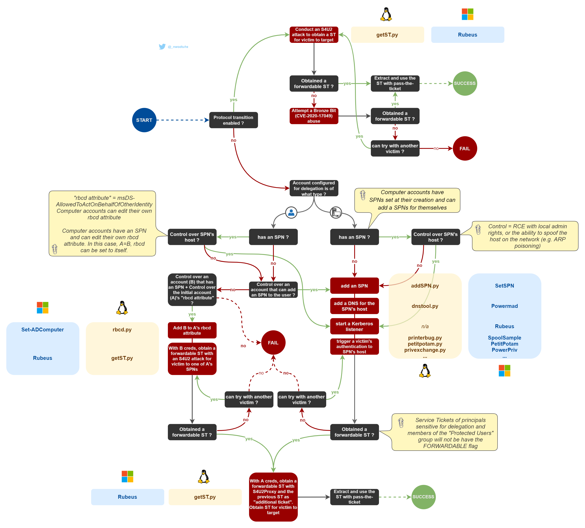

# Delegations

## Theory

### Types of delegation

The authentication protocol "Kerberos" features delegation capabilities described as follows. There are three types of Kerberos delegations

* **Unconstrained delegations (KUD)**: a service can impersonate users on any other service.
* **Constrained delegations (KCD)**: a service can impersonate users on a set of services
* **Resource based constrained delegations (RBCD)** : a set of services can impersonate users on a service


With constrained and unconstrained delegations, the delegation attributes are set on the impersonating service (requires `SeEnableDelegationPrivilege` in the domain) whereas with RBCD, these attributes are set on the target service account itself (requires lower privileges).


### Extensions

Kerberos delegations can be abused by attackers to obtain valuable assets and sometimes even domain admin privileges. Regarding constrained delegations and rbcd, those types of delegation rely on Kerberos extensions called S4U2Self and S4U2Proxy.

* **Service for User to Self (S4U2Self)**: allows a service to obtain a Service Ticket, on behalf of a user (called "principal"), to itself. This extension can be used by any account that has at least one SPN. The resulting Service Ticket is forwardable (i.e. can be used with S4U2Proxy to access another service) unless
  * the service is not configured for constrained delegation (or rbcd)
  * the service is configured for constrained delegation without protocol transition
  * the principal is sensitive for delegation
  * the principal is a member of the Protected Users group
*   **Service for User to Proxy (S4U2Proxy)**: allows a service to obtain a Service Ticket on behalf of a user to a different service. For this extension to work properly, the service needs to supply a Service Ticket as "additional-ticket" (i.e. used as an evidence that the service using S4U2Proxy has the authority to do it on behalf of a user). For S4U2Proxy to work, the ST used as "additional-ticket" must be:

    * either a forwardable ticket
    * or a ticket with it's PA-PAC-OPTIONS padata type having the resource-based constrained delegation bit set

    S4U2Proxy always results in a forwardable ST, even when the ticket used as evidence wasn't forwardable.

Some of the following parts allow to obtain modified or crafted Kerberos tickets. Once obtained, these tickets can be used with [Pass-the-Ticket](../pass-the-ticket.md).

## Practice


[unconstrained.md](unconstrained.md)



[constrained.md](constrained.md)



[rbcd.md](rbcd.md)


## Resources






