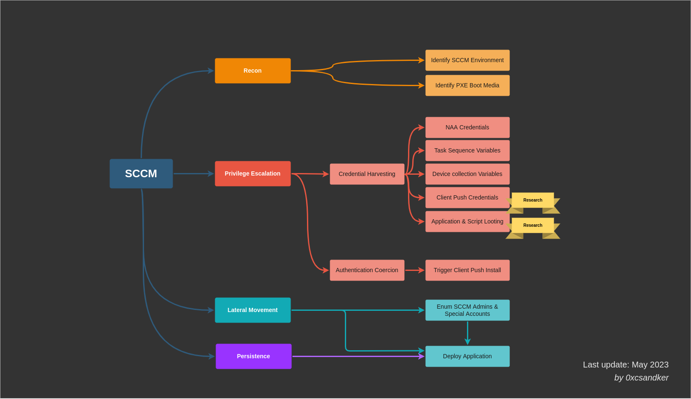

# SCCM / MECM

## Theory

The **System Center Configuration Manager** (SCCM), now (since 2020) known as **Microsoft Endpoint Configuration Manager** (MECM), is a software developed by Microsoft to help system administrators manage the servers and workstations in large Active Directory environments. It provides lots of features including remote control, patch management, task automation, application distribution, hardware and software inventory, compliance management and security policy administration.

SCCM is an **on-premise** solution, but Microsoft also maintains a cloud-native client management suite named **Intune**. Both Intune and SCCM are part of the "**Microsoft Endpoint Manager**"  umbrella.

### Topology

SCCM operates in a Client-Server architecture deployed on a "site", representing the SCCM environment. Each client (server or workstation) has an agent installed used to communicate with its SCCM server, the [Primary Site server](https://learn.microsoft.com/en-us/mem/configmgr/core/plan-design/hierarchy/design-a-hierarchy-of-sites#BKMK\_ChoosePriimary).

Clients are logically grouped into [boundary groups](https://learn.microsoft.com/en-us/mem/configmgr/core/servers/deploy/configure/boundary-groups), that are a set of network locations allowing clients to communicate with the SCCM closest resources in an SCCM site.

Boundary groups also allow for [automatic site assignment](https://learn.microsoft.com/en-us/mem/configmgr/core/clients/deploy/assign-clients-to-a-site#automatic-site-assignment) for discovered clients based on their network location to attach them to the right site and ensure they receive the right configuration.


Each SCCM site is identified by a three-character code to distinguish it in an SCCM hierarchy. This is needed at the client registration process.


The primary site server manages the clients (like distributing software updates) and can have child servers attached to it ([secondary sites](https://learn.microsoft.com/en-us/mem/configmgr/core/plan-design/hierarchy/design-a-hierarchy-of-sites#BKMK\_ChooseSecondary)), generally for scalability purpose. In case of high availability in required, it is also possible to find a [passive site server](https://learn.microsoft.com/en-us/mem/configmgr/core/servers/deploy/configure/site-server-high-availability) that will be used only if the active site server stop working.

Between the site server and clients sites [the management point](https://learn.microsoft.com/en-us/mem/configmgr/core/plan-design/hierarchy/plan-for-site-system-servers-and-site-system-roles#management-point) which is an SCCM server role allowing to provide clients with necessary policies and configuration to communicate with the site server and receive configuration data from them.

To get software packages, updates, OS images, etc. clients request the [distribution point](https://learn.microsoft.com/en-us/mem/configmgr/core/plan-design/hierarchy/plan-for-site-system-servers-and-site-system-roles#distribution-point), which is the SCCM component that hosts and distributes them.

All information about the clients, software updates, hardware and software inventories, configuration settings of the site, etc. are stored in a Microsoft SQL Server (MSSQL) instance, known as the [site database server](https://learn.microsoft.com/en-us/mem/configmgr/core/plan-design/hierarchy/plan-for-the-site-database). This database is used by the site server to retrieve and store information about the managed devices and is also used by the management point to retrieve policies and configuration information needed by the SCCM clients.

In addition, another component called the [SMS Provider](https://learn.microsoft.com/en-us/mem/configmgr/core/plan-design/hierarchy/plan-for-the-sms-provider#about), provides a set of interfaces between the site server and the site database to give the clients needed information like available software updates and allow them communicate information like status of a software deployment and inventory data to store in the site database.

Finally, in really big environments that host multiple SCCM sites (think about a big company, with one SCCM site per continent), it is possible to encounter a **Central Administration Site (CAS)**. This type of site allows to manage all the primary sites from one point, make some reporting, and is totally optional.

All the previously described components can be installed on a single physical server, or dispatched between multiple servers for load balancing purpose for example.

<figure><figcaption><p>Typical multi-site architecture</p></figcaption></figure>

### Deployment types

When SCCM is installed in an Active Directory, the clients can be deployed on the workstations by six different ways:

* Client push installation (default)
* Software update-based installation
* Group Policy installation
* Manual installation
* Logon script installation
* Package and program installation

<details>

<summary>Client push installation</summary>

The first way of deploying SCCM is the **Client push installation** method, which is the default one and the least secure.

This installation will use "client push accounts". They are service accounts with local administrative rights on the assets where SCCM will have to deploy some stuff. The system administrator creates groups of endpoints and for each of those, one "client push account". For each group, only one "client push account" can authenticate with administrator rights on the assets of this group. Thus, if an account is compromised, only the members of the corresponding group can be compromised in turn.

When the SCCM deployment is launched, it will basically try to authenticate with each client push accounts on each asset, and if the authentication fails, SCCM will try the next account in line. When the authentication succeeds, it moves to the following asset, and so on until the deployment is complete.

SCCM deployment via **Client push installation** is service accounts credentials spraying in a nutshell.

_Nota bene, there is a_ [_feature_](https://learn.microsoft.com/en-us/mem/configmgr/core/clients/deploy/deploy-clients-to-windows-computers#configure-the-site-to-automatically-use-client-push-for-discovered-computers) _(not enabled by default) allowing for automatic client push installation on all discovered clients in a boundary group in an SCCM site._

</details>

## Practice

### Attack path overview

<figure><figcaption><p>SCCM Attack Surface Overview</p></figcaption></figure>

### Recon

SCCM reconnaissance can be performed in many ways. The goal is to enumerate whether SCCM is present in a target network, and which are the assets related to it.



[pxethiefy.py](https://github.com/sse-secure-systems/Active-Directory-Spotlights/tree/master/SCCM-MECM/pxethiefy) (Python), which is based on [PXEThief](https://github.com/MWR-CyberSec/PXEThief), can be used to query for PXE boot media. The Pre-Boot Execution Environment (PXE) is a mechanism for booting a computer over the network. Specifically, instead of booting from a CD drive, USB key or hard disk and finding the boot program, the PC will use the network to read such a program from the PXE server.

<figure><figcaption></figcaption></figure>

There are a few things to note:

* [pxethiefy.py](https://github.com/sse-secure-systems/Active-Directory-Spotlights/tree/master/SCCM-MECM/pxethiefy) uses broadcast requests to request DHCP PXE boot options. An SCCM setup does not have to support PXE boot and a "found" PXE server does not have to be an SCCM component. Be cautious of false positive results.
* In this case a PXE server was found and PXE media was downloaded. The location of the PXE media on the TFTP server is `\SMSTemp\...`, which indicates that this is indeed an SCCM server.

[sccmhunter](https://github.com/garrettfoster13/sccmhunter) (Python) can also be used to explore the Active Directory and search for SCCM/MECM assets. For this tool, a first user account is required. The first step is to retrieve the different assets in the LDAP annuary, and extract informations from the identified servers SMB shares.

For each servers, the extracted informations are :
* the SCCM site code
* if the server is a Central Administration Site (CAS) or not
* the SMB signing status (useful to perform later [NTLM relay](../ntlm/relay.md) attacks)
* if the server is the SCCM Primary Site server or not
* if it is the SCCM Distribution Point or not
* if it is the SCCM SMS Provider or not
* if there are the WSUS and MSSQL services running on it or not

```bash
# Find the assets in the LDAP configuration
sccmhunter.py find -u $USER -p $PASSWORD -d $DOMAIN -dc-ip $DC

# Retrieve informations regarding the identified servers and save PXE variables
sccmhunter.py smb -u $USER -p $PASSWORD -d $DOMAIN -dc-ip $DC -save
```

When informations gathering is finished, the second step is to display the results with the `show` command:

```bash
# View the SMB configurations and running services
sccmhunter.py show -smb

# View the users
sccmhunter.py show -user

# View the servers
sccmhunter.py show -computers

# View everything
sccmhunter.py show -all
```



Using LDAP queries from a **domain-joined** Windows machine:

```powershell
# LDAP search via PS
([ADSISearcher]("objectClass=mSSMSManagementPoint")).FindAll() | % {$_.Properties}
```

<figure><figcaption></figcaption></figure>

Using WMI queries or [SharpSCCM](https://github.com/Mayyhem/SharpSCCM) to query a clients local WMI database:

```powershell
# WMI
Get-WmiObject -Class SMS_Authority -Namespace root\CCM

# SharmSCCP
SharpSCCM.exe local site-info
```

<figure><figcaption></figcaption></figure>



### Abuse

The different phases of an SCCM environment compromise are detailled in the following sections.

#### Privilege Escalation

This page will describe how to compromise a SCCM infrastructure.


[privilege-escalation.md](privilege-escalation.md)


#### Post-exploitation

After the SCCM infrastructure compromise, this page will describe how to pivot through the network with the help of the SCCM features.


[post-exploitation.md](post-exploitation.md)


## Resources
































