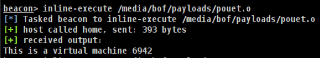

# 🛠️ Stealth with C2

> [!WARNING]
> This is a work-in-progress. It's indicated with the 🛠️ emoji in the page name or in the category name. Wanna help? Please reach out to me: [@_nwodtuhs](https://twitter.com/_nwodtuhs)

## What is a Command & Control (C2) Reminder

## Cobalt / Havoc

once you have a shell on the victim, one of the most discreet ways to execute code is through object file because the idea is to avoid creating a sub-process but rather to allocate memory to run code and then resume its initial size.

#### Object file

Here is an example of how to launch the BoF (Beacon Object File) once compiled. The source code is available [here ](https://github.com/matro7sh/bof-collection/blob/main/src/checkVM/checkVM2.c)and the goal is to verify if we are dealing with a virtual machine or not.




#### How to write BoF (Beacon Object File)

For example, if you need the `RegCloseKey` function.

Look at the Windows documentation (in our example [https://learn.microsoft.com/en-us/windows/win32/api/winreg/nf-winreg-regclosekey](https://learn.microsoft.com/en-us/windows/win32/api/winreg/nf-winreg-regclosekey)) to get the list of the arguments.

In our case : 

```c
LSTATUS RegCloseKey(
 [in] HKEY hKey
);
```

Then, get the name of the library used (at the bottom of the page) in our case it is : `Advapi32.lib`

We have to structure it like this : `DECLSPEC_IMPORT LSTATUS WINAPI $();`

Still in our case, we will get this: `DECLSPEC_IMPORT LSTATUS WINAPI ADVAPI32$RegCloseKey(HKEY);`

Simply use the function like this in our code: `ADVAPI32$RegCloseKeyA(hKey);`

> [!TIP]
> In addition, to use these functions download the library "beacon.h" available [here](https://hstechdocs.helpsystems.com/manuals/cobaltstrike/current/userguide/content/beacon.h).

It is also possible to load a library and then call the method using methods like `GetProcAddress` or `LoadLibraryA.`

Below is an example of how to use this approach:

[https://github.com/matro7sh/bof-collection/blob/main/src/getAV/getAV-ll.c](https://github.com/matro7sh/bof-collection/blob/main/src/getAV/getAV-ll.c)

More information at this URL: [https://hstechdocs.helpsystems.com/manuals/cobaltstrike/current/userguide/content/topics/beacon-object-files_main.htm](https://hstechdocs.helpsystems.com/manuals/cobaltstrike/current/userguide/content/topics/beacon-object-files_main.htm).