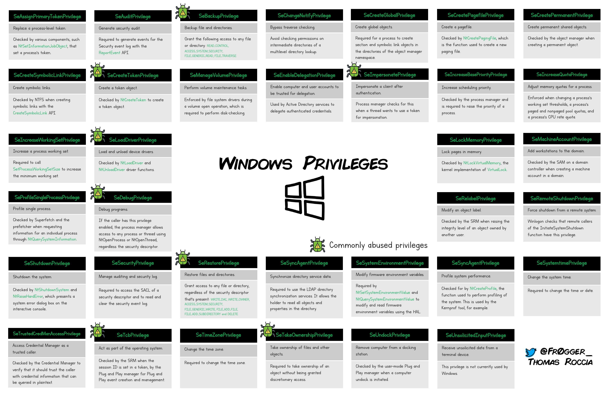

# Account privileges

## Theory

Windows distinguishes between **permissions** (ACLs on objects such as files, registry keys, and Active Directory objects) and **privileges** (rights assigned to accounts that allow specific system-level operations, regardless of object ownership or ACLs). Privileges are stored in the access token of a process or thread and are evaluated by the kernel when a privileged operation is requested. 

Some groups grant privileges by default, without any explicit assignment. Refer to [Security groups](../../../../ad/movement/builtins/security-groups.md) for a full overview.


Windows privileges reference chart by ([@fr0gger_](https://x.com/fr0gger_/status/1379465943965909000)){.caption}

Each privilege has three possible states in a token:

| State | Description |
|---|---|
| Not present | The account does not hold the privilege at all |
| Present, disabled | The privilege is assigned but not active; it must be explicitly enabled via `AdjustTokenPrivileges` before use |
| Present, enabled | The privilege is active and immediately usable |

From an attacker's perspective, certain privileges open direct paths to credential access, privilege escalation, or persistence, even without exploiting any vulnerability.

## Practice

### Enumeration

The current token's privileges are listed with the built-in `whoami` command:

```powershell
whoami /priv
```

### Abusable privileges

| Privilege | Default holders | Impact |
|---|---|---|
| [SeBackupPrivilege](SeBackupPrivilege.md) | Backup Operators, Administrators | Read any file; dump SAM, NTDS.dit |
| SeRestorePrivilege | Backup Operators, Administrators | Write any file; overwrite binaries, registry keys |
| SeDebugPrivilege | Administrators | Debug or inject into any process; dump LSASS |
| SeImpersonatePrivilege | Service accounts, Administrators | Token impersonation; Potato attacks |
| SeAssignPrimaryTokenPrivilege | Service accounts | Assign primary tokens; Potato attacks |
| SeLoadDriverPrivilege | Administrators | Load arbitrary kernel drivers |
| SeTakeOwnershipPrivilege | Administrators | Take ownership of any securable object |
| SeManageVolumePrivilege | Administrators | Direct sector-level read/write on any volume |
| SeTcbPrivilege | SYSTEM | Act as part of the OS; create arbitrary tokens |

## Resources

[https://github.com/gtworek/Priv2Admin](https://github.com/gtworek/Priv2Admin)

[https://github.com/hatRiot/token-priv](https://github.com/hatRiot/token-priv)

[https://x.com/fr0gger_/status/1379465943965909000](https://x.com/fr0gger_/status/1379465943965909000)