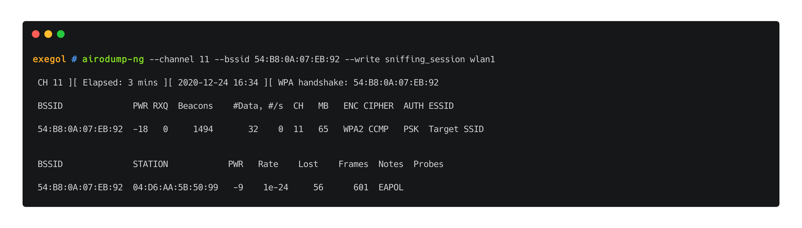
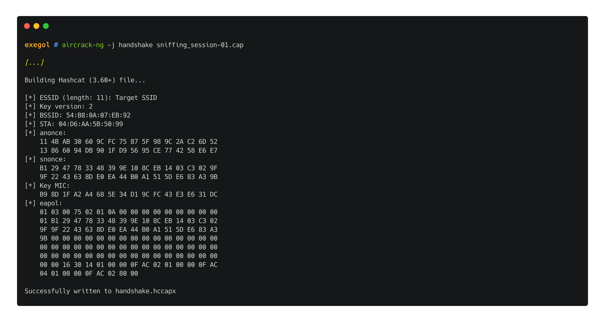

# 🛠️ WPA2

## Theory

## Attacks

//TODO : differences between CCMP and TKIP for cipher ? 

### Sniffing

{.rawimg}

### De-authentication

{.rawimg}

### WPA handshake capture & cracking

clients needed

sniffing + deauth

gives "WPA handshake" followed by AP MAC addr, possible to crack

{.rawimg}

either crack with aircrack directly or use aircrack to create a hashcat formatted file

{.rawimg}

preparing hashcat file

{.rawimg}

cracking

{.rawimg}

### PMKID capture

### KRACK

## Resources