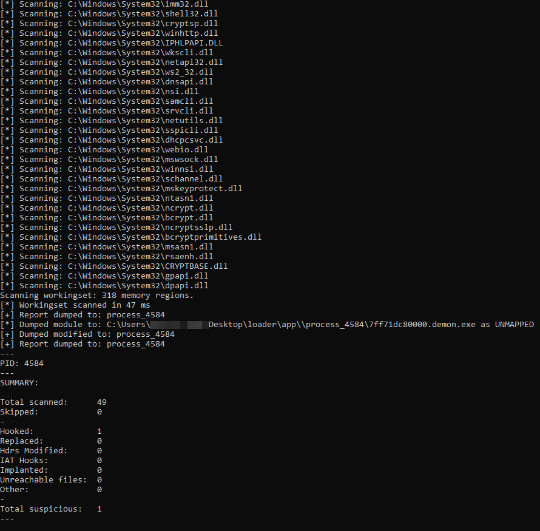

# 🛠️ Loader


**This is a work-in-progress**. It's indicated with the 🛠️ emoji in the page name or in the category name. Wanna help? Please reach out to me: [@\_nwodtuhs](https://twitter.com/\_nwodtuhs)


The following piece of C code is a simple example of DLL loader, where the DLL holds the malicious shellcode.

```c
#include <iostream>
#include <Windows.h>

int main(void) {
  HMODULE hMod = LoadLibrary("shellcode.dll");
  if (hMod == nullptr) {
    cout << "Failed to load shellcode.dll" << endl;
  }

  return 0;
}
```

Once the payload is completed, [pe-sieve](https://github.com/hasherezade/pe-sieve) can be used to identify if it is stealthy or not.

<figure><figcaption></figcaption></figure>

