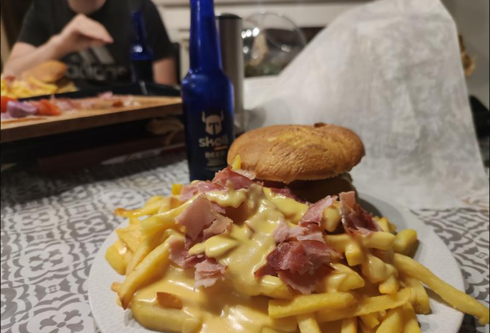

# 🍔 Burger de seigneur

##

## Theory

El famoso "Burger de seigneur" is the reward meal after successfully completing your pentest. This meal was created in "montceau-les-mines" in 2022 by famous french head cook "Toma".&#x20;

The requirements for this meal are as follow (for 3 attacker):

* &#x20;32 slices of bacon (320 g) 🥓
* &#x20;24 slices of cheddar [🧀](https://emojipedia.org/cheese-wedge/)
* &#x20;6 slices of lard
* 600 g of minced meat&#x20;
* 3 tablespoon of  flour
* 25 g of butter 🧈
* 750 ml of semi-skimmed milk 🥛
* 3 hamburger bun
* 1 red onion 🧅
* sauces (ketchup/ buger/ mustard)
* 1 tomato 🍅
* 1.6 KG french fries 🍟
* Une bonne grose dose de talent


This meal can overflow your calorie counter in this case you can make your shopping by bike.&#x20;


## Practice

You need to follow this recipe step by step as follows:

### Bacon and french fries

Preheat the oven at 220 C° and place the french fries and bacon in the oven as shown below

### Cheddar Bechamel aka "la sauce de gros sac"

Melt the butter in a saucepan. Stir in the flour and cook, stirring constantly, until the paste cooks and bubbles a bit, but don't let it brown.&#x20;


It has to look a bit like dough


Now you can add the milk, continuing to stir as the sauce thickens. When all the milk was add you need to put 18 slice of cheddar inside.

### Create Steak

You need to create steak you have two methods&#x20;



Take 200g of minced meat and create steaks of 200g.



Take a salad bowl and add $nb\_attacker \* 200 g of meat as well as ketchup, minced red onion, cayenne pepper, provencal herbs.

Knead the mixture and create steaks of 200g.



### Cook the steak

put the steak and the lard in the pan and cook it when it almost finish put 2 slice of cheddar on each steak as shown below.

### Merge it together&#x20;

Take the bread and apply a little sauce as well as a slice of tomato, steak and the lard as shown below.\

Cut the bacon like this

### Degust it&#x20;

The best way is to eat this meal with a beer.

