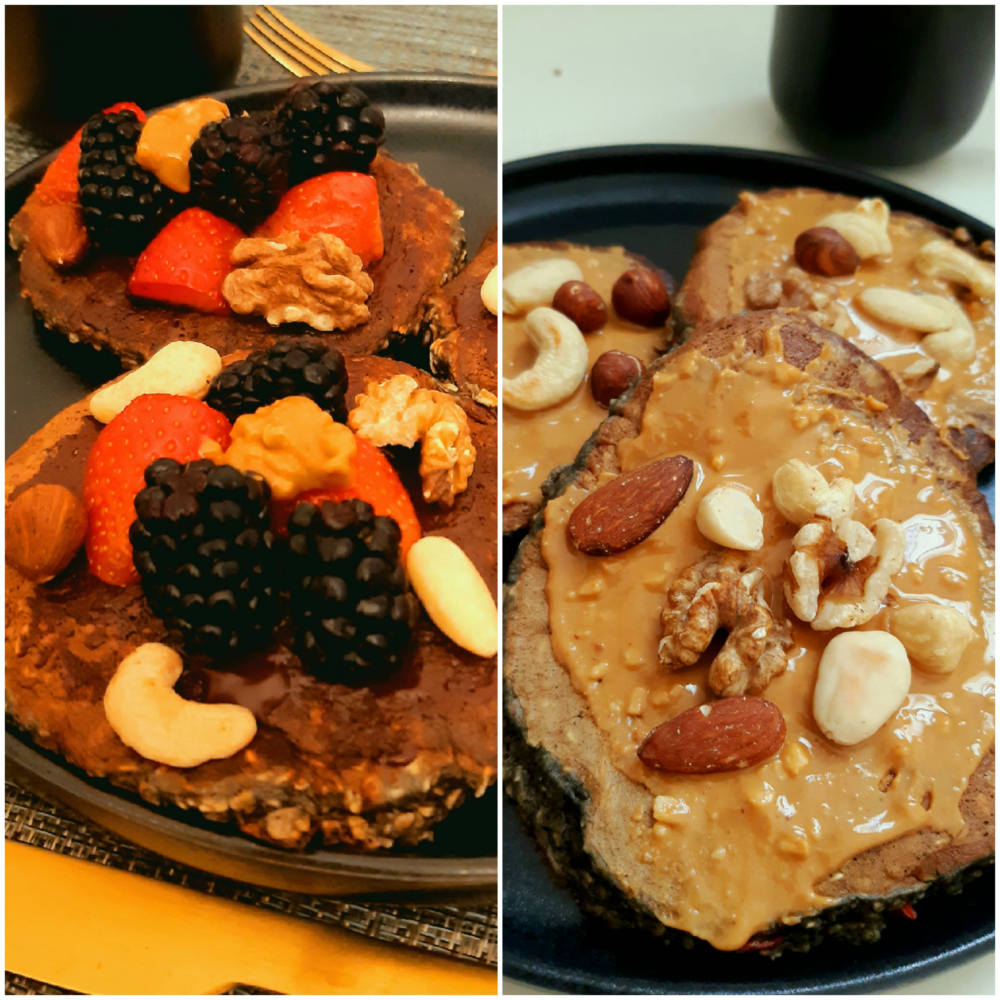

# 🥞 The Pancakes of Heaven

## Theory

Those who made it here are one of the luckiest. The legend says that hackers who ate these pancakes saw the doors of heaven wide open! :open\_mouth:

Following are the ingredients for 3 BIG PANCAKES (we wanna enter those doors, don't we? :eyes:):

* 1 banana
* 1 egg
* 3 tablespoons of coconut Milk&#x20;
* 70g of oatmeal&#x20;
* 1 teaspoon of Açai's powder&#x20;
* 1 tablespoon of Goji barries&#x20;
* 1 tablespoon of maizena&#x20;
* 1 teaspoon of baking powder

## Practice

1. In a container, mash the banana with the bottom of a fork
2. Add the egg and the coconut milk and mix
3. Add the Açai's powder, the maizena, the oatmeal and the baking powder and mix
4. Form 3 "perfectly-rounded" pancakes on a very hot stove and cook for 2 minutes on each side

Now, **the most important part: the toppings**. Plenty of options here but following are few:&#x20;

* Peanut butter with all sorts of nuts (nuts, almonds, cashew nuts, hazelnuts, etc.)
* Melted dark chocolate with berries (blue berries, red berries or whatever color berries)
* Maple syrup


The recipe must be strictly followed or one may not see heaven... :woman\_shrugging:


**Now, let's fly straight to heaven all together hand in hand** :dove:

<figure><figcaption></figcaption></figure>
