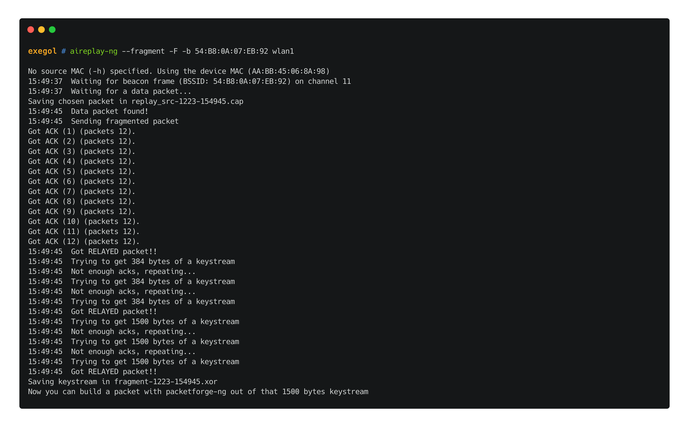
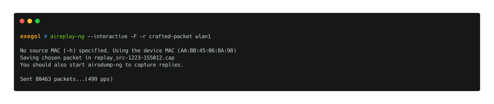

# WEP

## Theory

WEP \(Wired Equivalent Privacy\) was designed around 1999 to offer security to wireless network users. This standard requires the access points and the authenticating users to know a common secret key of 5 characters \(40 bits\) or 13 characters \(104 bits\). WEP is known to be very weak \(IVs can be reused, IVs are too short \(24 bits\), secret keys are too weak, ...\).

WEP can be configured with two different authentication modes : **Open** and **SKA** \(Shared Key Authentication\).

## Requirements

[Aircrack-ng](https://www.aircrack-ng.org/) is a complete suite of tools to assess WiFi network security. The suite offers may famous tool like `airbase-ng`, `aircrack-ng`, `airdecap-ng`, `airdecloak-ng`, `airdrop-ng`, `aireplay-ng`, `airmon-ng`, `airodump-ng`, `besside-ng`, `dcrack`, `easside-ng`, `packetforge-ng`, `tkiptun-ng`, `wesside-ng`.

Depending on the wireless network configuration and on the context, there are different attack scenarios that can be followed but in order to carry on those attacks, there are requirements that need to be met.

### Find target networks

First of all, testers can look out for access points using WEP with `airodump-ng`.

### Find connected clients

Another important thing to know is if clients are authenticated to the access point. Depending on the situation, different attacks can be carried out. In order to gather that information, testers can use `airodump-ng` to capture 802.11 frames between clients and the target AP. In the following example, frames were captured with two clients.

### Obtain an associated state

In order to inject frames from a client to an access point, the client has to be known by the AP \(i.e. be associated\). 

When using `aireplay-ng` for various attacks \(ARP replay, fragmentation, chopchop, ...\), it is possible to set the `-h` option along with the MAC address of an authenticated client. The authenticated clients can be gathered with `airodump-ng`.

When no clients are connected to the AP, or when the tester doesn't want to spoof a legitimate client's MAC address to inject frames, it is required to operate a [fake authentication](wep.md#fake-authentication) attack in order to associate the client with the AP.

## Attacks

When attacking WEP networks, testers need to gather a sufficient amount of IVs \(Initialization Vectors\) to operate a known-plaintext attack and find the secret key. This amount is indicated in the `#Data` column in `airodump-ng`'s output. It is hence required to run `airodump-ng` in the background when operating any of the following attacks. In certain scenarios, it will print additionnal information \(like SSID of hidden networks, authentication types for WEP SKA, ...\) or capture useful data \(keystreams, frames captures, ...\).

While `airodump-ng` is running, testers can launch `aircrack-ng` that will retry cracking the secret key every 5.000 IVs.

For WEP attacks, the PTW attack \(named after its creators Pyshkin, Tews, and Weinmann\) will be used in the cracking process which is much more efficient that the standard bruteforce one. When attacking 104 bits keys \(13 chars\), the only consequence is that the number of IVs needed for the cracking process is higher.

### Fake authentication

When no clients are connected to the AP, or when the tester doesn't want to spoof a legitimate client's MAC address to inject frames, it is required to operate a fake authentication attack in order to [associate the client with the AP](wep.md#obtain-an-associated-state). This can be done with `aireplay-ng`. In the following example, the authentication mode was set to OPEN on the access point. For SKA access points, `aireplay-ng` will print "Switching to shared key authentication" instead of "Authentication successful".

When the authentication mode in use is not OPEN, but rather SKA, the tester can either 

* use a legitimate client's MAC address when attacking with `aireplay-ng` with option `-h`.
* wait a legitimate client to connect to the AP \(or [force it](wep.md#de-authentication)\), capture the authentication, have airodump-ng extract the keystream from it, and use it with a known-plaintext attack to bypass the SKA mode requirement \(.i.e the need to know the secret key\).


**TODO** : I've had issues with my AP, I need to try again with a Rpi or something...


Depending on the scenario, it is advisable to operate fake authentication regularly to keep the association state alive during long attacks. This can be achieved by setting the fakeauth delay to something like 60 \(`--fakeauth 60`\) and/or changing the delay between keep-alive packets \(`-q` option, set to 15 by default\). 

### De-authentication

It is possible to send disassociation packets to clients connected to an access point. This works since 802.11 is a protocol where the source can be impersonated \(spoofed access point MAC address\), 802.11 is on the physical and data link layers of the OSI model. This will make the client try to re-authenticate to the target AP.


This attack is more effective when targeting a specific connected client withe the `-c` option, and in order to work, the attacker needs to be close to that client since the frames will be sent from his machine to the client directly.


This attack can be used continuously to prevent the client\(s\) from accessing the access point by setting the delay to 0 \(`--deauth 0`\).

### ARP replay


**Tips and requirements**

* An [associated state](wep.md#obtain-an-associated-state) is needed. Testers can either run a [fake authentication attack](wep.md#fake-authentication) or set a client's MAC address with the `-h` option on `aireplay-ng`.
* Connected clients are needed.

In order to make that operation more effective, it is possible to combine the ARP replay technique with a [de-authentication attack](wep.md#deauthentication).


The "ARP replay" mode of `aireplay-ng` can be used to gather new IVs by listening to ARP packets and resending them to the AP. The data will be captured by `airodump-ng` and saved in a capture file with the name supplied on the `--write` argument.

> The classic ARP request replay attack is the most effective way to generate new initialization vectors \(IVs\), and works very reliably. The program listens for an ARP packet then retransmits it back to the access point. This, in turn, causes the access point to repeat the ARP packet with a new IV. The program retransmits the same ARP packet over and over. However, each ARP packet repeated by the access point has a new IVs. It is all these new IVs which allow you to determine the WEP key. \([source](https://www.aircrack-ng.org/doku.php?id=arp-request_reinjection)\)

### Fragmentation


**Tips and requirements**

* An associated state is needed. Testers can either run a [fake authentication attack](wep.md#fake-authentication) or set a client's MAC address with the `-h` option on `aireplay-ng`.
* Connected clients are not needed in this attack \(except if the testers wants one's MAC address to meet the associated state requirement\).

This attack is really useful when no clients are connected to the target access point.


//TO EXPLAIN fragmentation attack : in certain scenarios, this process can be very long since it's virtually based on luck.

//TO EXPLAIN packet creation

//TO EXPLAIN packet replay

### ChopChop


**Tips and requirements**

* An associated state is needed. Testers can either run a [fake authentication attack](wep.md#fake-authentication) or set a client's MAC address with the `-h` option on `aireplay-ng`.
* Connected clients are not needed in this attack \(except if the testers wants one's MAC address to meet the associated state requirement\).

This attack is really useful when no clients are connected to the target access point and when the [fragmentation attack](wep.md#fragmentation) fails.


//TO EXPLAIN chopchop /!\ the -h option needs the attacker's MAC address \(or spoofed legitimated client's\)

//TO EXPLAIN packet creation

packet replay

## Resources





