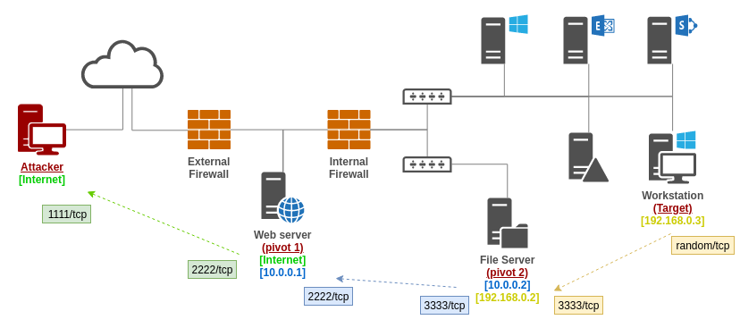
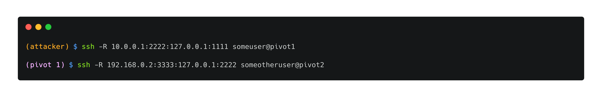

# Port forwarding

//TODO : talk about the upsides, downsides \(easy but SSH needed and so on\), how to on Windows, talk about ssh -D == dynamic port forwarding == SOCKS

## Theory

//TODO 

## Practice

//TODO : simple usage for LPF/RPF

### Chained local port forwarding

//TODO

### Chained remote port forwarding

In the following example, let's assume the remote attacker wants a target workstation to connect back to him with a reverse shell. There are multiple scenarios where using a combination of remote port forwarding would be interesting or even required.

* the attacker wants to stay stealthy and make multiple specific hops to make the tr by targeting port affic legitimate-looking \(workstation communicates with an internal server, an internal server communicates with a DMZed server, a DMZed server communicates with a remote client\)
* the target workstation doesn't have access to the remote attacker's network \(i.e. to the Internet\)

The commands to run from the attacker's machine and from the pivot1 are the following.

This setup allows the target workstation to communicate with the attacker's port `1111/TCP3333/TCP` on pivot2. Pivot2 will forward the communication to pivot1's port `2222/TCP` which will itself forward to attacker's port `1111/TCP`.

