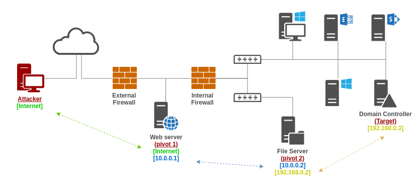

# SOCKS proxy

## Theory

SOCKS \(SOCKet Secure\) is a network protocol that allows users to route network traffic to a server on a client's behalf. SOCKS is between the application and the transport layer of the OSI model.

This is especially useful for penetration testing engagements where a target is hiding behind one or multiple firewalls. A compromised server connected to two networks can be used as a SOCKS proxy server to pivot from a network to another.

In short, a SOCKS proxy can relay TCP and UDP connections and hence help bypass network segmentation. It's sort of a dynamic [port forwarding](port-forwarding.md) technique.

## Practice

### Setup

#### Using SSH

In practice, there are many ways to turn a controlled machine into a SOCKS proxy server. One of the most easy one is by relying on SSH. The tester needs to supply the `-D` option along with the port to use for tunneling. The command can also be used with `-N` option to make sure no command gets executed after the SSH session is opened.

```bash
ssh -N -D $PORT $CONTROLLED_TARGET
```

Once the ssh command exits successful \(or a session opens\) the tester can then proceed to [the usage part](socks-proxy.md#usage). 

#### Using Metasploit

//TODO

#### Using Cobalt Strike

//TODO

#### Using 3proxy

//TODO

### Usage

Network traffic can be tunneled through SOCKS proxy servers with [proxychains-ng](https://github.com/rofl0r/proxychains-ng) \(C\), a tool still maintained and more advanced based on the original [proxychains](https://github.com/haad/proxychains) \(that is not maintained anymore\).

```bash

```

### Chaining proxies

In certain scenarios, SOCKS proxies can be chained. This can easily be done with proxychains. In the following example, SSH is used to turn compromised machines into SOCKS proxy servers.




