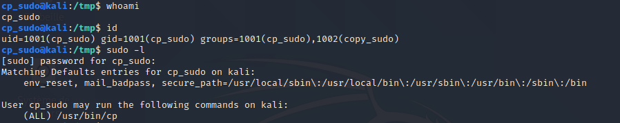
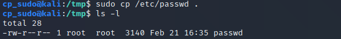
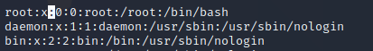

# 🛠️ Sudo configuration

## List a user's available sudo commands

```bash
# List sudo commands
sudo  -l

User user123 may run the following commands on machineN4me:
    (ALL) ALL
```


It might seem obvious, but a user `user1` with "ALL" sudo permissions doesn't need to know the `root` password to get a `root` shell. Just run `sudo -i`, `sudo -s` or even `sudo su` to drop in an interactive root shell with `user1`'s password. This is mitigated when there is a command whitelist. 


## sudoers file

Access the sudo configuration running the `visudo` command as root. This will open `/etc/sudoers`.

We can see several interesting lines :

```
# Allow root to execute any command, on any system.
root ALL = (ALL:ALL) ALL
···
# Allow users in sudo group to execute any command, on any system.
%sudo ALL = (ALL:ALL) ALL
```

The sudo configuration lines take the form : 
```
user MACHINE = (USERS THAT CAN BE IMPERSONATED) COMMANDS
```
* user : the user to which these restrictions apply
* MACHINE : usually ALL, name of the system to which these restrictions apply
* (USERS..) : the users that `user` will be able to take the rights from
* optional : `NOPASSWD:`, self-explanatory
* COMMANDS : allowed commands (ex : ALL, or /usr/bin/ls)


### Bypassing restrictions
Depending on the allowed commands, restrictions can be bypassed pretty easily. Suppose a user allowed to only use the `cp` command with sudo.




This already makes possible privilege escalation, as we can copy any file to arbitrary location. We can for example modify /etc/passwd so that the root account doesn't have a password anymore...

We first use our `sudo cp` to copy `/etc/passwd` to a nice location, and make a copy that we own in order to modify it.



We can then just edit the `x` on the root line, to indicate that the account doesn't need any password.



And we can see that we are not prompted to insert the password anymore.




