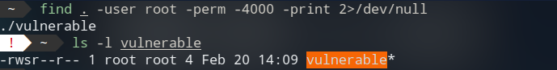

# 🛠️ SUID/SGID binaries

Just like other linux files, binaries have permissions. Due to obligation or misconfiguration, some of them run with higher privileges than usual and can therefore be targeted in priority when trying to locally escalate privileges on a machine.

## SUID binaries

The SUID bit allows the binary to run with the privileges of the owner instead of those of the user executing it. They can be spotted to the `s` permission in the file owner permissions (ie files with permissions `-rws...`).


Run `ls -l` to have access to file permissions in the current working directory. Note that if the permission is listed with a capital `S` such as `-rwS...`, the file is suid-enabled but not executable...


```bash
# List all the root suid-enabled running binaries on the machine (and variants)
find / -perm -u=s -type f 2>/dev/null
find / -user root -perm -4000 -exec ls -ldb {} \;
find / -user root -perm -4000 -print 2>/dev/null
```

In this command, replace `/` with the directory you want to search, `f` indicates that only regular (ie not directories, special files) will be searched.


Once the suid binaries listed, you can try and exploit them. If in the list you get a usual linux command, chances are that it is exploitable : [GTFOBins-sudo](https://gtfobins.github.io/#+sudo)




VRun `ls -l` to have access to file permissions in the current working directory. Note that if the permission is listed with a capital `S` such as `-rwS...`, the file is suid-enabled but not executable...


Set special user permission on a file : 
```bash
# Set SUID bit to file
sudo chmod u+s file
```

## SGID binaries
The same principles apply to SGID binaries. They can be spotted by the `s` permission in the file group permission (ie files with the permissions `-...rws...`).


Set special group permission on a file : 

```bash
# Set SGID bit to file
sudo chmod g+s file
```


