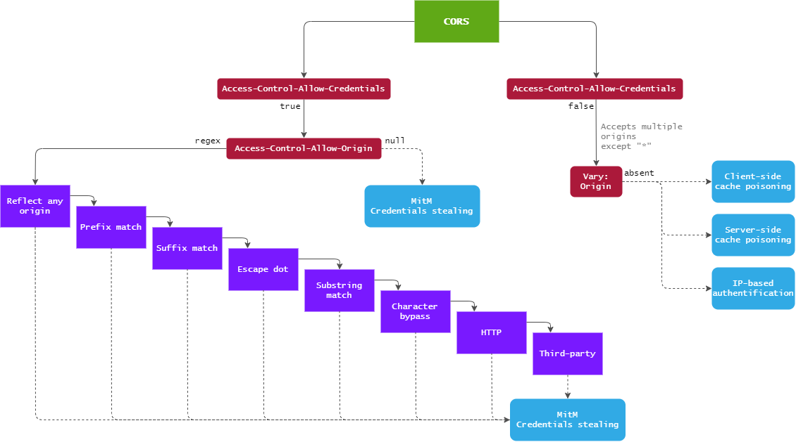

# 🛠️ CORS (Cross-Origin Resource Sharing)

## Theory

Sometimes browsers need to load resources from another origin other than their own. The Same-Origin Policy mechanism (SOP) restricts access to resources on other origins. 


The same-origin is defined for two URLs that have the same protocol, port (if specified), and host.


To bypass this limitation, the JSON-P technique (in JavaScript) was introduced. To retrieve information from another origin, it uses the `<script>` tag (which is not blocked by the SOP). Unfortunately, this technique has some issues and lacks controls in some cases. Here we introduce CORS.

Cross-Origin Resource Sharing (CORS) is a header-based mechanism. It improves security and flexibility for cross-domain resource sharing. CORS is relatively new and therefore, not very well-known. As result, misconfigurations are common and bring security concerns. The main vulnerabilities lie in the overly permissive access to credentials from non-controlled domains.

### Misconfigurations

The exploitation will depend on the misconfiguration. The next image shows a road that can be followed:



#### Case 1

Misconfiguration:

* `Access-Control-Allow-Credentials: true`
* `Access-Control-Allow-Origin: regex`

The origins are verified through a regex match.\
The misconfiguration types can be better understood with this table:



The configuration below is [impossible](https://developer.mozilla.org/en-US/docs/Web/HTTP/CORS#requests_with_credentials):

* `Access-Control-Allow-Credentials: true`
* `Access-Control-Allow-Origin: *`


The attack technique is a simple Man-in-the-Middle.

#### Case 2

Misconfiguration:

* `Access-Control-Allow-Credentials: true`
* `Access-Control-Allow-Origin: null`

According to [James Kettle](https://portswigger.net/research/exploiting-cors-misconfigurations-for-bitcoins-and-bounties), browsers might send the value `null` in the `Origin` header in some unusual situations:

* Cross-site redirects.
* Requests from serialized data.
* Request using the `file:` protocol.
* Sandboxed cross-origin requests.

The value `null `when the server sends credentials is the worst-case scenario. It means any origin can request credentials without limitation.

The attack technique is a simple Man-in-the-Middle.

#### Case 3

Misconfiguration:

* `Access-Control-Allow-Credentials: false`
* `Access-Control-Allow-Origin` is dynamically generated
* `Vary: Origin` is absent

In this case, it is a little bit difficult to exploit CORS misconfigurations. Check [James Kettle](https://portswigger.net/research/exploiting-cors-misconfigurations-for-bitcoins-and-bounties)'s explanation for more information. 

## Practice

In a pentest mission, exploiting CORS misconfigurations is difficult. The attacks rely on manipulating a victim and finding configuration issues on other domains (which can be out of scope).

### Tool

The tool [CORScanner ](https://github.com/chenjj/CORScanner)is useful in finding misconfigurations. It relies on the table shown in the misconfiguration case 1.

```bash
python cors_scan.py -u $URL
```


It is advised to use the verbose option `-v` to see the tests.



It is possible to customize the third parties origins in the file `origins.json`.


## References




